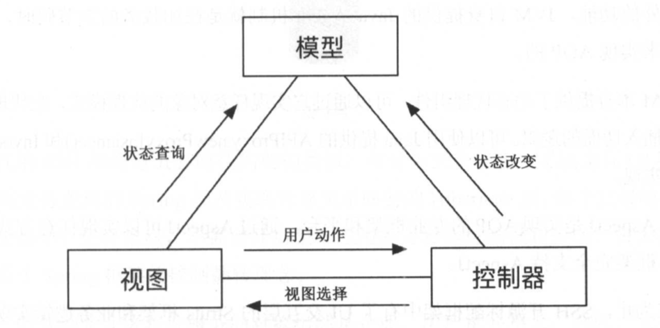
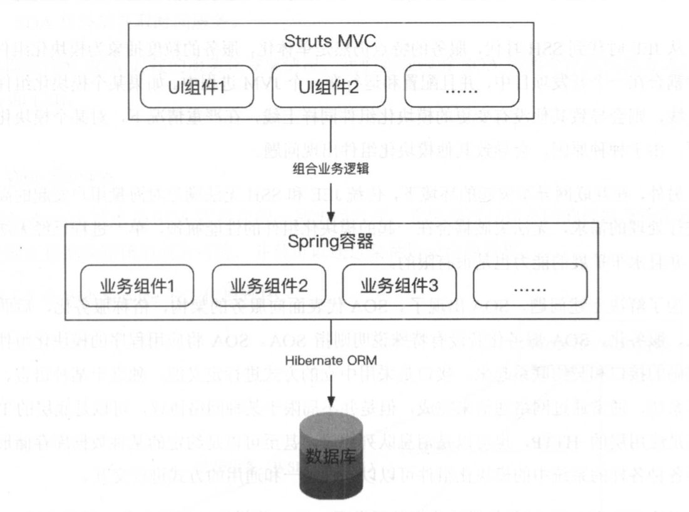
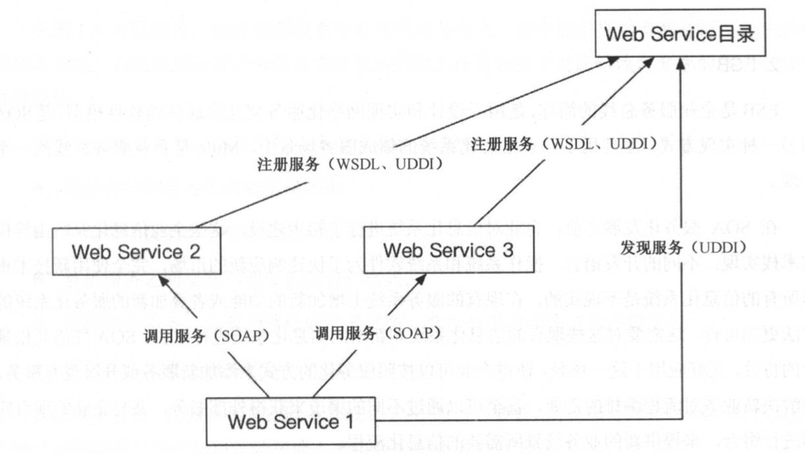
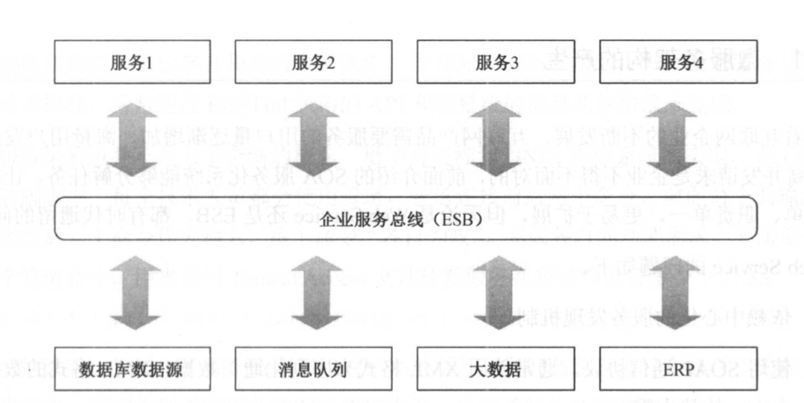
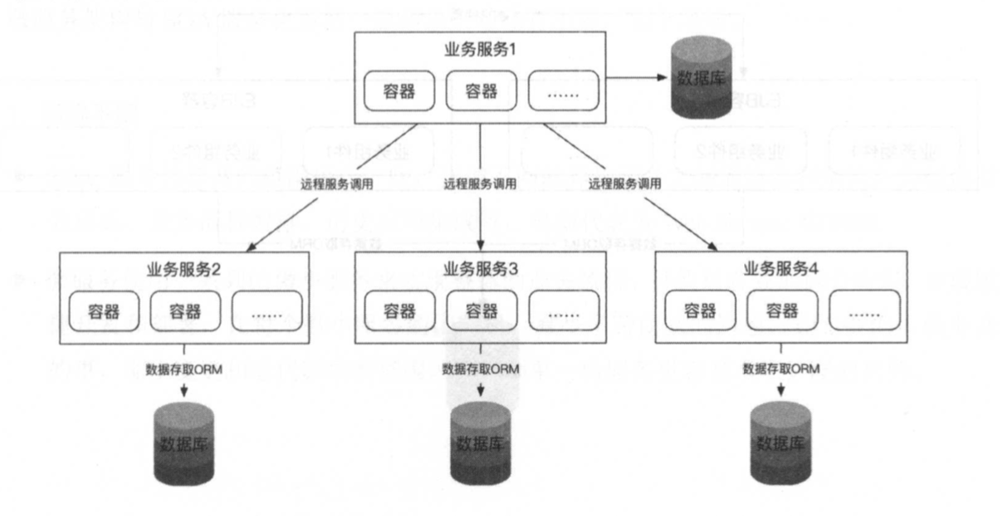

## 一 业务拆分的演进

#### 1.1 分层

分层是企业应用最常见的架构模式，将系统在横向维度上切分成几个部分，每个部分负责一部分相对单一的职业，通过上层对下层的依赖和调用组成一个完整的系统，如网络的七层通信协议，计算机的操作系统其实都可以视为一种分层结构。  

web系统也采用分层结构：
- 应用层：负责具体业务和视图展示，如网站首页和搜索输入结果展示
- 服务层：为应用层提供服务支持，如用户管理，购物车
- 数据层：提供数据存储和访问服务，如缓存、数据库、搜索引擎等

分层很好的将庞大的系统切割后更便于维护和开发，但是也存在一定问题：开发中需要严格遵循分层架构的约束，禁止跨层次调用或者逆向调用。

web应用中基础的分层实践MVC，如图所示：

MVC在业界的经典代表是Java的SSH三大框架（虽然现在过时了，但是经典还是经典）：   

#### 1.2 服务化架构SOA

在SSH时代，服务的特点是单体化的，服务的粒度抽象为模块化组件，所有组件杂糅在一个开发项目中，并且配置和运行在一个JVM进程中。如果某个模块化组件需要升级上线，需要所有整个系统重启，会导致所有组件提供的功能在重启期间不可用。这在传统企业级软件中并没有太大的问题，但是在互联网应用中，这是致命的。  

在上一章节2.7部分，我们考虑将服务进行拆分，即服务化架构（SOA）。SOA将应用程序的模块化组件通过定义明确的接口和契约联系起来，接口是采用中立的方式进行定义的，独立于某种语言、硬件和操作系统，通常通过网络通信来完成，但是并不局限于某种网络协议，可以是应用层的HTTP，也可以是消息队列协议，甚至可以是约定的某种数据库存储形式。这使得各种各样的系统中的模块化组件可以以一种统一和通用的方式进行交互。  

总结：SOA将模块化组件从单一进行中进一步拆分，形成独立的对外提供服务的网络化组件，每个网络组件通过某种网络协议对外提供服务。  

SOA有两个主流实现方式: Web Service 和 ESB。  

**webservice**：  

每个服务之间是对等的，并且互相是解耦的，通过WSDL定义的服务发现接口进行访问，并通过SOAP协议进行通信。SOAP协议通常是一种在 HTTP或者 HTTPS 通道上传输 XML 数据来实现的协议，但是每个服务都要依赖中心化 Web Service 目录来发现现存的服务。如图所示：

  

**ESB**：  

ESB是企业服务总线的简称，是用于设计和实现网络化服务交互和通信的软件模型，主要用于企业信息化系统的集成服务场景中。ESB服务没有中心化的服务节点，每个服务提供者都是通过总线的模式插入系统，总线根据流程的编排负责将服务的输出进行转换并发送给流程要求的下一个服务进行处理。如图所示：

  

#### 1.3 从服务化到微服务

SOA的问题：
- webservice问题：依赖中心化服务发现机制；XML通信格式数据冗余严重；服务化管理和治理设施不完善。
- ESB问题：ESB上的服务本身是个过重的整体服务；ESB总线隐藏了系统复杂性但是并未消灭复杂性；总线本身属于中心化管理模型，系统变更影响范围大。

新时代诞生的微服务架构倡导将软件应用设计成多个可独立开发、可配置、可运行、可维护的子服务，自服务之间通过良好的接口通信机制（REST API或者rpc等等）进行交互，这些服务不需要中心化的统一管理，每个服务功能自治，并且可以由不同的语言、系统、平台实现。  

微服务架构图：  

  

微服务的特点：
- 微服务把每一个职责单一的功能放在一个独立的服务中。
- 每个服务运行在一个单独的进程中。
- 每个服务有多个实例在运行，每个实例可以运行在容器化平台内，达到平滑伸缩的效果。
- 每个服务有自己的数据存储，实际上，每个服务应该有自己独享的数据库、缓存、消息 队列等资源。
- 每个服务应该有自己的运营平台，以及独享的运营人员，这包括技术运维和业务运营人 员:每个服务都高度自治，内部的变化对外透明。
- 每个服务都可根据性能需求独立地进行水平伸缩。

再看传统的单体架构的伸缩配置：  

  

传统单体架构将所有模块化组件混合运行在了一个服务进程中，可以对整体服务进程（JMV）进行水平扩展，但是无法对某个模块进行水平扩展，同时模块间的依赖、耦合现象极为严重。  

但是我们仍然能看到微服务架构的一些特点与 SOA 服务化架构相似，事实上微服务架构与 SOA 服务化架构并不冲突，它们一脉相承，微服务架构是服务化架构响应特定历史时期的使用场景的延续，是服务化进行升华井落地的一种实现方式。 SOA 服务化的理念在微服务架构中仍然有效，微服务在 SOA 服务化的基础上进行了演进和叠加，形成了适合现代化应用场景的一个方法论。  

当然微服务和SOA在服务粒度和部署方式上明显不同：
- 部署方式：微服务的多个服务通过docker等容器，运行在单一进程内，互不影响，SOA是将所有组件打包在war包内，统一部署在一个应用服务器上
- 服务粒度：SOA对粒度没有要求，值强调接口契约规范，微服务倡导职责单一，要求粒度极小
