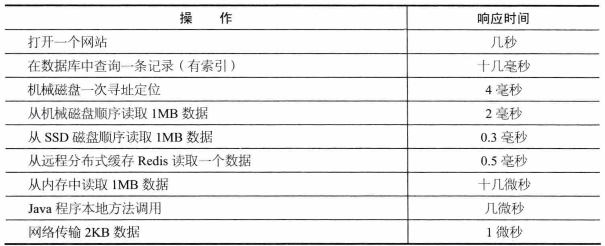
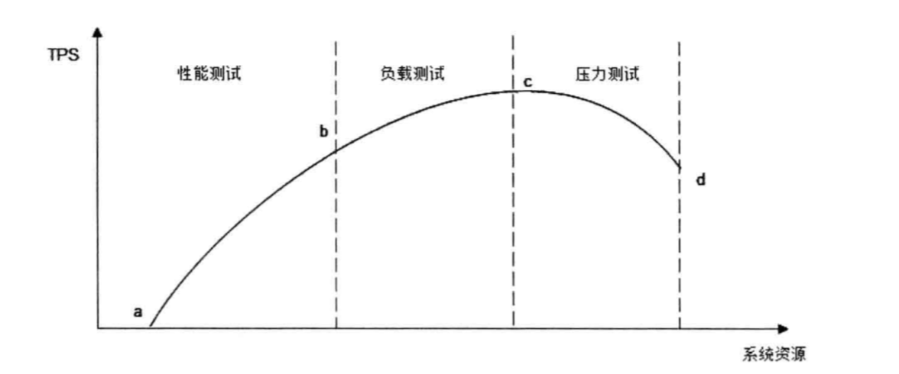

## 一 性能测试指标 

#### 1.1 响应时间

开发人员关注的性能指标包括：响应延迟、系统吞吐量、并发处理能力、稳定性等。主要的优化手段有：缓存加速数据读取、集群提升吞吐能力、异步消息加快请求响应以及实现削峰等。  

从运维角度看，更关注基础设施性能和资源利用率，如网络运营商的贷款能力、服务器硬件的配置、数据中心网络架构、服务器和网络贷款的资源利用率等。主要优化手段有：建设骨干网、使用高性价比定制服务器、利用虚拟化技术优化资源利用等。  

常用系统操作响应时间表：  
  

为了保证准确性，在测试时，一般请求要重复执行1万次，用请求时间总和除以1万，得到单次请求的响应时间。  

#### 1.2  并发数

并发数：指系统能够同时处理请求的数目，这个数字也反映了系统的负载特性。对于网站而言，并发数即网站并发用户数，指同时提交请求的用户数目：  
`网站系统用户数 >> 网站在线用户数 >> 网站并发用户数 `。  

测试程序通过多线程模拟并发用户的办法来测试系统的并发处理能力，当然为了能够真实模拟用户的行为，测试程序并不是启动多线程后不停的发送请求，而是在两次请求之间加入一个随机等待时间，这个时间成为思考时间。  

#### 1.3 吞吐量

吞吐量指单位时间内系统处理的请求数量，提现系统的整体处理能力，对网站来说，可以用“请求数/秒”来衡量，也可以用”访问人数/天“或者”处理的业务数/小时“衡量。  

TPS（每秒事务数）是吞吐量的常用量化指标，此外还有HPS（每秒HTTP请求数），QPS（每秒查询数）等。  

#### 1.4 性能计数器

性能计数器是描述服务器、操作系统性能的数据指标，包括：System Load、对象与线程数、内存使用、CPU使用、瓷片与网络I/O等指标。  

System Load即系统负载，指当前正在被CPU执行和等待被CPU执行的进程数目综合，是反映系统忙闲程度的重要指标。多核CPU的情况下，完美情况是所有CPU都在使用，没有进程在等待处理，所以Load的理想值是CPU的数目，Load值低于CPU数目，表示CPU有空闲，存在资源浪费，Load值高于CPU数目，表示进行在排队等待CPU调度，表示系统资源不足。  

贴士：使用top命令查看上述指标。

## 二 性能测试方法

性能测试有很多方法：
- 性能测试：对系统不断施加压力，验证系统在资源可接受范围内，是否能达到设计初期规划的目标
- 负载测试：对系统不断增加并发请求，直到系统指标达到安全临界值，如资源饱和。
- 压力测试：超过安全负载时，继续施加压力，直到系统崩溃，此时可以获得系统最大压力承受能力
- 稳定性测试：不均匀的对系统提升业务压力，让系统运行较长一段时间，检测其稳定性

性能测试曲线如图（随着并发请求数的增加，系统资源消耗变化）：
  

图中a~b代表网站的日常运行区间，大部分负载压力集中在这一区间，c是系统最大负载点，d是系统崩溃点。  

相应的用户响应时间变化如图：  
 

## 三 性能优化策略

#### 3.0 整体策略

要着手性能优化，首先要寻找系统瓶颈，分而治之，逐步优化。排查步骤有：
- 检查请求处理的各环节日志，分析哪个环节响应时间不合理，超过预期
- 检查监控数据，分析影响性能的主要因素是内存、磁盘、网络、CPU中的哪些
- 分析是代码问题、架构设计问题、系统资源不足问题中的哪些

#### 3.1 web前端性能优化

- 减少http请求：合并CSS、js、图片base64化、精灵图等。
- 使用浏览器缓存：因为静态资源更新频率很低，可以缓存起来，改善性能，也算是减少http请求的策略
- 启用压缩：GZi压缩效率可达80%以上，但是要权衡压缩带来的服务器资源占用
- 避免大cookie传输
- cdn加速：本质仍然是缓存，使用距离用户较近的服务端发送数据给用户
- 反向代理：反向代理有一定的安全作用的，当然静态文件也会缓存到反向代理服务器。当然有些网站会把动态内容也缓存到代理服务器上，比如热门词条等

#### 3.2 应用服务器性能优化

应用服务器优化的手段主要有：使用分布式缓存，使用异步，使用集群，优化代码等。  

分布式缓存：  
缓存的本质是一个内存Hash表，数据以kv形式存储到内存Hash表中，其读写的时间复杂度为O(1)。计算KV对中Key的HashCode对应的Hash表索引，可快速访问Hash表中的数据。缓存主要用来存放读写较多，变化较少的数据，如商品类目信息等。数据访问遵循二八定律，即80%的访问落在20%的数据上。  

缓存雪崩：缓存服务崩溃后，数据库因为承受不住压力而宕机。  

缓存预热：

#### 3.3 存储性能优化

