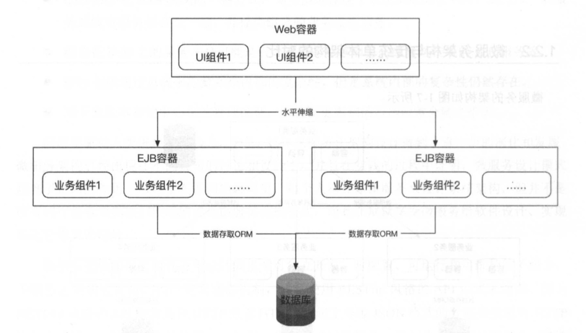

## 一 架构的概念

架构这个词汇可以应用到很多软件、产品、系统中，比如微信架构、Linux架构，MySQL架构、电商系统架构、订单架构等等。  

一个成熟的大型软件本身是一个系统，但是也会由很多基础子系统构建而来，系统与子系统有着一定的层级关系，比如微信系统包括：
- 聊天系统
- 登录系统
- 支付系统
- 朋友圈系统
  - 评论：数据防刷、审核系统、存储系统
  - 点赞
  - 动态

评论、审核等子系统本身也会包含非业务方向的模块、组件，如mysql，kafka，他们分别是存储系统、消息系统。  

相应的，架构也需要从不同的角度去对产品、业务观察，如一个学生管理系统：
- 从业务角度分析，其架构是：登录注册模块、个人信息管理模块、成绩信息模块
- 从部署角度分析，其架构是：Nginx-->WebServer-->MySQL
- 从开发角度分析，其架构师：MVC

所以，一个系统的架构要综合的描述起来，需要将其系统本身、子系统、模块、组件等概念都要描绘进去，构成一个广义的、可视的结构，才能称之为架构。  

## 二 架构诞生背景

最初的软件都是极其简单复杂的，之所以演化到今天，一定的原因是应对软件危机：
- 第一次软件危机：
  - 背景：位于20世纪60~70年代，经典案例是美国IBM操作系统研发，耗费了大量时间、人力、金钱，但是项目却没有成功（见《人月神话》）
  - 原因：Fortran、Lisp等高级语言出现解放了开发者生产力，但软件的逻辑变得更复杂，没有合理的软件工程理念，软件文件结构庞杂，造成项目进度失控
  - 解决：提出了”软件工程“，”结构化程序设计“等概念，要求软件开发思想为：”自顶向下，逐步细化、模块化“
- 第二次软件危机：
  - 背景：位于20世纪80年代，软件生产力跟不上硬件、业务的发展
  - 原因：软件的扩展变得极其困难
  - 解决：面向对象思想被大规模应用（不过该思想提出的很早）

为了应对软件危机，架构的思想概念被人们逐渐应用于生产实践。

## 三 架构设计的目的

架构的设计都必须基于业务现实而设计，而不能为了架构而架构。产品的类型不同、规模不同、研发团队不同都会对架构设计产生影响。  

架构设计的最根本目的还是为了解决软件的复杂度问题。所以研究架构设计的目的，无非是探索软件走向复杂的缘由，并利用相应的架构设计理念来应对这些问题。

下面列举软件走向复杂的几个主要原因，也是架构设计要解决的问题
- 高性能
- 高可用
- 可扩展性
- 低成本、安全、规模等

## 四 架构的变迁

比较明显的四个时代是：
- 1 单体应用：单机服务器时代
- 2 组件化：分布式组件化应用时代
- 3 SOA：面向服务架构
- 4 微服务架构

当然，现在在微服务基础上又出现了趋于热门的云原生架构。  

## 五 四个时代的特征

### 5.1 单体应用时代

该时期的软件架构都是单一架构，纯粹为了面向功能而实现业务。该架构目前也仍然是很多初创公司架构，因为其架构单一，体系简单，适合快速开发项目原型。   

该架构缺点：
- 大量代码组织在一起，协同开发较为困难
- 系统高度集中，非核心部分出现问题也能让整个系统瘫痪，这是单机应用最严重的问题
- 代码耦合度极高，当系统庞大之后，维护、扩展困难
- 对开发语言依赖较大，无法依据场景选择合适的技术体系

### 5.2 组件化应用时代

软件复用理念兴起后，软件开发出现了新的思潮，组件化也随之诞生。开发的重心从数据库转移到了业务逻辑层，引入了应用服务器的概念，业务本身也进行了MVC分层，服务的粒度抽象为模块化组件，所有的组件耦合在一个项目中，并且配合运行在一个JVM进程中。  

分层是企业应用最常见的架构模式，将系统在横向维度上切分成几个部分，每个部分负责一部分相对单一的职业，通过上层对下层的依赖和调用组成一个完整的系统，如网络的七层通信协议，计算机的操作系统其实都可以视为一种分层结构。  

web系统MVC分层分层结构：
- 应用层：负责具体业务和视图展示，如网站首页和搜索输入结果展示
- 服务层：为应用层提供服务支持，如用户管理，购物车
- 数据层：提供数据存储和访问服务，如缓存、数据库、搜索引擎等

分层很好的将庞大的系统切割后更便于维护和开发，但是也存在一定问题：开发中需要严格遵循分层架构的约束，禁止跨层次调用或者逆向调用。  

web应用中基础的分层实践MVC，如图所示：

MVC在业界的经典代表是Java的SSH三大框架（虽然现在过时了，但是经典还是经典）：   

整体而言，该阶段是单体应用时代在开发方式上的进步，代表性的技术有：EJB，UML，业务模型，敏捷开发等。  

### 5.3 SOA-面向服务架构

SOA（Service Oriented Architecture）即面向服务架构。 

在 SOA 服务化发展之前，企业对信息化系统进行了初步建设，这些企业信息化系统由异构技术技实现：不同的开发语言、操作系统和系统软件为了快速响应新的市场，完全使用新技术重建所有的信息化系统是不现实的，在现有的服务系统上增加新的功能或者叠加新的服务化系统的方法更加可行，这需要对这些现有的信息化系统和新增的信息化系统进行组合。 SOA 凭借其松藕合的特性，正好应用于这一场景，使得企业可以按照服务化的方式来添加新服务或升级现有服务，来解决新业务对流程编排的需要，甚至可以通过不同的渠道来获得外部服务，并与企业的现有应用进行组合，来提供新的业务场景所需要的信息化流程。  

在SSH时代，服务的特点是单体化的，服务的粒度抽象为模块化组件，所有组件杂糅在一个开发项目中，并且配置和运行在一个JVM进程中。如果某个模块化组件需要升级上线，需要所有整个系统重启，会导致所有组件提供的功能在重启期间不可用。这在传统企业级软件中并没有太大的问题，但是在互联网应用中，这是致命的。  

SOA服务化将应用程序的模块化组件通过定义明确的接口和契约联系起来，接口是采用中立的方式进行定义的，独立于某种语言、硬件和操作系统，通常通过网络通信来完成，但是并不局限于某种网络协议，可以是应用层的HTTP，也可以是消息队列协议，甚至可以是约定的某种数据库存储形式。这使得各种各样的系统中的模块化组件可以以一种统一和通用的方式进行交互。  

总结：SOA将模块化组件从单一进行中进一步拆分，形成独立的对外提供服务的网络化组件，每个网络组件通过某种网络协议对外提供服务。  

SOA特点：
- SOA 定义了良好的对外接口，通过网络协议对外提供服务，服务之间表现为松耦合性，松耦合性具有灵活的特点，可以对服务流程进行灵活组装和编排，而不需要对服务本身做改变
- 组成整个业务流程的每个服务的内部结构和实现在发生改变时，不影响整个流程对外提供服务，只要对外的接口保持不变，则改变服务内部的实现机制对外部来说可以是透明的
- SOA 在这一时代的数据通信格式通常为 XML，因为 XML 标记定义在大规模、 高并发通信过程中，冗余的标记会给性能带来极大的影响，所以后来被 JSON 所取代
- SOA 通过定义标准的对外接口，可以让底层通用服务进行下沉，供多个上层的使用方同时使用，增加了服务的可重用性
- SOA 可以让企业最大化地使用内部和外部的公共服务，避免重复造轮子，例如：通过SOA 从外部获取时间服务。

SOA有两个主流实现方式: Web Service 和 ESB。  

**webservice**：  

每个服务之间是对等的，并且互相是解耦的，通过WSDL定义的服务发现接口进行访问，并通过SOAP协议进行通信。SOAP协议通常是一种在 HTTP或者 HTTPS 通道上传输 XML 数据来实现的协议，但是每个服务都要依赖中心化 Web Service 目录来发现现存的服务。如图所示：

  

**ESB**：  

ESB是企业服务总线的简称，是用于设计和实现网络化服务交互和通信的软件模型，主要用于企业信息化系统的集成服务场景中。ESB服务没有中心化的服务节点，每个服务提供者都是通过总线的模式插入系统，总线根据流程的编排负责将服务的输出进行转换并发送给流程要求的下一个服务进行处理。如图所示：

  

### 5.4 微服务时代

SOA的问题：
- webservice问题：依赖中心化服务发现机制；XML通信格式数据冗余严重；服务化管理和治理设施不完善。
- ESB问题：ESB上的服务本身是个过重的整体服务；ESB总线隐藏了系统复杂性但是并未消灭复杂性；总线本身属于中心化管理模型，系统变更影响范围大。

新时代诞生的微服务架构倡导将软件应用设计成多个可独立开发、可配置、可运行、可维护的子服务，自服务之间通过良好的接口通信机制（REST API或者rpc等等）进行交互，这些服务不需要中心化的统一管理，每个服务功能自治，并且可以由不同的语言、系统、平台实现。  

微服务架构图：  

  

微服务的特点：
- 微服务把每一个职责单一的功能放在一个独立的服务中。
- 每个服务运行在一个单独的进程中。
- 每个服务有多个实例在运行，每个实例可以运行在容器化平台内，达到平滑伸缩的效果。
- 每个服务有自己的数据存储，实际上，每个服务应该有自己独享的数据库、缓存、消息 队列等资源。
- 每个服务应该有自己的运营平台，以及独享的运营人员，这包括技术运维和业务运营人 员:每个服务都高度自治，内部的变化对外透明。
- 每个服务都可根据性能需求独立地进行水平伸缩。

再看传统的单体架构的伸缩配置：  

  

传统单体架构将所有模块化组件混合运行在了一个服务进程中，可以对整体服务进程（JMV）进行水平扩展，但是无法对某个模块进行水平扩展，同时模块间的依赖、耦合现象极为严重。  

但是我们仍然能看到微服务架构的一些特点与 SOA 服务化架构相似，事实上微服务架构与 SOA 服务化架构并不冲突，它们一脉相承，微服务架构是服务化架构响应特定历史时期的使用场景的延续，是服务化进行升华井落地的一种实现方式。 SOA 服务化的理念在微服务架构中仍然有效，微服务在 SOA 服务化的基础上进行了演进和叠加，形成了适合现代化应用场景的一个方法论。  

当然微服务和SOA在服务粒度和部署方式上明显不同：
- 部署方式：微服务的多个服务通过docker等容器，运行在单一进程内，互不影响，SOA是将所有组件打包在war包内，统一部署在一个应用服务器上
- 服务粒度：SOA对粒度没有要求，值强调接口契约规范，微服务倡导职责单一，要求粒度极小