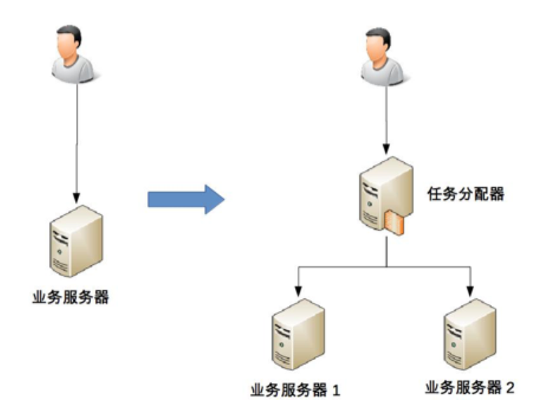
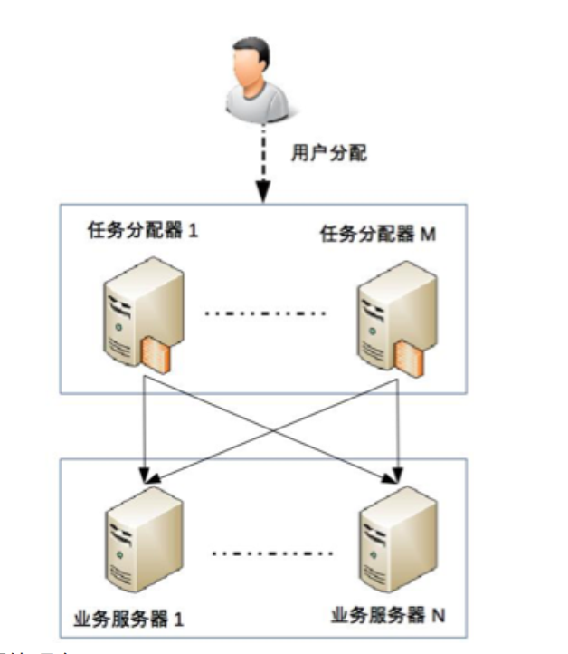
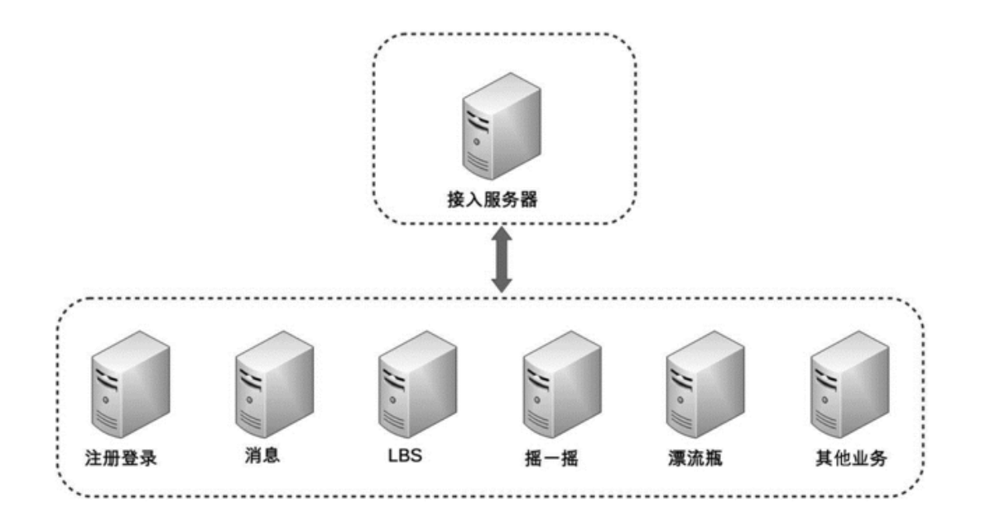
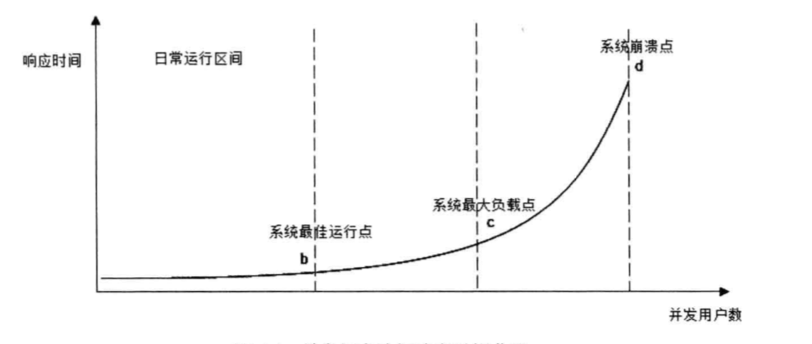

## 一 高性能架构简介

### 1.1 单机应对高性能时的复杂性

高性能是软件最核心的复杂度来源。随着软件服务群体的规模逐渐变大，高性能会逐渐成为企业最迫切的业务需求，这在互联网公司尤其常见。  

单机性能提升的办法：
- 多进程：操作系统使用进程来对应任务，每个进程之间互不相关，拥有独立的内存空间，CPU利用时间片轮转法，达到”宏观“上的并行运行效果。进程称为了操作系统上分分配资源的最小单元。
- 多线程：为了解决进程内部只能串行处理的问题，衍生了线程，可以认为多线程是单个进程内部的多个子任务，线程也成了操作系统调度的最小单元。
- 非阻塞I/O：在处理I/O时，CPU处于空闲，可以用于其他计算
- 多核心：操作系统的本质仍然是分时系统，并没有做到真正的并行，多核处理器（SMP方案）可以从真正意义上让多任务实现并行

从上可见，即使是单机系统，其本质内部为了应对高性能，也进行了十分复杂的改进与优化。  

### 1.2 多机集群复杂性-任务分配

虽然单机服务器具备多进程、多线程能力，但是在动辄千万、上亿级别的流量压力下，单机性能实在堪忧。这时候就需要更多的机器进行配合才能实现一个复杂的任务。集群、多机部署自然就带来了极大复杂性，如：任务如何分解、任务如何分配服务器资源。  

下图演示单机到两台机器的演变：  

由于多台业务服务器的引入，需要一台额外的任务分配器来是在业务的负载均衡，这个分配器可以有下列多种选择：
- 硬件网络设备（F5、交换机）
- 软件网络设备（LVS）
- 负载均衡软件（Nginx、HAProxy）

选择合适的任务分配器也是一件复杂的事情，需要综合考虑性能、成本、可维护性、可用性等各方面的因素。    

任务分配器和真正的业务服务器之间有连接和交互（即图中任务分配器到业务服务器的连接线），需要选择合适的连接方式，并且对连接进行管理。例如，连接建立、连接检测、连接
中断后如何处理等。此外，任务分配器还需要增加负载算法，如轮询、加权等。  

更重要的是，随着流量的增大，任务分配器本身也会成为瓶颈，这时候就需要引入多个分配器：  

此时就需要将不同的用户分配到不同的任务分配器上，常见的方法包括： DNS 轮询、智能 DNS、CDN（Content Delivery Network，内容分发网络）、GSLB 设备（Global Server Load Balance，全局负载均衡）等。  

### 1.3 多机集群复杂性-任务分解

在1.2中的架构能够突破单机性能的瓶颈，只需要增加机器即可。如果业务本身非常复杂，一些子业务对性能极度敏感，一些业务无需过多考虑性能，那么类似1.2的扩展就会让部分机器出现资源浪费。  

此时需要对任务进行分解，以微信后台架构为例：  

  

当然任务分解也并不是分解的越多越好，频繁的跨网络请求往往反而让系统的延迟更高，这里要对任务分解设置合理的度。  

## 二 性能测试指标 

### 2.1 响应时间

开发人员关注的性能指标包括：响应延迟、系统吞吐量、并发处理能力、稳定性等。主要的优化手段有：缓存加速数据读取、集群提升吞吐能力、异步消息加快请求响应以及实现削峰等。  

从运维角度看，更关注基础设施性能和资源利用率，如网络运营商的贷款能力、服务器硬件的配置、数据中心网络架构、服务器和网络贷款的资源利用率等。主要优化手段有：建设骨干网、使用高性价比定制服务器、利用虚拟化技术优化资源利用等。  

常用系统操作响应时间表：  
  

为了保证准确性，在测试时，一般请求要重复执行1万次，用请求时间总和除以1万，得到单次请求的响应时间。  

### 2.2  并发数

并发数：指系统能够同时处理请求的数目，这个数字也反映了系统的负载特性。对于网站而言，并发数即网站并发用户数，指同时提交请求的用户数目：  
`网站系统用户数 >> 网站在线用户数 >> 网站并发用户数 `。  

测试程序通过多线程模拟并发用户的办法来测试系统的并发处理能力，当然为了能够真实模拟用户的行为，测试程序并不是启动多线程后不停的发送请求，而是在两次请求之间加入一个随机等待时间，这个时间成为思考时间。  

### 2.3 吞吐量

吞吐量指单位时间内系统处理的请求数量，提现系统的整体处理能力，对网站来说，可以用“请求数/秒”来衡量，也可以用”访问人数/天“或者”处理的业务数/小时“衡量。  

TPS（每秒事务数）是吞吐量的常用量化指标，此外还有HPS（每秒HTTP请求数），QPS（每秒查询数）等。  

### 2.4 性能计数器

性能计数器是描述服务器、操作系统性能的数据指标，包括：System Load、对象与线程数、内存使用、CPU使用、瓷片与网络I/O等指标。  

System Load即系统负载，指当前正在被CPU执行和等待被CPU执行的进程数目综合，是反映系统忙闲程度的重要指标。多核CPU的情况下，完美情况是所有CPU都在使用，没有进程在等待处理，所以Load的理想值是CPU的数目，Load值低于CPU数目，表示CPU有空闲，存在资源浪费，Load值高于CPU数目，表示进行在排队等待CPU调度，表示系统资源不足。  

贴士：使用top命令查看上述指标。

## 三 性能测试方法

性能测试有很多方法：
- 性能测试：对系统不断施加压力，验证系统在资源可接受范围内，是否能达到设计初期规划的目标
- 负载测试：对系统不断增加并发请求，直到系统指标达到安全临界值，如资源饱和。
- 压力测试：超过安全负载时，继续施加压力，直到系统崩溃，此时可以获得系统最大压力承受能力
- 稳定性测试：不均匀的对系统提升业务压力，让系统运行较长一段时间，检测其稳定性

性能测试曲线如图（随着并发请求数的增加，系统资源消耗变化）：
 

图中a~b代表网站的日常运行区间，大部分负载压力集中在这一区间，c是系统最大负载点，d是系统崩溃点。  

相应的用户响应时间变化如图：  

## 四 性能优化策略

#### 4.0 整体策略

要着手性能优化，首先要寻找系统瓶颈，分而治之，逐步优化。排查步骤有：
- 检查请求处理的各环节日志，分析哪个环节响应时间不合理，超过预期
- 检查监控数据，分析影响性能的主要因素是内存、磁盘、网络、CPU中的哪些
- 分析是代码问题、架构设计问题、系统资源不足问题中的哪些

#### 4.1 web前端性能优化

- 减少http请求：合并CSS、js、图片base64化、精灵图等。
- 使用浏览器缓存：因为静态资源更新频率很低，可以缓存起来，改善性能，也算是减少http请求的策略
- 启用压缩：GZi压缩效率可达80%以上，但是要权衡压缩带来的服务器资源占用
- 避免大cookie传输
- cdn加速：本质仍然是缓存，使用距离用户较近的服务端发送数据给用户
- 反向代理：反向代理有一定的安全作用的，当然静态文件也会缓存到反向代理服务器。当然有些网站会把动态内容也缓存到代理服务器上，比如热门词条等

#### 4.2 应用服务器性能优化

应用服务器优化的手段主要有：使用分布式缓存，使用异步，使用集群，优化代码等。  

缓存本质：    
缓存的本质是一个内存Hash表，数据以kv形式存储到内存Hash表中，其读写的时间复杂度为O(1)。计算KV对中Key的HashCode对应的Hash表索引，可快速访问Hash表中的数据。缓存主要用来存放读写较多，变化较少的数据，如商品类目信息等。数据访问遵循二八定律，即80%的访问落在20%的数据上。  

缓存雪崩：  
缓存服务崩溃后，数据库因为承受不住压力而宕机。  

缓存预热（warm up）：  
缓存中存放的是热点数据，这些数据是缓存系统使用LRU（最近最久未用算法）对不断访问的数据筛选淘汰出来的，这个过程耗时较长。重新启动的系统，在重建缓存数据过程中，会消耗大量资源，从而造成系统整体性能和负载的降低，所以最好在缓存系统启动时就把热点数据加载好。  

缓存穿透：  
请求的数据在缓存中不存在，请求到达了数据库。该现象一般是因为不合理的业务造成，简单对策是将不存在的数据也缓存起来（value设置为null）。  

分布式缓存：  
分布式缓存是指缓存部署在多个服务器组成的集群中，以集群方式提供缓存服务，常见的分布式缓存产品有Memcached等。

消息队列与异步操作：  
使用消息队列后，用户请求的数据发送给消息队列后立即返回，再由消息队列的消费者进程（通常该进程独立部署在专门的服务器集群上）从消息对垒中获取数据，异步写入数据库。该方式可以大大降低用户的响应延迟。消息队列还可以用作削峰处理：将短时间内高并发产生的事务消息存储在消息队列中，该策略经常用于秒杀系统。注意：为了防止数据处理出现失败，应该子啊真正处理完成后，将响应结果通过邮件发送给用户，即任何可以晚点做的事情都应该晚点再做。  

代码优化：  
- 多线程、协程：CGI时代，每个请求都会创建一个独立的系统进程，但是单台服务器并发用户可能达到数百，使用多线程方式能有效提升响应能力。并发部分将会在并发章节详细介绍。
- 资源复用：尽量减少开销很大的系统资源创建和销毁，如数据库连接，网络通信连接，复杂对象创建等，开发上主要以单例模式、对象池等方式实现复用。  
- 垃圾回收：合理利用垃圾回收机制以及参数调优

#### 4.3 存储性能优化

存储性能优化主要针对数据库软件与磁盘而言，比如使用LSM树结构，使用RAID（廉价磁盘冗余阵列）、使用MapReduce并发计算任务框架等。  

