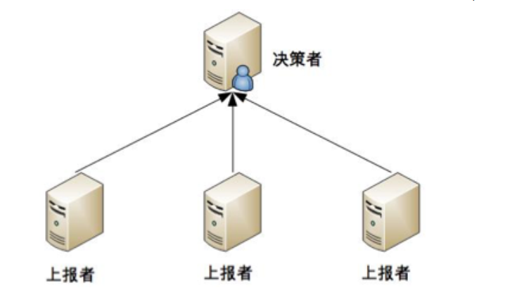
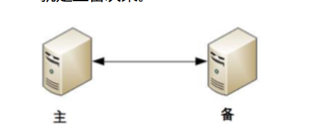
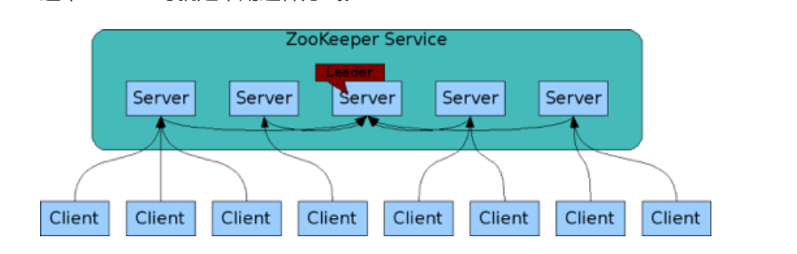
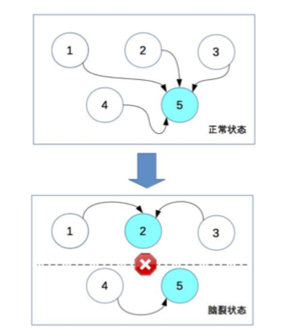

## 一 高可用架构的衡量

注意可用性与可靠性的区别：
- 可用性：Avaliability，是系统可以被使用的时间描述
- 可靠性：Reliability，是系统无效时间间隔的描述

业界通常使用多个9来衡量网站的可用性，如：可用性是4个9，即99.99%可用，也即一年大约最多53分钟不可用。
```
网站不可用时间 = 故障修复时间点 - 故障报告时间点
网站年度可用性指标 = (1 - 网站不可用时间 / 年度总时间) * 100%
```

对于大多数系统而言：
- 2个9基本可用，网站年度不可用时间小于88小时
- 3个9是较高可用，网站年度不可用时间小于9小时
- 4个9则具备自动回复能力，年度不可用时间小于53分钟
- 5个9是极高可用，网站年度不可用时间小于5分钟


影响可用性的一些场景：
- 应用的升级发布
- 应用发生故障
- 应用访问压力激增
- 外部依赖异常

## 二 高可用架构设计

### 2.1 高可用架构整体设计

提升可用性的最简单、有效的方法就是：消除单点、多借点部署！一般要求节点数为n+2，这里不是n+1的原因是：升级时，要升级一个节点，剩下2个节点正常提供服务时，还可以允许一个节点失效。  

各层手段对应措施：
- 应用层：通过负载均衡将一组服务器组成的集群共同对外提供服务，当负载均衡的心跳检测手段监控到某台服务器不可时，将该服务器从集群剔除
- 服务层：同样通过集群方式实现高可用，通过分布式服务调用框架访问，由该框架实现负载均衡，通过服务注册中心对提供服务的服务器进行心跳检测，发现服务不可用，立即通知客户端程序修改服务访问列表，剔除不可用服务器
- 数据层：保证数据写入时数据同步复制，写入多太服务器，实现数据冗余备份，宕机后，应用程序将访问切换到备份数据库服务器上

### 2.2 应用层session管理

在2.1中，应用层可以利用负载均衡实现高可用，当应用是无状态时，这种高可用很容易实现。但是现实是业务总是有状态的，尤其是交易类电商网站的购物车、社交网站的登录状态等等。在集群中，保证每次请求能够获得正确的Session非常复杂。  

主要手段：
- Session复制：早期的集群Session管理机制，在集群中的服务器之间同步Session对象，每台都保存所有用户的Session信息，但是大量占用服务器和网络资源（通信原因），在大型系统中，用户可能达到千万，session异常庞大，该方案肯定不适合
- Session绑定：Session绑定可以利用负载均衡原地址Hash算法实现，负载均衡器将来源于同一IP的请求分发到同一台服务器上，该方法称为会话黏滞。该方案的缺点是被分发到的服务器一旦宕机，业务就暂停了。该方案很少使用。
- Session服务器：独立部署Session服务器集群，统一管理Session。其实就是讲应用服务器的状态进行了分离。

### 2.3 服务层高可用

服务层一般负责提供基础公共服务，大型系统的基础服务通常采用分布式部署，然后被具体的应用远程调用。由于其也粗在无状态特性，可以使用类似负载均衡的失效转移策略实现高可用。  

具体实践中，还有以下方式：
- 分级管理：核心应用和服务采用更好的硬件，同时服务的部署也进行隔离避免连锁故障出现。低优先级的服务通过启动不同的线程或者部署在不同的虚拟机上进行隔离，高优先级的服务则需要部署在不同的物理机上，核心服务和数据可以部署在不同地域的数据中心。  
- 超时设置：超时后，应用程序根据服务调度策略，可选择继续重试或者请求转移
- 异步调用：异步调用可以避免一个服务失败导致整个应用请求失败，当然也不是所有服务都可以使用异步调用。
- 服务降级：高峰访问时期，可以采取降级手段（拒绝服务或者关闭服务）提升系统负载能力
- 幂等性设计：应用调用服务成功后因为网络原因没有收到响应，很容易造成重复调用，这在涉及转账类操作时，后果是严重的。在设计上，应用层不用关心该问题，服务层自身应该保证重复调用和一次调用的结果相同，即服务具有幂等性。有些服务本身是幂等的，比如设置人的性别的男，多少次都一样，但是转账之类的服务需要对交易编号进行校验。

### 2.4 数据层高可用

保证数据高可用的手段主要是数据备份和失效转移机制。备份分为：
- 冷备份：早期手段，即定期将数据复制到存储戒指上物理存档，不能保证最终一致性
- 热备份
  - 异步热备：多分副本写入操作异步完成，应用程序在收到响应时其实只写入了一份，然后由主从机制控制从服务器异步写入
  - 同步热备：应用程序收到响应时多份数据写入成功，此时服务器没有主从之分，完全对等，便于管理，等待响应的时间是操作最慢的服务器的时间。


## 三 高可用状态决策

### 3.1 状态决策不能100%正确

高可用的基础是”状态决策“，即系统需要能够判断当前的状态是正常还是异常，如果出现了异常就要采取行动来保证高可用。  

这里要格外注意的是：状态决策本身有错误或偏差，那么整个后续的操作都是没有意义的，但是在具体实践的过程中，通过冗余来实现的高可用系统，状态决策本质上就不可能做到
完全正确。

### 3.2 常见的决策方式

**独裁式**：一台机器称为决策者，负责收集信息进行决策，其余冗余的个体只是将状态信息上报给决策者，如下图所示：  

  

由于只有一个决策者，这时候就不会出现决策混乱的问题，但是决策者如果本身发生故障，整个系统就无法实现准确的状态判断了！  

**协商式**：两个独立的个体通过交流信息，然后根据规则进行决策，最常用的协商式决策就是主备决策，如下图所示：

  

这个架构的协商规则可以这样设计：
- 2 台服务器启动时都是备机
- 2 台服务器建立连接，交换状态信息
- 某 1 台服务器做出决策，成为主机；另一台服务器继续保持备机身份

协商式的问题在于如果两者的信息交换出现问题（比如主备连接中断），此时状态决策应该怎么做，目前来看都是有瑕疵的。

**民主式**：多个独立的个体通过投票的方式来进行状态决策。例如，ZooKeeper 集群在选举 leader 时就是采用这种方式，如下图所示：  

  

民主式和协商决策类似，都是独立的个体之间交换信息，每个个体自己做出决策，按照多数取胜规则确定最终状态，该步骤实现的经典算法有：Paxos，Raft。

### 3.3 脑裂

民主式有一个固有缺陷：`脑裂`。这个词来源于医学，指人体左右大脑半球的连接被切断后，左右脑因为无法交换信息，导致各自做出决策，然后身体受到两个大脑分别
控制，会做出各种奇怪的动作。  

脑裂的根本原因是，原来统一的集群因为连接中断，造成了两个独立分隔的子集群，每个子集群单独进行选举，于是选出了 2 个主机，相当于人体有两个大脑了。  

   

为了解决脑裂问题，民主式决策的系统一般都采用“投票节点数必须超过系统总节点数一半”规则来处理。上图中节点4、节点5组成的子集群会因为总节点数没有过半而不会选举。  

虽然这样解决了脑裂问题，但是降低了系统的整体的可用性，如果不是因为脑裂造成的分离，而是节点确实故障了，此时系统无法选出主节点，整个系统就相当于宕机了！

### 3.4 初探CAP理论

CAP理论：
- 数据持久性：数据持久化在多个备份上，不会因为某个存储故障而丢失数据
- 数据可访问性：在切换备份时，该过程完成较慢，或者切换时需停止用户访问数据，这段时间内数据是无法访问的
- 数据一致性：多备份时，需要保证多个备份写入数据的一致性

为了保证数据的高可用，会牺牲另一个指标，即数据一致性。  

CAP理论认为，数据存储系统无法同时满足数据一致性（Consistency），数据可用性（Availibility），分区耐受性（Patition Tolerance）.  

  

大型系统中，数据的扩张速度极快，因此可伸缩性，也即耐受挫性比不好少，由于分布式的必定存在，必须保证分布式的高可用，所以通常大型系统都会采用存储系统的可用性A与伸缩性P，在一定程度上放弃一致性C。  

数据一致性可以分为如下几点：
- 数据强一致：各个副本的数据在物理存储中总是一致
- 数据用户一致：物理上可能不一致，但是终端用户访问时，通过纠错校验机制，保证一个确定、正确的数据返回
- 数据最终一致：较弱的一致性，物理存储和终端访问都有可能不一致（同一用户连续访问数据不一致），但是系统经过一段较短时间自我修正，数据最终到达一致

## 四 软件质量保证

### 4.1 系统更新

在单机系统上，系统更新基本代表着服务器的重启，用户失去重启时间内的响应，在大用户量情况下，这种显现是不被允许的，可以采取如下措施：  


### 4.2 其他措施

- 自动化测试
- 预发布验证：内部搭建一批没有配置负载均衡的服务器，用于验证新版系统
- 灰度发布：新版系统在线上发生故障后，需要回滚，在分布式集群环境中，回滚的时间漫长。为了避免该问题，可以每天只发布一定量的集群服务器，持续几天发布完毕。