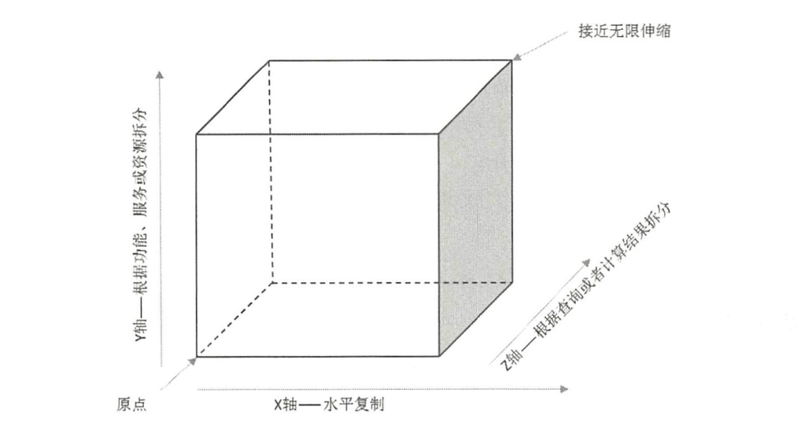

## 一 伸缩性概念

> 可伸缩：无需改变软件的软硬件设计，仅仅通过改变部署的服务器数量就可以扩大或者缩小网站的服务处理能力。 

软件从单台服务器到分布式系统演化过程中，最重要的技术手段是使用服务器集群，通过不断的向集群中添加服务器来增强整个集群的处理能力，这就是伸缩性架构！  
伸缩性架构的一大重要应用是面向类似秒杀的场景，在秒杀活动期间内，并发压力极大，而活动结束后往往又不再需要如此多的服务器集群，良好的可伸缩架构能够很好的应对该业务场景。  

可伸缩性是一种对软件系统计算处理能力的设计指标，在系统扩展成长的过程中，通过很少的改动甚至只是硬件设置的添置，就能实现整个系统能力的线性增长，实现高吞吐量和低延迟性能。   


## 二 伸缩性策略思想

### 1.1 横向扩展

为了提升性能，我们可以做各种扩展：
- 纵向扩展（scale up）：提升单点能力，一般通过硬件升级
- 横向扩展（scale out）：利用多借点提升性能，也称为水平扩展

早期架构设计中，新增服务器总是从现有服务器中分离出部分功能和服务，比如数据库分离，缓存分离，静态资源分离等等。该策略在系统发展的任何阶段都是适用且有效的，具体可以分为两种情况：
- 纵向分离： 即代码分层后分离，将业务处理流程上不同部分分离部署
- 横向分离： 即业务分割后分离，将不同业务模块分离部署

对部署了单一功能的服务器，还可以继续进行集群部署实现伸缩。   

注意：横向扩展能够有效提升系统的吞吐量，但是与此同时，也要保证响应时间不能受到影响（一般提升单机性能，因为响应时间与吞吐量往往存在互斥关系）。  

### 1.2 扩展立方体

AFK扩展立方体（Scalability Cube）将系统在架构上伸缩按照三个维度进行说明：  

   

使用实例：
- X轴：主从复制集群
- Y轴：分库、分表
- Z轴：分片

## 三 伸缩性实战

### 3.1 应用服务器集群伸缩性设计

应用服务器应该设计为无状态的，每次请求都可以发送到应用服务器集群的任意一台上。请求的分发装置即负载均衡器。  

实现负载均衡的办法：
- 重定向：重定向服务器将真实的web服务器地址返回给用户浏览器，浏览器重新请求新的地址
- DNS解析负载均衡：其优点是负载均衡的工作交给了DNS服务商，缺点是DNS存在缓存记录，某台服务器下线时，DNS依然会将域名解析到已下线服务器。生产实践中，DNS解析作为第一级负载均衡手段，即域名解析得到的一组服务器只是负载均衡服务器，然后这组负载均衡服务器将请求分发的真实的web服务器上
- 反向代理：大多数 负载均衡服务器也同时提供反向代理功能，反向代理也称为应用层负载均衡
- IP负载均衡：在网络层修改请求姆比爱地址进行负载均衡。
- 数据链路层负载均衡：在数据链路层修改mac地址进行负载均衡

负载均衡的相关算法：
- 轮询（Round Robin，RR）：每天服务器处理的请求数目相同
- 加权轮询（Weighted Round Robin，WRR）：按照配置的权重分发请求。
- 随机（Random）：随机之后很难均衡，可以使用加权随机算法
- 最少连接（Least Connections）：记录每个应用服务器正在处理的连接数，新请求分发的最少连接的服务器上
- 源地址散列（Sourece Hashing）：根据来源IP进行Hash计算，得到应用服务器，这样来自同一IP的请求总在同一个服务器上处理】

### 3.2 分布式缓存集群的伸缩性设计

分布式缓存服务器的伸缩性不能使用简单的负载均衡手段实现，必须保证新加入缓存服务器后，缓存集群的数据还能被访问到，这是分布式缓存最重要的目标。  

案例：Memcached中的分布式实践。  
```
Memcached的理由算法根据应用程序缓存数据key计算得到写到了哪台缓存服务器，或者应该从哪台服务器读取缓存，这样才能保证缓存命中。
简单的路由算法使用余数Hash：用服务器书除以缓存数据KEY的Hash值，余数为服务器列表下标编号。
    假设现在服务器数目为3，除以Hash值490806430，得到余数1，对应节点node1
    现在新加一台服务器，仍旧使用旧的余数Hash，用4除以Hash值，得到余数为2，对应节点则为node2，缓存就不会命中
解决方案：
    1 在访问量最少的时候扩容缓存服务器集群，扩容后模拟请求逐渐预热缓存，使缓存重新分布
    2 使用一致性Hash算法
```

### 3.3 数据存储服务器集群的伸缩性上设计

最简单的数据库伸缩设计就是主从读写分离，但在大型系统中，即使进行了分库、主从赋值，对一些单表数据很大的表，仍然需要分片。  