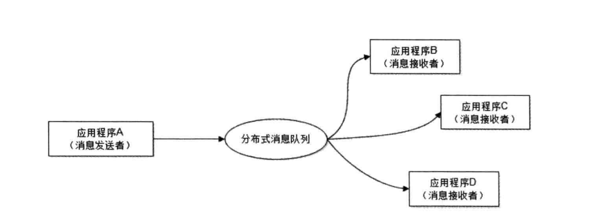

## 一 可扩展架构

> 可扩展架构：在软件层面上，新增的功能对原有系统影响极小，系统功能可持续的进行扩展

可扩展架构表现在对需求的敏捷响应上，是系统架构设计层面的开闭原则（对扩展开放，对修改关闭）。  

可扩展架构设计的核心思想是模块化，并在此基础上，降低模块间的耦合性，提高模块的复用性。  

其实软件的分层、分割也是模块化设计的重要手段，利用该策略将软件分割为若干个低耦合的独立的组件模块，这些组件模块以消息传递及依赖调用的方式聚合成为一个完整的系统。  

在大型软件中，这些模块可以通过分布式部署的方式，独立的模块部署在独立的服务器集群上，从物理上分离模块之间的耦合关系，进一步降低耦合性、提高复用性。  
分离后的不同系统之间可以通过分布式消息队列、分布式服务来进行重新聚合。  

如图所示：  

