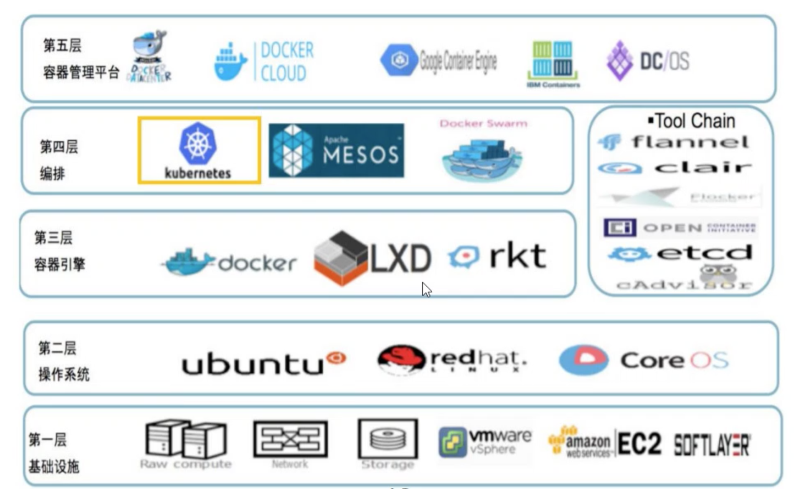
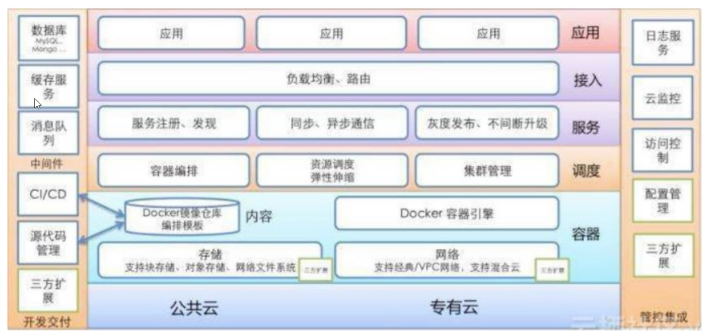
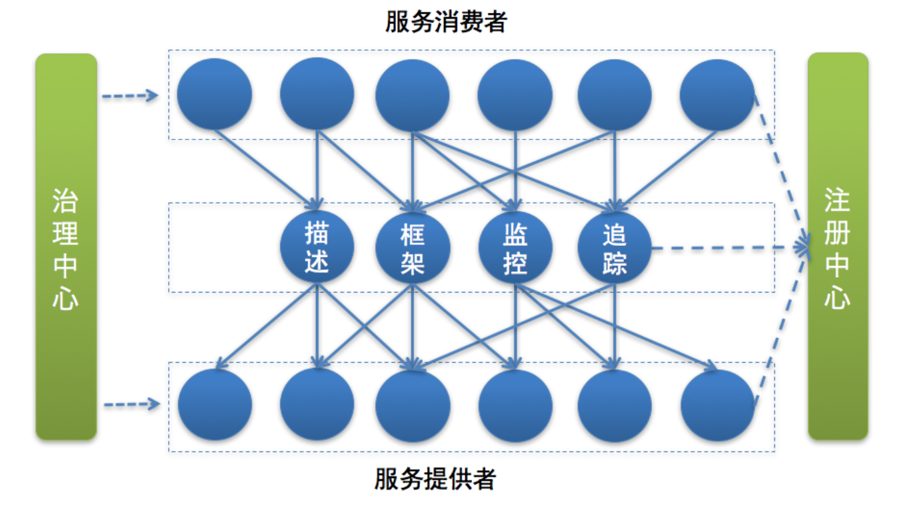

## 一 微服务生态

### 1.0 微服务生态的组成

微服务并不是单纯从开发的角度出发将业务进行微服务化，而是需要许多从硬件、网络到运维、测试的整体环境支持。虽然微服务与硬件、网络、构建和部署管道、服务发现和负载均衡都是分离的，但他们都是微服务生态系统基础设施组成部分。  

微服务生态需要下列四层支持：
- 第4层：微服务层。微服务常用业务开发框架
- 第3层：应用平台层。微服务的平台支持：服务管理平台、运维平台
- 第2层：通信层。涉及服务的通信，如TCP
- 第1层：硬件层。涉及服务的编排，如k8s 

在这些层级内、层级间存在着大量问题以及对应解决方案，如图所示：  
 

#### 1.1 第1层-硬件层

硬件层是微服务运行的基础，按照业务需求，可以是从云服务商提供，也可以是企业自己购置的服务器。  

微服务的硬件层生态主要有：
- 物理服务器
- 数据库系统
- 操作系统
- 资源隔离和抽象
- 配置管理
- 主机级别的监控
- 主机级别的日志

涉及的技术点有：  

 

#### 1.2 第2层-通信层

由于微服务之间的交互会在多个层上进行，所以通信是微服务重要的一环。该层主要生态包括：
- 网络传输：利用HTTP、TCP等进行通信
  - HTTP：RESTFUL
  - TCP RPC调用：Thrift、Dubbp、grpc
- 消息传递：即消息的序列化与反序列化，常用的有json、Thrift、protobuf（性能最高）
- 服务发现与注册：常用技术有Zookeeper、Etcd（CP系统）、Consul、Eureka（AP系统）
- 负载均衡：使用随机算法、轮询、一致性Hash等方式

**RPC、端点、消息传递**：  

微服务通过远程过程调用（RPC）或消息传递方式与其他微服务进行交互，其基本原理是：使用一个特定的协议，一个微服务把符合特定格式的数据通过网络发送到另一个服务或消息代理上。最常见的通信方式是HTTP+REST/Thrift，发送的数据一般是JSON/protocol buffer，不过由于其是同步阻塞的，有些厂商使用消息传递（异步非阻塞）的方式通信，其原理是一个微服务把数据通过网络发送给一个消息代理，消息代理会把消息路由到其他微服务上，消息穿很低可以使用直接请求/响应的方式，也可以使用发布/订阅的方式。值得一提的是Apache的Kafka支持上述两种消息模式。  

虽然消息传递带来的异步特性，但是它没有比REST更强的伸缩性，因为是集中式的，会导致消息对垒和消息代理变成整个生态系统的故障点，异步特性也会导致竞争条件。 

**服务发现与服务注册**：  

单体应用中，所有流量都发送给了负载均衡器，最后被分发到应用服务器上。在微服务架构中，业务流量被路由到不同的应用程序上，再被分发给部署了特定微服务的服务器。为了能够高效的实现上述场景，微服务架构需要在通信层实现：服务发现、服务注册、负载均衡。常见的服务发现技术有：etc、Consul、ZooKeeper。  

#### 1.3 应用平台层 

应用平台层包含了所有独立于微服务的内部工具和服务，其包含的主要内容有：
- 内部自助工具
- 开发环境
- 测试、构建、打包、发布公户
- 部署管道
- 微服务界别的日志与监控

#### 1.4 微服务层

该层属于业务范畴，与基础设施层完全分离。  

## 二 微服务架构全景图

### 2.0 单体服务改造为微服务后的架构图

FTG单体服务改造为微服务的架构：  

一个简单的微服务架构图：  

在该图中，微服务的调用步骤：
- 服务注册：服务提供方按照一定格式的服务描述，向注册中心注册服务，即声明自己能够提供哪些服务、服务地址在哪儿里等等
- 服务调用：服务调用过程中，服务的请求耗时、调用量、以及成功率等指标会被记录下来用作监控，调用经过的链路信息会被记录下来，用于故障定位和问题追踪。在这期间，如果调用失败，可以通过重试等服务治理手段来保证成功率。  

微服务架构在服务调用时的主要依赖组件：
- 服务描述
- 注册中心
- 服务框架
- 服务监控
- 服务追踪
- 服务治理

### 2.1 服务描述

服务调用首先要解决的问题就是服务如何对外描述。比如，你对外提供了一个服务，那么这个服务的服务名叫什么？调用这个服务需要提供哪些信息？调用这个服务返回的结果是什么格式的？该如何解析？这些就是服务描述要解决的问题。  

常用的服务描述方式包括
- RESTful API：常用于 HTTP 协议的服务描述，并且常用 Wiki 或者Swagger来进行管理。
- XML 配置：多用作 RPC 协议的服务描述，通过 *.xml 配置文件来定义接口名、参数以及返回值类型等。
- IDL 文件：IDL 文件方式通常用作 Thrift 和 gRPC 这类跨语言服务调用框架中，比如 gRPC 就是通过 Protobuf 文件来定义服务的接口名、参数以及返回值的数据结构

### 2.2 注册中心

有了服务的接口描述，下一步要解决的问题就是服务的发布和订阅，就是说你提供了一个服务，如何让外部想调用你的服务的人知道。这个时候就需要一个类似注册中心的角色，服务提供者将自己提供的服务以及地址登记到注册中心，服务消费者则从注册中心查询所需要调用的服务的地址，然后发起请求。  

一般来讲，注册中心的工作流程是：
- 服务提供者在启动时，根据服务发布文件中配置的发布信息向注册中心注册自己的服务。
- 服务消费者在启动时，根据消费者配置文件中配置的服务信息向注册中心订阅自己所需要的服务。
- 注册中心返回服务提供者地址列表给服务消费者。
- 当服务提供者发生变化，比如有节点新增或者销毁，注册中心将变更通知给服务消费者。  

### 2.3 服务框架

通过注册中心，服务消费者就可以获取到服务提供者的地址，有了地址后就可以发起调用。但在发起调用之前你还需要解决以下几个问题。  

服务通信采用什么协议？就是说服务提供者和服务消费者之间以什么样的协议进行网络通信，是采用四层 TCP、UDP 协议，还是采用七层 HTTP 协议，还是采用其他协议？  

数据传输采用什么方式？就是说服务提供者和服务消费者之间的数据传输采用哪种方式，是同步还是异步，是在单连接上传输，还是多路复用。  

数据压缩采用什么格式？通常数据传输都会对数据进行压缩，来减少网络传输的数据量，从而减少带宽消耗和网络传输时间，比如常见的 JSON 序列化、Java 对象序列化以及 Protobuf 序列化等。  

### 2.4 服务监控

一旦服务消费者与服务提供者之间能够正常发起服务调用，你就需要对调用情况进行监控，以了解服务是否正常。通常来讲，服务监控主要包括三个流程。  

指标收集。就是要把每一次服务调用的请求耗时以及成功与否收集起来，并上传到集中的数据处理中心。  

数据处理。有了每次调用的请求耗时以及成功与否等信息，就可以计算每秒服务请求量、平均耗时以及成功率等指标。   

数据展示。数据收集起来，经过处理之后，还需要以友好的方式对外展示，才能发挥价值。通常都是将数据展示在 Dashboard 面板上，并且每隔 10s 等间隔自动刷新，用作业务监控和报警等。   

### 2.5 服务追踪

除了需要对服务调用情况进行监控之外，你还需要记录服务调用经过的每一层链路，以便进行问题追踪和故障定位。  

服务追踪的工作原理大致如下：
- 服务消费者发起调用前，会在本地按照一定的规则生成一个 requestid，发起调用时，将 requestid 当作请求参数的一部分，传递给服务提供者。
- 服务提供者接收到请求后，记录下这次请求的 requestid，然后处理请求。如果服务提供者继续请求其他服务，会在本地再生成一个自己的 requestid，然后把这两个 requestid 都当作请求参数继续往下传递。
- 以此类推，通过这种层层往下传递的方式，一次请求，无论最后依赖多少次服务调用、经过多少服务节点，都可以通过最开始生成的 requestid 串联所有节点，从而达到服务追踪的目的。

### 2.6 服务治理

服务监控能够发现问题，服务追踪能够定位问题所在，而解决问题就得靠服务治理了。服务治理就是通过一系列的手段来保证在各种意外情况下，服务调用仍然能够正常进行。  

在生产环境中，你应该经常会遇到下面几种状况:
- 单机故障。通常遇到单机故障，都是靠运维发现并重启服务或者从线上摘除故障节点。然而集群的规模越大，越是容易遇到单机故障，在机器规模超过一百台以上时，靠传统的人肉运维显然难以应对。而服务治理可以通过一定的策略，自动摘除故障节点，不需要人为干预，就能保证单机故障不会影响业务。
- 单 IDC 故障。你应该经常听说某某 App，因为施工挖断光缆导致大批量用户无法使用的严重故障。而服务治理可以通过自动切换故障 IDC 的流量到其他正常 IDC，可以避免因为单 IDC 故障引起的大批量业务受影响。
- 依赖服务不可用。比如你的服务依赖依赖了另一个服务，当另一个服务出现问题时，会拖慢甚至拖垮你的服务。而服务治理可以通过熔断，在依赖服务异常的情况下，一段时期内停止发起调用而直接返回。这样一方面保证了服务消费者能够不被拖垮，另一方面也给服务提供者减少压力，使其能够尽快恢复。

上面是三种最常见的需要引入服务治理的场景，当然还有一些其他服务治理的手段比如自动扩缩容，可以用来解决服务的容量问题。