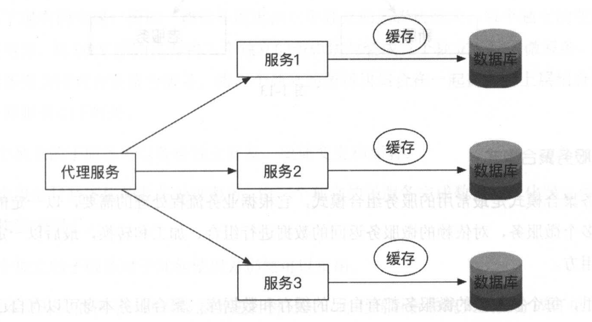
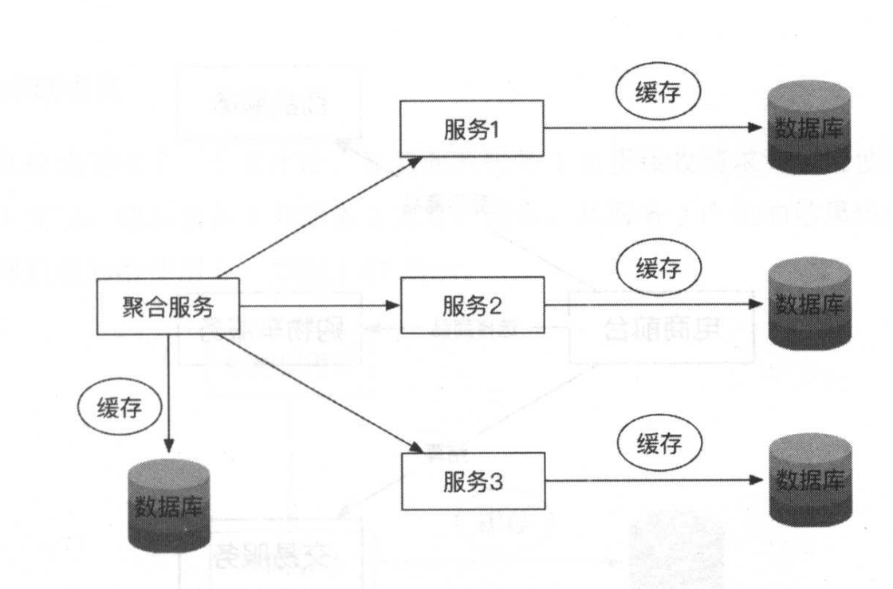
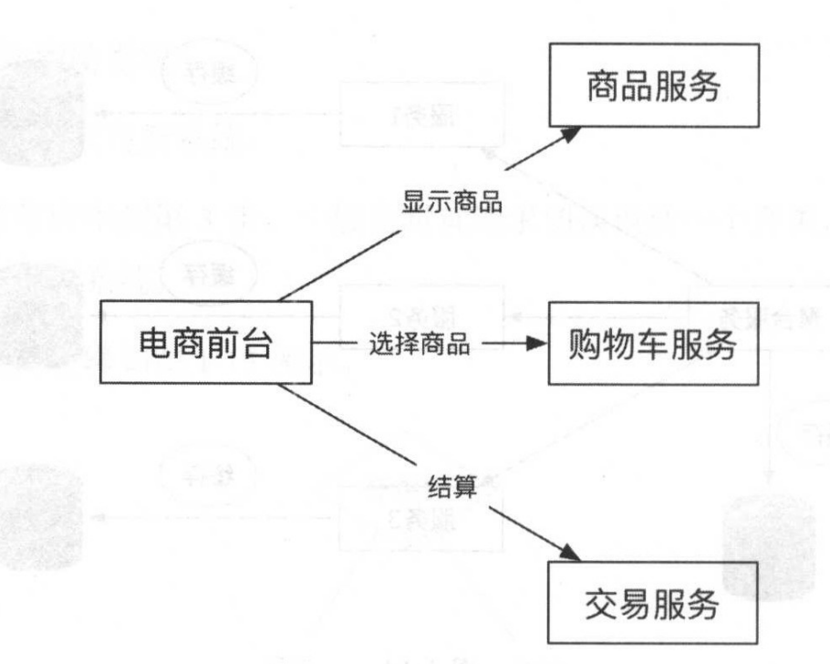
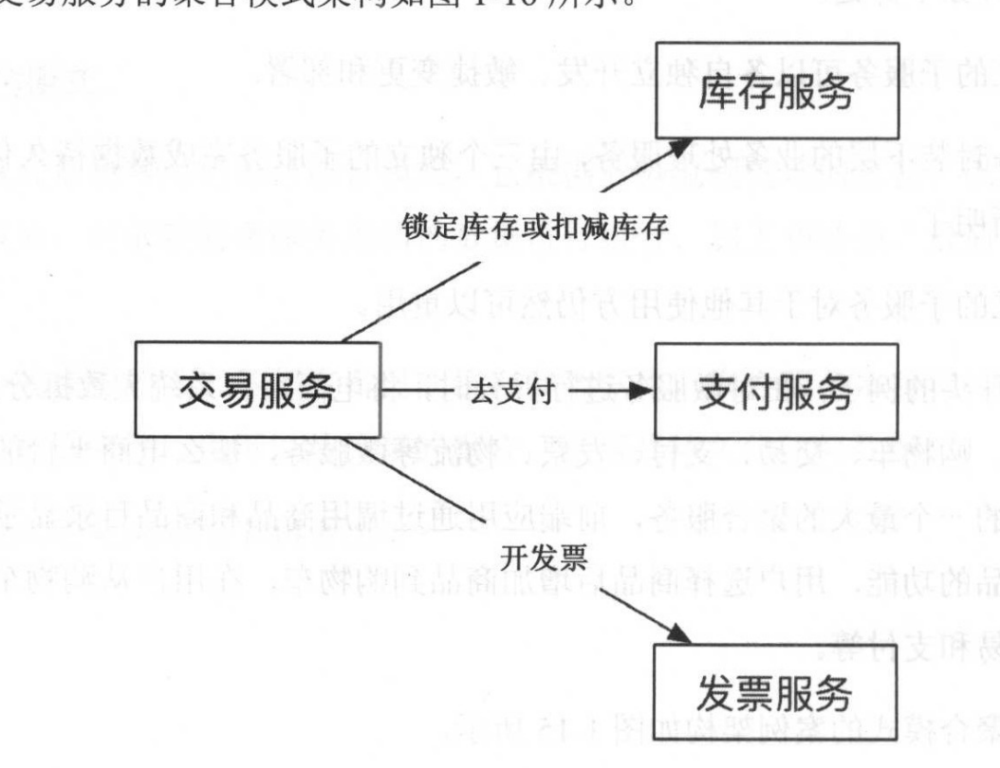
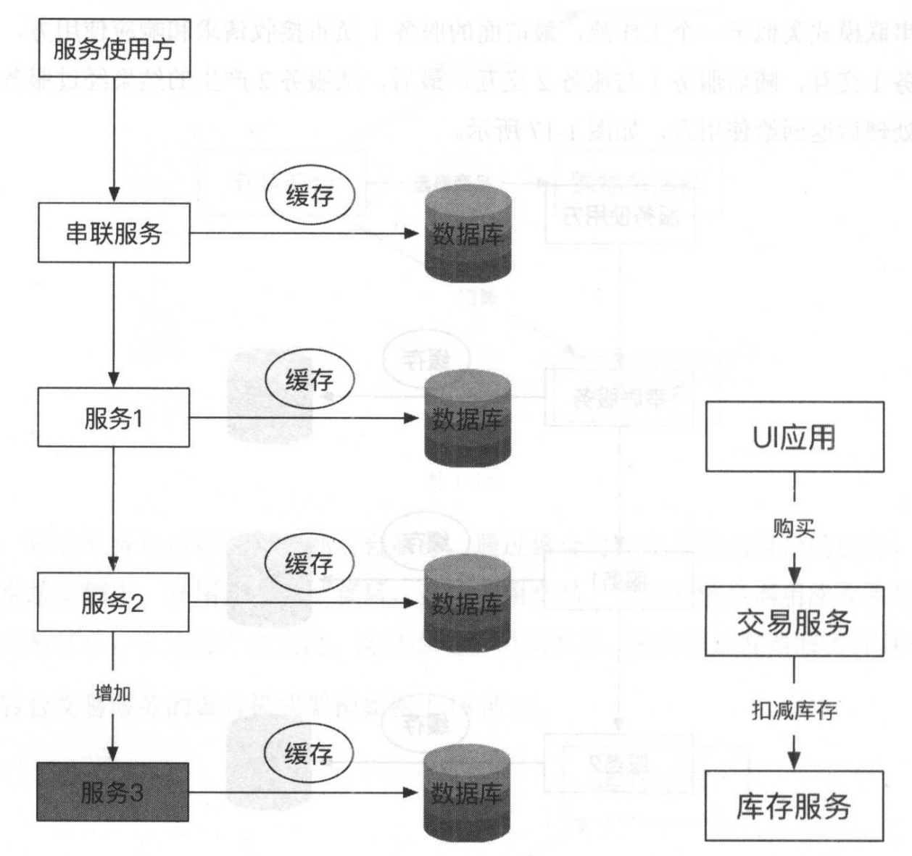
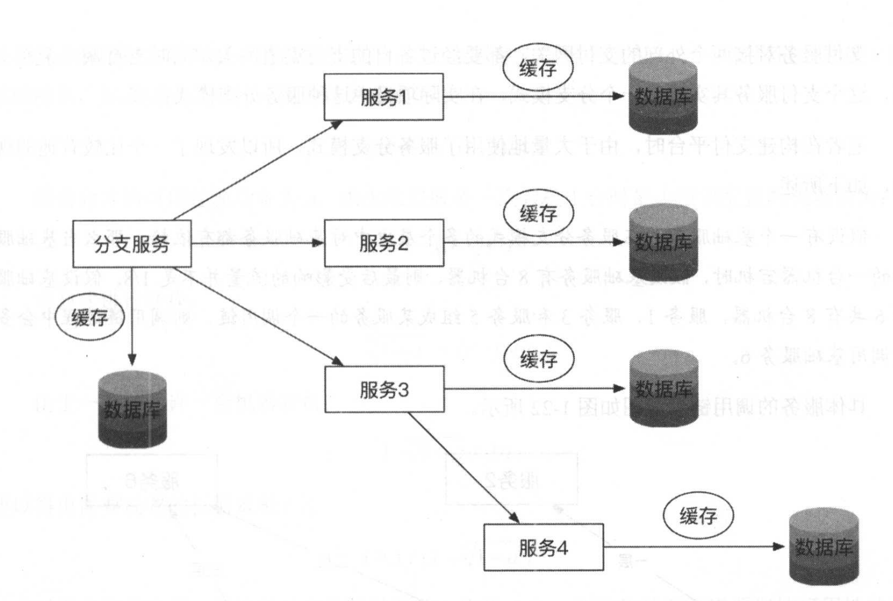
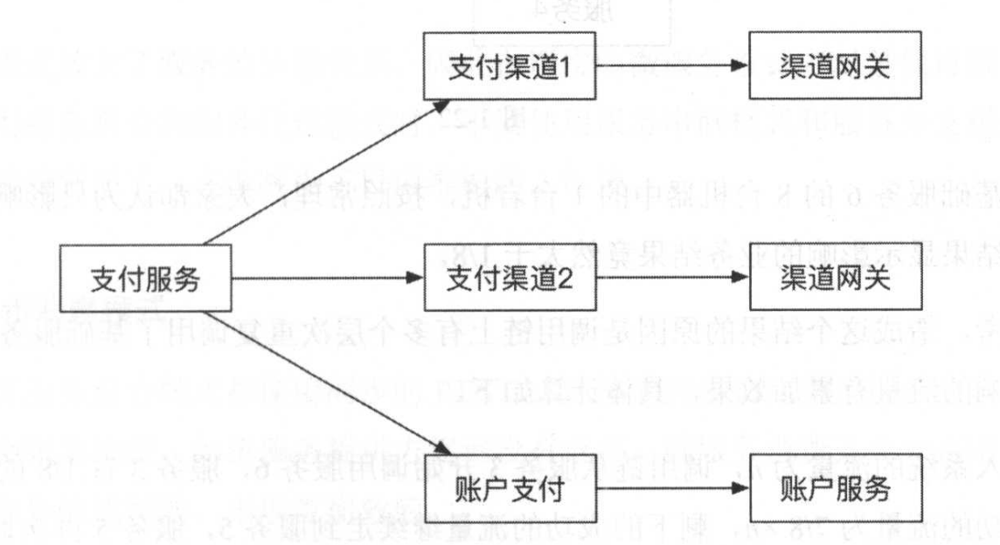
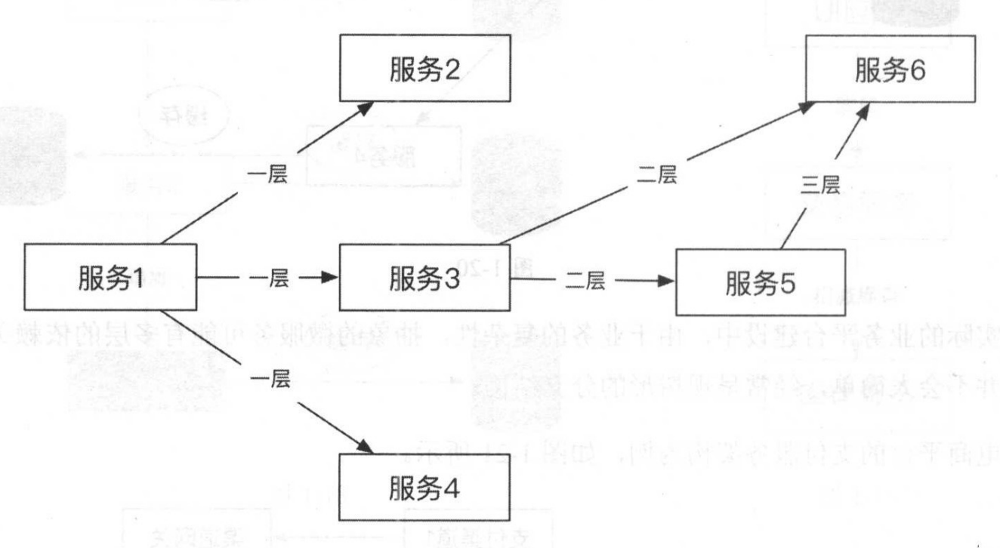
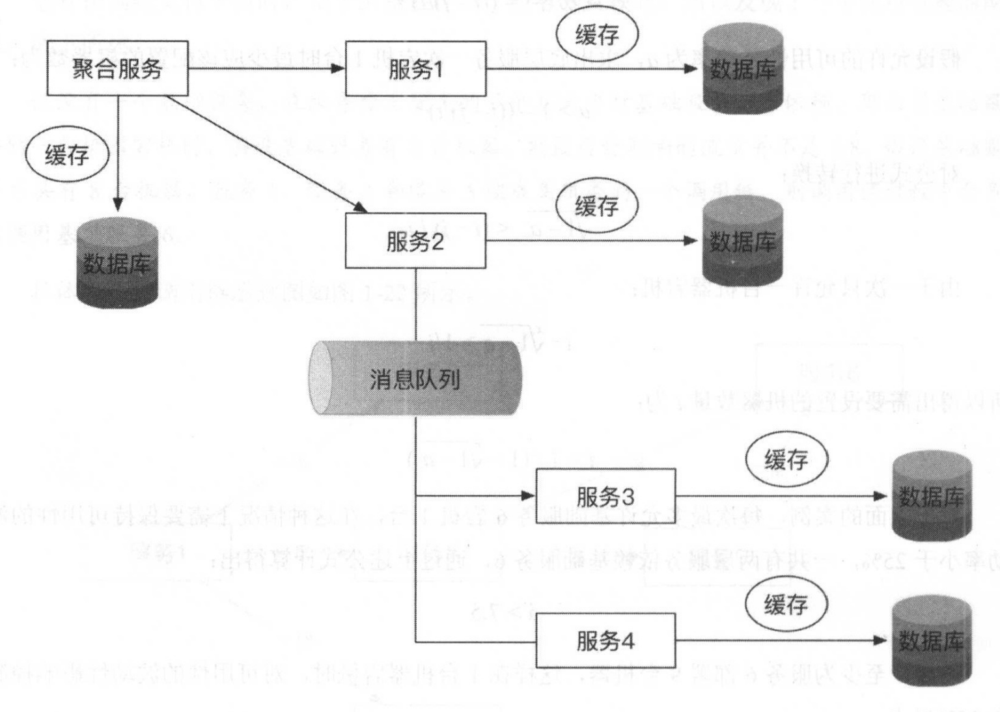

## 一 微服务拆分和组合模式

### 1.0 微服务拆分

良好的划分和拆分使系统达到松辑合和高内聚的效果，然后通过微服务的灵活组装可以满足上层的各种各样的业务处理需求。在微服务架构的需求分析和架构设计过程中，通常是用领域的动词和名词来划分微服务的。  

示例：
> 对于一个电商后台系统，可以分解为订单、商品、商品目录、库存、购物车、交易、支付、发票、物流等子系统，每个名词和动词都可以是一个微服务，将这几个微服务组合在一起，就实现了电商平台用户购买商品 的整个业务流。

这样拆分以后，系统具有敏捷性、灵活性、可伸缩性等，拆分后有多个高度自治的微服务，这些自治的微服务组合方式有：
- 服务代理模式
- 服务聚合模式
- 服务串联模式
- 服务分支模式
- 服务共享数据模式

### 1.1 服务代理模式

  

这种模式，典型的案例是做平滑的系统迁移，通常经历如下 4 个阶段：
- 在新老系统上双写。
- 迁移双写之前的历史遗留数据。
- 将读请求切换到新系统。
- 下调双写逻辑，只写新系统。

服务代理模式常常应用到第 3 步， 一般会对读请求切换设计一个开关，开关打开时查询新系统，开关关闭时查询老系统。  

### 1.2 服务聚合模式

服务聚合模式是最常用的服务组合模式，它根据业务流程处理的需要，以一定的顺序调用依赖的多个微服务，对依赖的微服务返回的数据进行组合、加工和转换，最后以一定的形式返回给使用方。  

这里，每个被依赖的微服务都有自己的缓存和数据库，聚合服务本身可以有自己的数据存储，包括缓存和数据库等，也可以是简单的聚合，不需要持久化任何数据 。  

    

该模式的好处：
- 最大限度的重用了现有的实现。
- 各个服务高度自治，可以实现独立开发、敏捷变更与部署  

示例一：电商前台  

  

示例二：电商后台交易服务  
   

### 1.3 服务串联模式

服务串联模式类似于一个工作流，最前面的服务 l 负责接收请求和响应使用方，串联服务后再与服务 l 交互，随后服务 1 与服务 2 交互，最后，从服务 2 产生的结果经过服务 l 和串联服务逐个处理后返回给使用方：  

   

服务串联模式之间的调用通常使用同步的 RESTful 风格的远程调用实现，注意，这种模式采用的是同步调用方式，在串联服务没有完成井返回之前，所有服务都会阻塞和等待， 一个请求会占用一个线程来处理，因此在这种模式下不建议服务的层级太多，如果能用服务聚合模式代替， 则优先使用服务聚合模式，而不是使用这种服务串联模式。  

相对于服务聚合模式，服务串联模式有一个优点，即串联链路上再增加一个节点时，只要不是在串联服务的正后面增加，那么串联服务是无感知的。  

### 1.4 服务分支模式

服务分支模式是服务代理模式、服务聚合模式和服务串联模式相结合的产物 。  

分支服务可以拥有自己的数据库存储，调用多个后端的服务或者服务串联链，然后将结果进行组合处理再返回给客户端 。 分支服务也可以使用代理模式，简单地调用后端的某个服务或者服务链，然后将返回的数据直接返回给使用方 。  

   

示例：支付的不同渠道  

    

示例：更多以来的分支模式 

   

由于分支模式放大了服务的依赖关系，因此在现实的微服务设计中尽量保持服务调用级别的简单，在使用服务组合和服务代理模式时，不要使用服务串联模式和服务分支模式，以保持服务依赖关系的清晰明了，这也减少了日后维护的工作量。

### 1.5 服务异步消息模式

前面的所有服务组合模式都使用同步的 RESTful 风格的同步调用来实现，同步调用模式在调用的过程中会阻塞线程，如果服务提供方迟迟没有返回，则服务消费方会一直阻塞，在严重情况下会撑满服务的线程池，出现雪崩效应。  

因此，在构建微服务架构系统时，通常会梳理核心系统的最小化服务集合，这些核心的系统服务使用同步调用，而其他核心链路以外的服务可以使用异步消息队列进行异步化 。  

    

聚合服务同步调用服务 l 和服务 2，而服务 2 通过消息队列将异步消息传递给服务 3 和服务 4。  

示例：
> 典型的案例就是在电商系统中，交易完成后向物流系统发起消息通知，通知物流系统发货。  

### 1.6 服务共享数据模式

在微服务的交互模式中，提倡去数据共享，但是有些场景仍然需要：
- 单元化架构：一些平台由于对性能有较高的要求，数据共享可以减少大量微服务组织时候造成的网络带宽消耗与IO消耗。  
- 历史遗架构：对于历史遗留的传统单体服务，其依赖的数据库表辑合在一起，对其拆分需要进行反规范化的处理，可能会造成数据一致性问题，在没有对其
完全理解和有把握的前提下，会选择保持现状，让不同的微服务暂时共享数据存储 。

