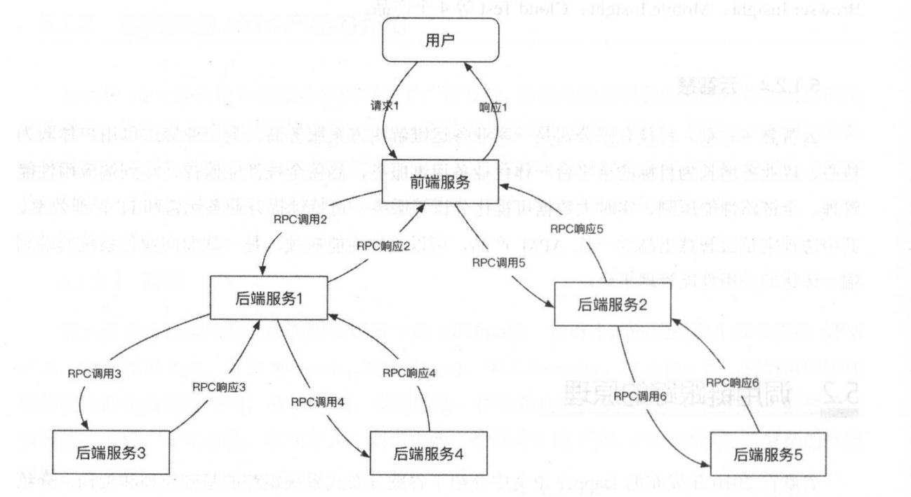
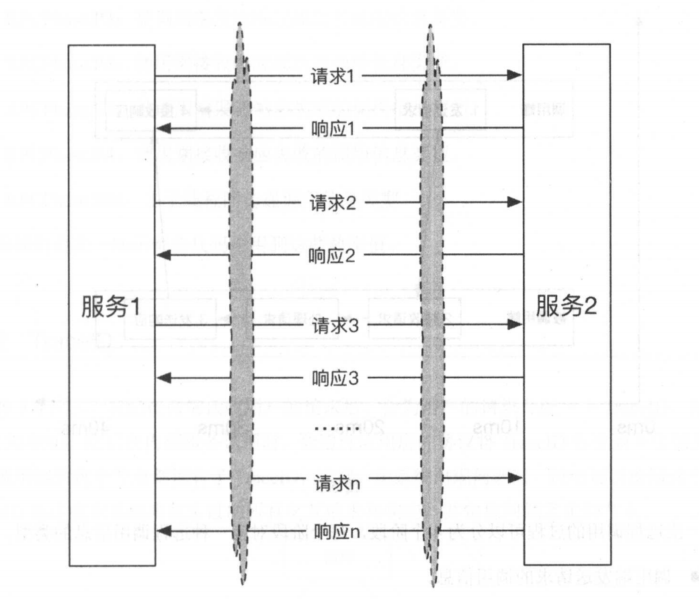
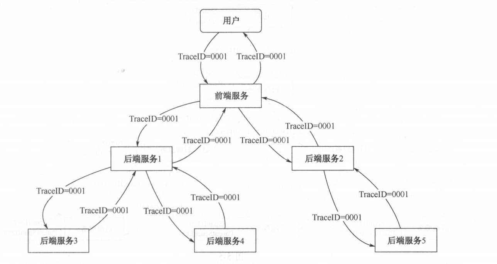
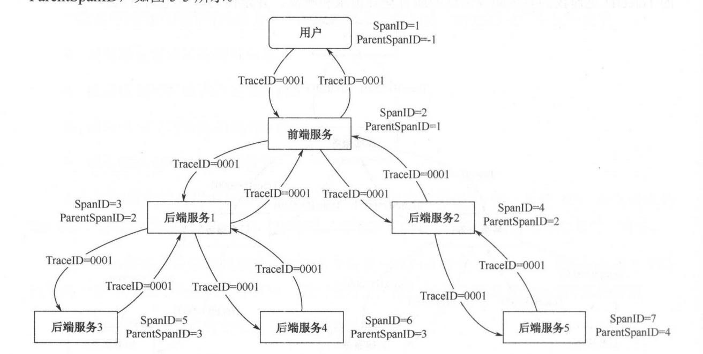
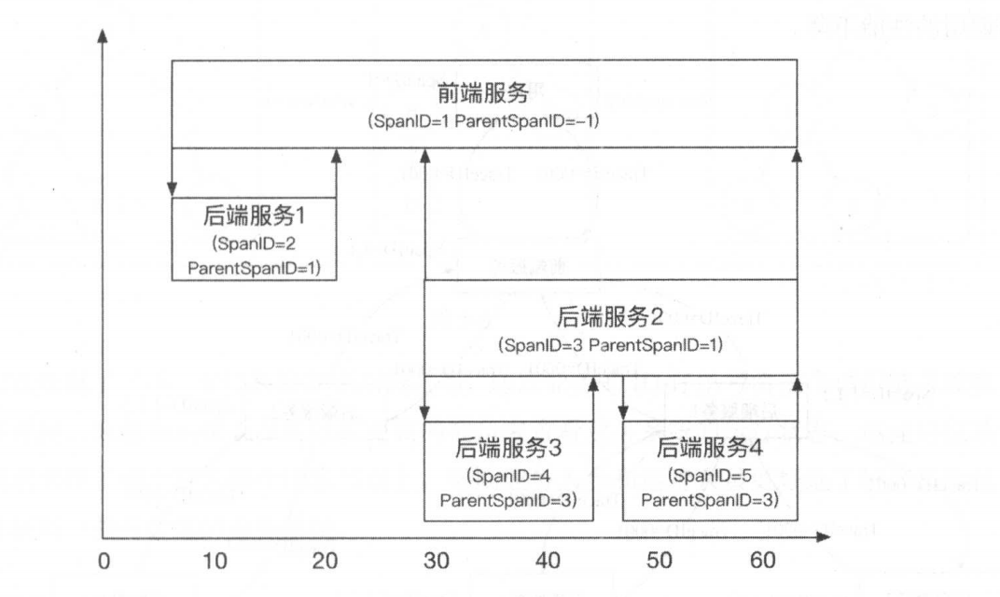
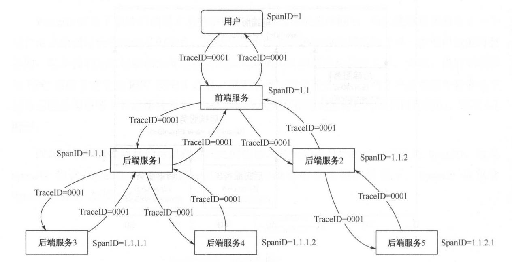
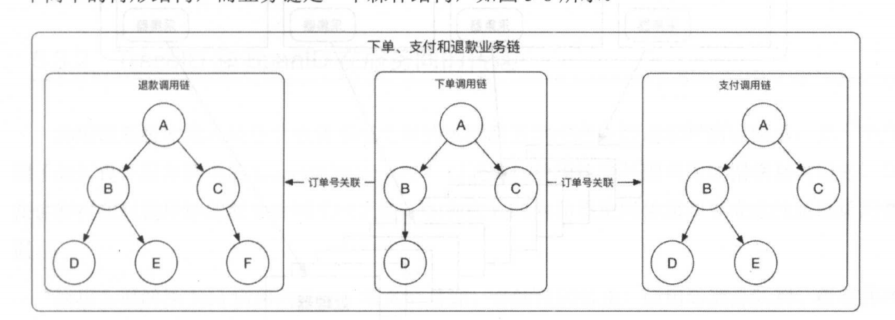

## 一 调用链跟踪解释

典型的分布式服务调用关系如图：  
  

从图中可知，一个用户的请求到达内部服务后，其调用结构是一个树型结构，树节点是整个架构的基本单元，每个节点是一个独立的服务节点。  

谷歌在2010年发布的论文Dapper中介绍了谷歌分布式系统跟踪的基础原理和架构。在该论文中，每个节点都对应一个Span，节点之间的连线表示Span和它的父Span之间的关系，具体表现为依次调用请求和响应的调用关系。我们可以把描述依次请求调用和响应组成的数据叫做调用信息。  

现在我们重点关注两个服务之间的通信，如选图所示：  

两个服务之间有成千上万次通信，服务 1 与服务 2 进行交互时，会发送一个请求 1 ，并接收到一个响应 1 ，那么我们通过什么手段标识响应和请求是一对呢？  

服务 2 也会接收到一个请求 1 ，并发送一个响应 1 ，我们又如何将这一对请求和响应与服务1 的请求和响应联系在一起呢？如果选择在TCP层上跟踪，显然是极其复杂的，
谷歌的 Dapper 论文通过增加应用层的标记来对服务化中的请求和响应建立联系，例如：它通过 HTTP 协议头携带标记信息，标记信息包括标识调用链的唯一流水 ID，这里叫作 Trace!D，以及标识调用层次和顺序的 SpanID 和 ParentSpanID 。  

如图所示：  
  

一次远程调用的过程可以分为 4 个阶段， 每个阶段对应一种远程调用信息的类型：
- 调用端发送请求的调用信息。
- 被调用端接收请求的调用信息。
- 被调用端发送响应的调用信息。
  - 成功响应
  - 异常响应
- 调用端接收响应的调用信息。

上面每种类型的远程调用信息包含：
- 调用端或者被调用端的IP、系统ID
- 本次请求的TraceID、SpanID、ParentSpanlD
- 时间戳、调用的方法名称及远程调用信息的类型等 

我们为远程调用信息的类型定义的枚举类型如下：
- RPCPhase.P 1 ：调用端发送请求的调用信息类型 。
- RPCPhase.P2 ：被调用端接收请求的调用信息类型 。
- RPCPhase.P3 ：被调用端发送响应成功的调用信息类型。
- RPCPhase.P4：调用端接收响应成功的调用信息类型。
- RPCPhase.E3 ：被调用端发送响应失败的调用信息类型。
- RPCPhase.E4：调用端接收响应失败的调用信息类型。
- RPCPhase.SIB：主子线程间传递调用信息类型。

在保持系统最终一致性的定期校对模式中，需要同时事后异步的进行批量校对，基于全局的唯一流水ID将一个请求在分布式系统中的流转路径进行聚合，然后过程中传递和保存的SpanID将聚合的请求路径通过树形结构进行展示，这样可以让系统维护者快速发现问题、定位问题的服务节点。  

## 二 TraceID 

我们在前端接收用户的请求后，会为用户的请求分配一个 TraceID，此例中TraceID 为 0001 ，然后在内部服务调用时，会通过应用层的协议将 TraceID 传递到下层服务，直到整个调用链的每个节点都拥有了 TraceID，这样，在系统出现问题时，我们可以使用这个唯一的 TraceID 迅速找到系统间发生过的所有交互请求和响应，并定位问题发生的节点。  

如图所示：  
   

Vesta ( http://vesta.cloudate.net/ ）是一款原创的多场景的互联网发号器，此发号器可以作为全局唯一的流水号，也就是 TraceID 。  

## 三 SpanID

TraceID 解决了系统间调用关系的串联问题，对调用关系串联后，我们能够找到服务于一个用户请求的调用和响应消息的集合，这些集合里面的请求和响应都是为了同一次用户请求而服务的，但是我们无法标识和恢复这些请求和响应调用时的顺序和层级关系，例如，我们无法得知 RPC 调用 2 发生在 RPC 调用 3 之前，也无法得知前端服务调用了两个从前端服务看来是下层服务的后端服务 l 和后端服务 2，也就是说无法恢复调用的层级结构或者树形结构。  

因此，我们需要附加的信息在系统之间的请求和响应消息中传递，它就是 SpanID ， 这里SpanID 包含 SpanID 和 ParentSpanID ，后续在没有明确说明的情况下， SpanID 也包含ParentSpanID。

如图所示：  
   

SpanlD 和 ParentSpanlD 组合在 一起就可以表示一个树形的调用 关 系， 一 个 Span ID 和ParentSpanID 记录了一次调用的节点信息。 SpanID 表示 当前为一个调用节点， ParentSpanID 表示这个调用节点的父节点，通过这两个数据，我们就可以恢复树形的调用链。 

现在我们从时序的角度来看 SpanID 和 ParentSpanID 在调用链中携带的信息和含义，如图：  
  

当系统出现故障时，我们需要为开发、应急和运维人员显示树形的调用链，只需以下 4 步即可。
- 1 通过 TraceID 把一整条调用链的所有调用信息收集到一个集合中，包括请求和响应。
- 2 通过 SpanID 和 ParentSpanID 恢复树形的调用树，ParentSpanID 为－ 1 的节点为调用树的根节点，也是调用请求的源头请求。
- 3 识别调用链中出错或者超时的节点，并且做出标记。
- 4 把恢复的调用树和出错的节点信息通过某种图形显示到 UI 界面上。

SpanID 是一个 64 位的整型值，有多种策略产生 SpanID 。
- 1 使用随机数产生 SpanID ，理论上随机数是有可能重复 的，但是由于 64 位长整型值的取值范围为［－263, 263-1 ］，重复的可能性微乎其微，井且本地生成随机数的效率会高于其他方法。
- 2 使用分布式的全局唯一的流水号生成方式，可参考互联网发号器 Vesta.
- 3 每个 SpanID 包含所有父亲及前辈节点的 SpanID ，使用圆点符号作为分隔符，不再需要 ParentSpanlD 宇段，如下图所示。这种方案实现起来简单，但是在某些场景下有一个致命的缺点，当一个请求的调用链有太多节点和层次时， SpanID 会携带太多的冗余信息，导致服务间调用的性能下降 。  

  

## 四 业务链

在生产实践中，由于业务流程的复杂性， 一个业务流程的完成由用户的多次请求组成，这些请求之间是有关联的，我们在串联调用链之后，会根据业务的属性，将不同的调用链聚合在一起形成业务链，便于开发、应急和运维人员排查问题 。    

例如用户在电商平台下单后会进行支付，在支付后由于对货物不满意 ，会申请退款。要完成这样的整个业务流程至少需要（远远不止） 3 次用户请求，这 3 次用户请求是通过业务系统的 D 进行关联的，用户下单后会产生订单号，支付时会传入订单号，退款时也会传入原订单号来进行退款校验及获得退款信息。  

我们需要在多次请求之间建立联系，可以通过业务系统的订单号来串联业务链，调用链是一个简单的树形结构，而业务链是一个森林结构：  
  

我们在恢复了下单、支付和退款调用链之后，通过业务的 ID 订单号将三个调用链关联在一起，这样开发、应急和运维人员可以以更高的视角来查看业务系统的运行状态 ， 迅速定位某个用户的请求卡在了哪个链的哪个请求节点上，帮助业务人员和运营人员更好地了解产品的运行情况或者获得一些有价值的业务系统。  

