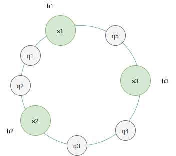
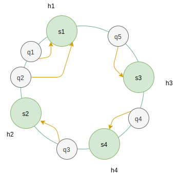

## 一 服务路由概述

服务路由：服务消费者通过服务名称，在众多服务中找到要调用的服务的地址列表，称为服务的路由。  

服务消费者只用知道当前服务者提供了哪些方法，却不知道服务具体在什么位置，这就是路由的透明化。  

这些服务的地址信息有多种存储方式：
- 硬编码：将服务的地址信息存放在服务消费者一端，服务消费者发起调用时，读取服务地址配置进行调用。这些地址在变化时，需要维护服务提供者地址，灵活性很差
- 数据库存储：服务的地址信息存储在数据库中，这种方式侵入性较之硬编码较小，但是服务的消费者还是需要感知服务提供者的地址信息
- 注册中心：服务注册中心可以用来保存服务提供者的地址信息，以及服务发布相关的属性信息。服务消费者无需知道服务提供者的地址信息，只需要知道当前系统发布了哪些服务。服务提供者将需要发布的地址信息和属性写入注册中心，消费者根据本地引用的接口名信息，从注册中心获取服务地址列表。  

当前常见的服务注册中心有ZooKeeper、etc等，注册中心用来管理服务的订阅与发布：
- 服务的发布者：需要发布服务
- 服务的消费者：需要订阅服务

注册中心解耦了服务的实例与代码关系，在微服务架构中具备协调作用。例如ZooKeeper还具备心跳检测功能，会定时向各个服务提供者发送请求，建立Socket长连接，如果长期没有响应，则注册中心会认为该实例5宕机，将其剔除服务实例列表。

## 二 负载均衡的实现

有了注册中心，服务路由，自然也就需要对集群中的实例进行负载均衡。常见的负载均衡实现有：
- 基于DNS域名解析的负载均衡：在DNS服务器上可以配置域名对应多个IP，该方式能够依据实例的地理位置进行合理的负载，DNS的服务器稳定性很高，但是其缺点也很明显
  - 将负载均衡工作交给了DNS服务商，无法更好的改善和管理
  - DNS负载一般是简单的轮训算法，不能区分服务器之间的差异，不能反映服务器当前的运行状态，不能按照服务器的处理能力来分配负载
  - DNS是多级解析，每一级DNS都可能缓存记录，当某一个服务器下线后，该服务器对应的DNS记录可能仍然存在，会导致分派到该服务器的用户访问失败
- 基于硬件的负载均衡：F5 Network Big-IP是一个网络设备，类似于网络交换机，位于流量入口的最前端。其负载的性能很好，每秒能处理请求数达到百万级，即几百万/秒的负载，其负载均衡算法支持很多灵活的策略，也具备一些防火墙功能。该方案主要缺陷是硬件价格昂贵。
- 基于软件的负载均衡：最常见的方式是使用Nginx，当然注册中心ZooKeeper也具备负载均衡算法，能够依据该算法选取一台服务器进行连接。

## 三 负载均衡算法

服务消费者从配置中心获取到服务地址列表后，需要选取一台实例发起RPC调用，此时需要负载均衡算法。常用的负载均衡算法有：
- 轮询法：将请求按顺序轮流的分配到实例，均衡对待后端的每一台服务器，不关心服务器实际的连接数和当前系统负载。如果有一台服务器一直在处理高耗时操作，那么下次轮到该服务器时，会进一步加剧其压力
  - 加权轮询法：根据实例的不同处理能力来调度访问请求，这样可以保证处理能力强的服务器处理更多的访问流量，解决了轮询法的不足
- 随机法：完全随机选择，在数目极大时，实际分配效果会越来越平均
  - 加权随机法：与加权轮训道理一致，解决随机法中对高配置服务器分配负载不足的问题
- 源地址哈希法：根据客户端的IP地址，通过哈希函数计算得到一个数值，用该数值对服务器列表的大小进行取模运算，得到的结果就是客户端要访问服务器的序号。该算法会让某个客户端的访问一直映射到同一台服务器。该方式的缺陷是当服务器增加、减少时，采用简单的哈希取模方法会使命中率大大降低。
  - 一致性哈希法：解决源地址哈希法的缺陷，即实例增加、减少时，也能很好的平均映射。

一致性哈希算法被广泛应用于分布式系统中。一致性哈希算法通过哈希环的数据结构实现。环的起点是0，终点是232-1，起点与终点连接，哈希环中间的证书按逆时针分布，所以哈希环的整数分布范围是[0, 232-1]，如果所示：  

  

假如有三台web服务器s1、s2、s3，为这每台服务器都计算一个哈希值，得到h1、h2、h3。假设有5个请求过来，对这5个请求进行哈希运算，如hash(192.168.0.1)，5个运算结果是q1、q2、q3、q4、q5。他们在哈希环上的位置如图：  

  

接下来为每一个请求找到对应的机器，在哈希环上顺时针查找距离这个请求的哈希值最近的机器，结果如图：  

  

对于线上的业务，增加或者减少一台机器的部署非常常见，现在对上图增加一台s4的部署，其哈希值为h4，服务器唯有s3和s2之间。这时只有机器s3和s4之间的请求需要重新分配新的机器，如下图所示，只有请求q4倍重新分配到了s4，其他请求仍然在原机器上： 

  

如上图所示，增、减机器只会影响相邻的机器，这就导致了添加机器时只会分担其中一台机器的负载，删除机器会把负载全部转移到相邻的一台机器上，这是不合理的。  

合理的结果应该是：
- 增加机器时，新的机器可以合理的分担所有机器的负载
- 减少机器时，多出来的负载可以均匀的分配给剩余的机器

为此可以引入虚拟节点可以解决负载不均的问题，即对每一个服务节点计算多个哈希，每个计算结果未知都放置一个此服务节点，称为虚拟节点。具体的做法是可以在服务器IP/主机名的后面增加编号来实现。假设有两台服务器NodeA与NodeB，如果让他们，以及自己的虚拟节点分布在哈希环上，则可以分别计算得到NodeA#1，NodeA#2，NodeA#3，NodeB#1，NodeB#2，NodeB#3这六个节点（真实节点只有NodeA#1，NodeB#1）的哈希值，形成了六个节点，这样就能解决服务倾斜的问题。  

在实际开发中，通常将虚拟节点数设置为32甚至更大！  