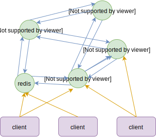

## 一 分布式缓存概述

缓存的核心作用是极大降低数据库的压力！  

服务存在状态将会使服务的弹性伸缩造成极大困难，最好的办法就是将状态外置到缓存中。  

但是并不是所有的数据都应该使用缓存系统：
- 变化较快的数据：比如一个页面按照点赞数进行展示，该页面不应该被缓存，因为点赞数的变化极快，缓存后会因此造成命中率极低
- 强一致的数据：处理强一致的数据时，服务在写缓存时还要更新数据库，由于网络的不确定，强一致的代价很高

## 二 常见分布式缓存

常用的缓存系统有：
Memcache：老牌缓存系统，最大用户为Facebook，基于libevnet，只支持简单的kv存储，采用多线程机制，不支持集群模式（需要额外开发），清理数据算法为LRU。
Redis：基于kv的内存nosql，是当今最流行的分布式缓存方案。

## 三 Redis简介

详细介绍见 常用软件-SQL 章节。  

Redis是一个开源的分布式内存KV存储系统，既可以做分布式缓存，也能作为分布式内存数据库、分布式消息中间件。  

Redis主要特点：
- 支出数据类型齐全
- 查询方便，支持bitmaps、hyperloglogs、地理空间
- 功能强大，内置了：复制、Lua脚本、LRU驱动事件、事务、持久化机制、高可用机制（哨兵，自动分区）

Redis与Memcache对比的优点：
- 支持数据结构更多
- Redis采用hash结构进行kv存储，进行了组合式压缩，内存利用率更高。Memcache只是简单的kv存储！

Redis3在功能上像一个过渡版本，Redis4较为完善，新增功能包括模块化，部分复制，改进缓存淘汰算法，非阻塞删除（先删除索引，再真正删除）等

## 四 基于Redis的分布式缓存

### 4.1 3.0之前的集群方案 Master-Slave

在Redis3.0之前，只能使用Master-Slave方式进行集群部署。该方式有两大问题：
- 并未解决写入性能问题！！！  
- Master与Slave之间由于异步复制，业务数据写入Master后立即返回，无法确定是否已经同步成功！（虽然可以使用wait指令，但是该指令强调同步又会导致可用性下降）

当然也有一些其他第三方方案：
- 客户端模式：在客户端做负载均衡，不经过任何代理，直接连接redis。客户端模式利用Etcd等作为服务发现，实现Redis节点的动态变化。
- 代理模式：负载均衡放在代理商来做，Proxy对外提供标准Redis协议，伪装为了一个Redis节点，可以让业务方无感知的使用redis

### 4.2 3.0之后的无中心方案 Redis Cluster

Redis3.0采用了无中心架构模式，所有的Redis节点彼此互联（PING-PONG机制），节点之间使用Gossip协议。  

如图所示：  

当前节点向目标节点发送PING命令，但是目标节点未能在给定时间内返回，那么当前节点会被标记位PFAIL。在发送PING时，也会随机广播三个当前节点所知道的节点，这些信息里包括节点是否被标记位PFAIL、FAIL。在及群众，超过半数的Master节点检测失效，则发生FAIL。  

无中心模式的优点：
- 绝对去中心化，元数据分布在所有节点上，不会轻易丢失
- 部署简单，存储和集群管理在一起，依赖少
- 无代理，性能高

无中心模式的缺点：
- 不细粒问题：以节点为单位，分区不细。比如Kafka中，使用分区+副本的方式可以让热点分散。
- 不一致问题：在主要从异步，重新选主过程中，Redis集群不能保证强一致性。比如在发生网络分区时，如果主服务器正好在少数节点，网络分区重新选主后，会覆盖旧的主服务器在刚才时间段内的数据

### 4.3 基于Codis的Redis分布式缓存集群

Codis是一个基于代理模式实现的Redis集群方案。Codis Proxy实现了Redis协议，因此业务方不会感知到使用上的变化。  

Codis主要组件：
- Codis Proxy：无状态的客户端连接代理，实现了Redis协议
- Codis Server：基于Redis3.2.8的分支，增强了数据结构、slot支持、数据迁移命令
- Codis Dashboard：集群管理工具，对codis-proxy、codis-server进行添加、删除，维护proxy的状态一致性。
- Codis Admin：集群管理的命令行工具
- Codis FE：集群管理界面，多个集群示例可以共享一个前端展示页面
- Storage：为集群状态提供外部存储，支持etcd、zookeeper等

