## 一 服务限流

服务限流（流量控制）可以有效保障服务的高可用。  

### 1.1 限流算法

限流方式一：**数器**  
- 原理：限制一秒钟能通过的请求数，比如限流QPS为100，则从第一个请求进入开始，在接下来一秒内，每来一个请求，计数器+1，累加数目到达100，则后续请求被拒绝。
- 弊端：在1秒钟内，前10毫秒处理了100个请求，那么后面的990毫秒就会拒绝所有请求，这种现象称为突刺现象

限流方式二：**漏桶算法**
- 原理：一个固定容量的漏桶按照敞亮固定速率流出水滴，如果桶是空的，就不需要流出水滴。我们可以让任意速率的水，流入漏桶，如果流入的水滴超出桶的容量，流入的水滴就会溢出（被丢弃），而漏桶的容量是不变的。  
- 作用：解决计数器的弊端，即让突发流量整形，以便让网络提供稳定的流量

漏桶算法图解：  
  

限流方式三：**令牌桶算法**  
- 原理：常用的限流算法。令牌按固定的速率放入令牌桶，例如：token/秒。桶中最多存放b个令牌（token），当桶装满时，新添加的令牌被丢弃或拒绝。当请求到达时，将从桶中删除1个令牌。令牌桶中的令牌不仅可以被移除，还可以往里添加。为了保证接口的数据能随时通过，必须不停的往桶里添加令牌。所以添加令牌的速度决定了单位时间内通过的接口数量。  

  

令牌桶与漏桶算法区别：
- 拒绝请求方式不同：
  - 漏桶算法流入速度任意，但是按照常量固定流出。当流入的请求数量积累到漏桶容量时，新请求被拒绝
  - 令牌桶算法是按照固定速率往桶中添加令牌的，请求是否被处理需要看桶中的令牌是否足够。令牌数为0，请求被拒绝
- 突发请求处理不同：
  - 漏桶算法限制常量流出速率，使突发流量速率平滑
  - 令牌桶算法允许突发请求，只要有令牌即可，允许了一定程度上的突发流量

### 1.2 限流设计

在多实例场景中如何进行限流设计？
- 静态限流：服务启动前，预先在配置中心配置总QPS阈值，根据集群节点的个数计算每个节点需要分摊的QPS
  - 缺点：当实例发生增、减、宕机时，需要手工调整配置中心预设的QPS阈值
- 动态限流：使用服务注册中心方式动态配置QPS阈值。每个服务的流量配额都是动态申请
- 分级限流：根据一些资源利用参数控制，如CPU使用率,内存利用率,消息队列积压率.当资源耗尽时,则触发限流。一个完整的请求在不同区域（前端、web端、消息队列、数据库）都有默认的流控阈值

## 二 服务降级与熔断

在流量高峰期，为了保证服务的高可用，需要一些服务、页面有策略的进行不处理或者简单处理，保证核心服务如支付能正常运转。  

常见的服务降级方式有：
- 利用服务降级开关：人工设置一个分布式的降级开关，然后集中管理开关的配置信息
- 自动降级：根据系统负载、资源利用率、QPS、平均响应时间、SLA等指标进行自动降级

一些真实降级案例：
- 读降级：非核心业务服务在读取数据时，可以采取切换到缓存、走静态化、读取默认值等方式
- 写降级：如同步写改为异步写，流量高峰结束后，同步到数据库

常见的服务降级熔断软件有：Hystrix。

## 三 服务容错

微服务架构非常复杂，必须能够在底层自动容错。设计服务容错的基本原则是：Design for Failure，以达到下列目标:
- 服务故障不会严重破坏用户体验
- 系统能自动、半自动处理故障，具备自我恢复能力

常用容错策略：
- 失败转移：Failover。服务出错时，服务框架尝试其他服务，通常用于幂等性服务，如读操作。缺点是失败重试会带来更长延时，需要做重试次数
- 自动恢复：Failback。对失败时的错误码进行分析执行对应策略
- 快速失败：Failfast。失败后不再发起重试，而是忽略失败，记录日志，常用于非核心服务
- 失败缓存：FailCache。服务失败后，将消息缓存，等到周期T后重新发送，直到服务提供者能够正常处理消息，常用场景有：日志记录，通知积分增长等。需要注意缓存时间、缓存对象大小、重试周期T以及重试最大次数等要做限制

## 四 服务优先级设计

可以依据调整服务运行的实例数来实现优先级调度：
- 1 系统出现资源紧张时，通过服务框架调整优先级低的服务的实例数，将实例从服务注册中心移除
- 2 此时低优先级服务得到调度的机会减少，释放的资源被高优先级服务使用
- 3 系统资源不再紧张时，可以重新调整服务的实例数

常用的实现方式有：加权优先级队列、线程调度器

