## 一 缓存穿透概述

数据的查询需要先经过缓存，当缓存命中后，直接返回缓存中的数据。在缓存未命中的情况下，去数据库查询数据，并写入缓存。缓存的目的是为了尽可能将请求在缓存层处理，避免大量的请求进入存储层，达到保护存储层的效果。  

缓存穿透：频繁查询根本不存在的数据，导致缓存层和存储层都不会命中，因为这部分数据查询频繁，缓存不能有效命中，导致存储层负载加大。  

通常可以在应用程序中分别统计总调用数、缓存层命中数和存储层命中数。如果发现大量存储层空命中，就有可能出现缓存穿透问题。  

造成缓存穿透的原因：
- 应用程序自身设计问题，如缓存、数据库错误
- 被恶意攻击，如爬虫

## 二 缓存穿透的解决办法

### 2.1 办法一：缓存空对象

在缓存层未命中时，将该空对象存储到缓存层，那么之后的访问将会在缓存层命中，获得空对象。  

该方式会有两个问题：
- 造成存储空间增长、浪费
- 缓存层与持久层可能出现数据不一致现象。即在缓存有效期内，持久层的数据如果更新了，需要使用消息队列、定时刷新工具等刷新缓存层对象。

### 2.2 办法二：布隆过滤器拦截

布隆过滤器用于检测一个元素是否在一个集合中，由一个很长的二进制向量和一系列随机映射函数组成。  

布隆过滤器的核心思想是：使用M个Hash函数，通过每个哈希函数对每个key生成一个整数值。在初始状态下，需要一个长度为N的比特数组，比特数组每一位都是0。当某个key加入布隆过滤器时，使用M个哈希函数计算出M个哈希值，并且根据K个哈希函数计算出M个哈希值，根据生成的M个哈希值查找比特数组中对应的比特位。只有当所有的哈希值对应的比特位都为1时，认为此时key在布隆过滤器中，否则认为此key不在布隆过滤器中。  

  

按照K1和K2的添加步骤，依次将所有存储层已经存在的key以及存储层新增的key都加入布隆过滤器中。  

当用户请求携带Kn经过布隆过滤器时:  

  

由于F2（Kn）对应的比特位位0，此时认为Kn不在布隆过滤器中，因此可以在布隆过滤器这一层将请求拦截，在一定程度上保护了存储层。  

可以在应用层面使用Google Guava框架实现布隆过滤器，也可以利用Redis的Bitmaps实现布隆过滤器。

## 三 缓存雪崩

缓存大量失效、穿透后会导致大量请求到达持久层，这就是缓存雪崩现象。  
常用的缓存雪崩处理方案：
- 保持缓存层的高可用：多实例、多机房部署缓存，如Redis
- 优化存储过期时间：为key设置合适的过期时间，避免大量key在同一时刻失效
- 使用互斥锁重建缓存
- 异步重建缓存

**互斥锁重建缓存**：  
在高并发场景中，为了避免大量请求同时到达存储层查询数据库造成重建缓存，可以使用互斥锁。  

如：根据key查询数据，当缓存层命中时，对key加锁，然后从存储层查询数据，将数据写入缓存层，最后释放锁，若其他线程获取锁失败，则让线程休眠一段时间后重试。在分布式redis中，可以使用SETNX方法。 

该方式利用代码实现了缓存重建，较为复杂，而且当前并发1000请求时，999个都在阻塞！  

**异步重建缓存**：  
该方案从线程池中获取线程来异步构建缓存，从而不会让所有的请求直接到达存储层。  

如：每个Redis key维护逻辑超时时间，当逻辑超时时间小于当前时间时，说明缓存失效，应当进行缓存更新，否则直接返回缓存的值

