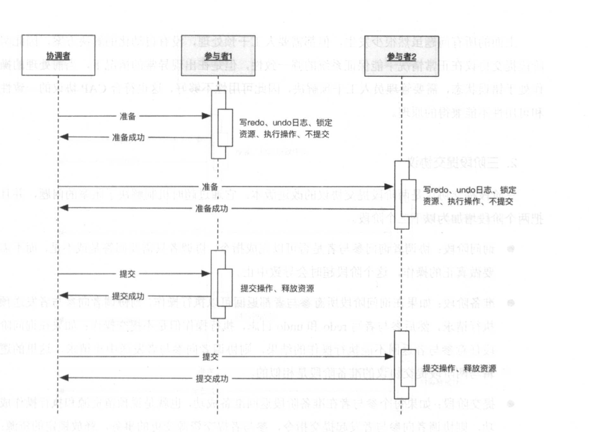
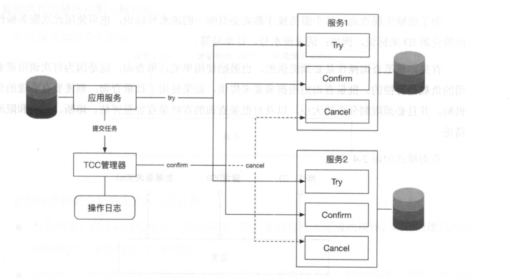

## 一  什么是一致性问题

在互联网系统中，一致性指分布式服务化系统之间的弱一致性，包括：系统的一致性和数据的一致性。  

常见的一致性问题：  
- 案例1：下单与库存。如果先下单，扣库存失败，会导致超卖，如果下单不成功，扣库存成功，那么会导致少卖
- 案例2：网络延迟。系统A同步调用系统B超时，A能够得到超时反馈，但是无法确定B是否已经完成了调用功能
- 案例3：缓存与数据库不一致
- 案例4：缓存本身不一致，如缓存节点之间不一致

强一致性：系统本身不会出现不一致，每个事务都是原子的，或者成功或者失败，事务之间是隔离的，完全不受影响。这在传统的关系型数据库中都得到了保证。  

## 二 解决一致性的方案

#### 2.1 酸碱平衡理论

单一的关系型数据库具备ACID（酸）特性，支持强一致性，即：
- A：Atomicity，原子性
- C：Consistency，一致性
- I：Isolation，隔离性
- D：Durability，持久性

BASE思想与ACID不同，其满足CAP原理，通过牺牲强一致性获得可用性，一般应用于服务化系统的应用层或者大数据处理系统中，通过达到最终一致性来尽量满足业务的大多数需求：
- BA：Basically Available，基本可用
- S：Soft State，软状态，状态可以在一段时间内不同步
- E：Eventually Cinsisten，最终一致，在一定的时间窗口内，最终数据达成一致即可

在01章中，CAP理论提出了分布式系统中，一致性和可用性不可兼得。其实在不同的场景下利用ACID和BASE（碱）来解决分布式服务化系统的一致性问题。

软状态是实现 BASE 思想的方法，基本可用和最终 一致是目标。以 BASE 思想实现的 系统 由于不保证强一致性，所以系统在处理请求的过程中可以存在短暂的不一致，在短暂的不一致 的时间窗口内，请求处理处于临时状态中，系统在进行每步操作时，通过记录每个临时状态，在系统出现故障时可以从这些中间状态继续处理未完成的请求或者退回到原始状态，最终达到一致状态。  

以转账为例，我们将用户 A 向用户 B 转账分成 4个阶段:第 l 个阶段，用户 A 准备转账; 第2个阶段，从用户A账户扣减余额:第3个阶段，对用户B增加余额;第4个阶段， 完成转 账。系统需要记录操作过程中每个步骤的状态， 一旦系统出现故障，系统便能够自动发现没有 完成的任务，然后根据任务所处的状态继续执行任务，最终彻底完成任务， 资金从用户 A 的账 户转账到用户 B 的账户，达到最终的一致状态。  

在实际应用中，上面这个过程通常是通过持久化执行任务的状态和环境信息， 一旦出现问 题，则定时任务会捞取未执行完的任务，继续执行未执行完的任务， 直到执行完成，或者取消 己经完成的部分操作并回到原始状态。这种方法在任务完成每个阶段时，都要更新数据库 中任 务的状态，这在大规模、高井发系统中不会有太好的性能， 一种更好的办法是用 Write-Ahead Log(写前日志)，这和数据库的 Bin Log (操作日志〉相似，在进行每个操作步骤时，都先写入日志， 如果操作遇到问题而停止，则可以读取日志井按照步骤进行恢复，继续执行未完成的工作， 最 后达到一致的状态。写前日志可以利用机械硬盘的追加写来达到较好的性能，然而这是一种专 业化的实现方式，多数业务系统还是使用数据库记录的字段来记录任务的执行状态，也就是记录中间的 “软状态飞 一个任务的状态流转一般可以通过数据库的行级锁来实现，这比使用写前日志实 现更简单、快速。  

有了 BASE 思想作为基础，我们对复杂的分布式事务进行拆解，对其中的每个步骤都记录 其状态 ，有问题时可以根据记录的状态来继续执行任务，达到最终一致。

##  三 分布式一致性协议 

国际开放标准组织 Open Group 定义了 DTS (分布式事务处理模型〉 ，模型中包含 4 种角色: 应用程序 、事务管理器、资源管理器和通信资源管理器。事务管理器是统管全局的管理者，资 源管理器和通信资源管理器是事务的参与者。  

#### 3.1 两阶段提交协议

两阶段提交协议把分布式事务分为两个阶段 ， 一个是准备阶段，另 一个是提交阶段 。 准备 阶段和提交阶段都是由事务管理器发起的 ， 为了接下来讲解方便，我们将事务管理器称为协调者 ，将资源管理器称为参与者。  

- 准备阶段： 协调者向参与者发起指令，参与者评估自己的状态，如果参与者评估指 令可 以完成，则会写 redo 或者 undo 日在、(Write-Ahead Log 的一种)，然后锁定资源，执行操作，但是并不提交。
- 提交阶段：如果每个参与者明确返回准备成功，也就是预留资源和执行操作成功，则协 调者向参与者发起提交指令，参与者提交资源变更的事务，释放锁定的资源;如果任 何一个参与者明确返回准备失败， 也就是预留资源或者执行操作失败，则协调者向 参 与者发起中止指令，参与者取消己经变更的事务，执行 undo 日志，释放锁定的资源 。

如图所示：  
  

我们看到两阶段提交协议在准备阶段锁定资源，这是一个重量级的操作，能保证强一致性，但是有如下致命问题：
- 阻塞：任何一次指令都要明确收到响应，才会继续进行下一步，否则处于阻塞状态，占用的资源被一直锁定，不会被释放
- 单点故障：如果协调者岩机，参与者没有协调者指挥，则会一直阻塞，尽管可以通过选 举新的协调者替代原有协调者，但是如果协调者在发送一个提交指令后岩机，而提交 指令仅仅被 一个参与者接收，并且参与者接收后也岩机，则新上任的协调者无法处理 这种情况 。
- 脑裂：协调者发送提交指令，有的参与者接收到并执行了事务，有的参与者没有接收到 事务就没有执行事务，多个参与者之间是不一致的。

上面的所有问题虽然很少发生，但都需要人工干预处理，没有自动化的解决方案，因此两 阶段提交协议在正常情况下能保证系统的强一致性，但是在出现异常的情况下，当前处理的操 作处于错误状态，需要管理员人工干预解决 ， 因此可用性不够好，这也符合 CAP 协议的 一致性 和可用性不能兼得的原理。

#### 3.2 三阶段提交协议

三阶段提交协议是两阶段提交协议的改进版本。它通过超时机制解决了阻塞的问题， 井且 把两个阶段增加为以下三个阶段：
- 询问阶段:协调者询问参与者是否可以完成指令，协调者只需要回答是或不是，而不 需 要做真正的操作 ，这个阶段超时会导致中止 。
- 准备阶段 : 如果在询问阶段所有参与者都返回可以执行操作，则协调者向参与者发送预 执行请求，然后参与者写 redo 和 undo 日志，执行操作但是不提交操作:如果在询问 阶 段任意参与者返回不能执行操作的结果，则协调者向参与者发送中止请求，这 里的逻 辑与两阶段提交协议的准备阶段是相似的。
- 提交阶段:如果每个参与者在准备阶段返回准备成功，也就是说预留资源和执行操作成 功，则协调者向参与者发起提交指令，参与者提交资源变更的事务，释放锁定的 资源: 如果任何参与者返回准备失败，也就是说预留资源或者执行操作失败，则协调者向 参 与者发起中止指令，参与者取消已经变更的事务，执行 undo 日志，释放锁定的 资源， 这里的逻辑与两阶段提交协议的提交阶段一致。  

如图所示：  
  

三阶段提交协议与两阶段提交协议主要有以下两个不同点：
- 增加了 一个询问阶段，询问阶段可以确保尽可能早地发现无法执行操作而需要中止的行 为，但是它并不能发现所有这种行为，只会减少这种情况的发生。
- 在准备阶段以后，协调者和参与者执行的任务中都增加了超时，一旦超时，则协调者和 参与者都会继续提交事务 ，默认为成功，这也是根据概率统计超时后默认为成功的正 确性最大。  

三阶段提交协议与两阶段提交协议相比，具有如上优点，但是一旦发生超时，系统仍然会 发生不 一 致，只不过这种情况很少见，好处是至少不会阻塞和永远锁定资源。

#### 3.3 TTC协议

两阶段及三阶段方案中都包含多个参与者、多个阶段实现一个事务，实现复杂，性能也是一个很大 的问题，因此，在互联网的高并发系统中，鲜有使用两阶段提交和三阶段提交协议的场景。  

阿里巴巴的TCC 协议将 一个任务拆分成 Try、 Confirm、 Cancel 三个步骤 ， 正常的流程会先执行 T可，如果执行没有问题，则再执行 Confirm，如果执行过程中出 了问题， 则执行操作的逆操作 Cancel。 从正常的流程上讲，这仍然是一个两阶段提交协议，但是在执行 出现问题时有 一定的自我修复能力，如果任何参与者出现了问题，则协调者通过执行操作的逆 操作来 Cancel 之前的操作，达到最终的 一致状态。  

可以看出，从时序上来说，如果遇到极端情况，则 TCC 会有很多问题，例如，如果在取消 时一些参与者收到指令，而另 一些参与者没有收到指令，则整个系统仍然是不一致的 。对于这 种复杂的情况，系统首先会通过补偿的方式尝试自动修复，如果系统无法修复，则必须由人 工 参与解决 。  

从 TCC 的逻辑上看，可以说 TCC 是简化版的三阶段提交协议，解决了两阶段提交协议的 阻塞问题，但是没有解决极端情况下会出现不一致和脑裂的问题 。 然而， TCC 通过自动化补 偿 手段 ，将需要人工处理的不一致情况降到最少，也是一种非常有用的解决方案 。某著名 的互联 网公司在内部的一些中间件上实现了 TCC模式。  

我们给出 一个使用 TCC 的实际案例，在秒杀的场景中，用户发起下订单请求，应用层先 查 询库存，确认商品库存还有余量，则锁定库存，此时订单状态为待支付，然后指引用户去支付 ， 由于某种原因用户支付失败或者支付超时，则系统会自动将锁定的库存解锁以供其他用户秒 杀。  

TTC协议使用场景：  

 