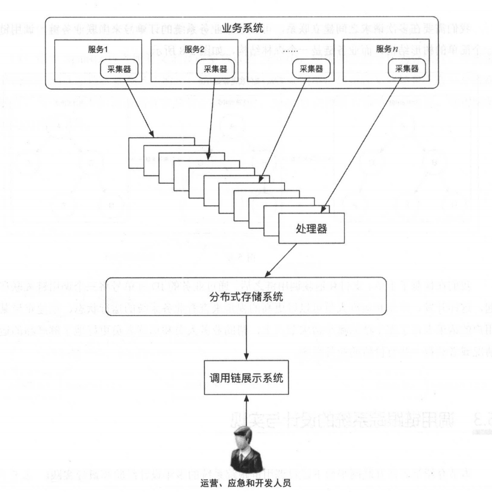
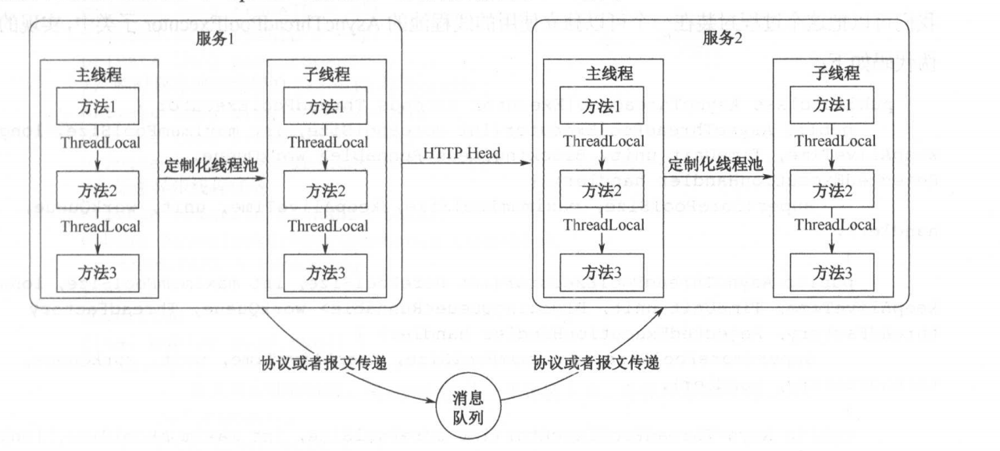

## 一 常用开源服务调用链

业界常用的APM项目（分布式服务调用链跟踪）有：
- Pinpoint：诞生于谷歌论文，基于Java开发的APM工具，用于大规模分布式系统，帮助开发人员分析系统结构、程序组件之间的数据互联
- Zipkin：诞生于谷歌论文，支持Java、Go、Scala等语言，能够收集服务调用的时序数据，解决微服务中定位超时问题。该框架会通过应用程序中挂载字节码增强库来讲实时数据汇报给Zipkin。
- CAT：美团开元的实时应用和性能监控系统
- 商业化产品：如听云、博睿、OneAPM

## 二 调用链的具体实现

### 2.1 整体架构

调用链跟踪系统通常由采集器、处理器和分布式存储系统组成，经过这几个模块处理后的调用数据会在调用链展示系统中对外提供查看和查询等功能，整体的调用链跟踪系统的通用实现架构如图：  

   

每个模块的功能职责如下：
- 采集器：负责把业务系统的远程服务调用信息从业务系统中传递给处理器。
- 处理器：负责从业务系统的采集器中接收服务调用信息并聚合调用链，将其存储在分布式数据存储中，以及对调用链进行分析，井输出给监控和报警系统 。
- 分布式存储系统：存储海量的调用链数据，并支持灵活的查询和搜索功能。
- 调用链展示系统：支持查询调用链、业务链等功能 

### 2.2 TraceID和SpanID在服务间的传递

TraceID和SpanID需要在很多场景中实现传递。如图所示：  

   

- 单个应用（进程内）内部传递：Java中可以使用ThreadLocal传递
- 不同服务间传递：需要利用网络通信协议传递，比如RESTFUL的api中，可以存放于HTTP头中，RPC远程调用中则可以为RPC序列化协议增加定制化字段
- 不同线程间传递：非核心链路逻辑往往会异步处理，这位于异步线程中，可以在创建这样的线程时，将ID一并传递过去，放在子线程的ThreadLocal中
  - 贴士：可以将这个过程封装在独立使用的线程池中，这种做法同样适用于go的协程
- 应用与消息队列间传递：消息队列往往用于解耦与削峰，有三种传递方式
  - 1 修改消息队列底层实现协议，让ID透明传递，这样就不需要应用层有感知，但是修改消息队列代价较大
  - 2 在应用层的报文上增加附属字段，应用层在发送消息时，手工将ID通过报文传递，该方案实现简单、快捷，但是侵入了业务系统
  - 3 在第二种方式基础上，为消息队列客户端库做定制化，每次发送消息时，将ID增加到消息报文中，这种方式既能不侵入系统，避免人为疏忽一些ID的缺失，也能不用更改消息队列底层业务协议
- 缓存和数据库之间传递：也有两种实现方式
  - 1 对缓存和数据库进行二次开发：和应用于消息队列的传递方案一一样，代价极大 
  - 2 封装缓存、数据库的客户端，将ID与访问的数据进行关联，推荐该方案

### 2.3 采集器

采集器用于采集ID（TraceID和SpanID）数据、推送数据，通过采集器从业务系统中把ID传输到调用链的处理器上。  

采集器的实现四种方法：
- 应用层主动推送：实现简单快速，但是调用信息侵入了业务代码，对重构压力较大
- AOP推送：Java中的方案,在业务层中使用AOP拦截目标服务调用,将请求/响应信息收集后,推送到调用链处理器。该方案虽然侵入了业务，但只需要开发AOP切面拦截类，耦合不严重
- JavaAgent字节码增强：JavaAgent可以构建一个独立于应用程序的代理程序，检测JVM上的程序，甚至能替换、修改某些类的定义，实现定制化
- 代理推送：使用日志文件通过应用程序打印相关调用日志，推送到日志中信，再从日志中心提取调用日志，组成调用链。常用Kafka消息队列、UDP推送（性能高），但是都需要使用异步方式发送数据，因为一旦收集器出现问题，会影响业务。  

### 2.4 处理器

收集端的处理器需要对收集的信息进行处理，通常我们会使用 Java 开发一个处理器， 对从UDP 或者 Kafka 消息队列消费得到的日志进行聚合，然后存入调用链的大数据存储系统中 。  

一般在生产实践过程中，我们在处理器中除了要对调用链进行聚合，还需要从调用链中发现调用的问题 ， 例如：抛异常、超时、服务响应时间过长等 。 这时我们需要使用类似 Storm、Spark 等流式计算系统对恢复的调用链进行分析，然后发送给报警和监控系统 。  

如图所示：  

   

一条调用链包含一个用户请求在服务化架构中的多次调用信息 ，每个调用信息分成 4 个阶段，每个阶段都有不同类型的信息进行存储。一般来说一个调用信息包含 4 个类型的具体信息，一个中型公司线上服务的请求每天可以达到上千万或者上亿级别，因此为了存储这么大的调用链数据，我们需要使用大数据存储技术。由于调用链本身是一个树形结构，而且没有固定的模式，数据量和消息数量也不固定，因此， HBase 是比较合适的存储系统，另外，基于 HBase 的TSDB 也适合存储基于时序的数据。  
