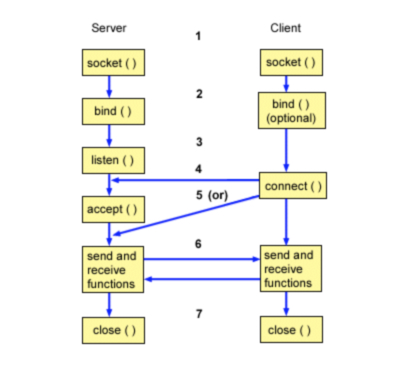

## 一 远程过程调用 RPC 概念

RPC(Remote Procedure Call)即远程过程调用。RPC的效果是，调用远程的方法就像在单体应用中调用本地的方法一样简单。  

要完成一次 RPC 调用，就必须先建立网络连接。建立连接后，双方还必须按照某种约定的协议进行网络通信，这个协议就是通信协议。双方能够正常通信后，服务端接收到请求时，需要以某种方式进行处理，处理成功后，把请求结果返回给客户端。为了减少传输的数据大小，还要对数据进行压缩，也就是对数据进行序列化。

完整的RPC包含四个核心组件：
- Client：服务调用方
- Server：服务提供方
- Client Stub：客户端存根，存放服务端的地址消息，再讲客户端的请求参数打包成网络消息，然后通过网络远程发送给服务方
- Server Stub：服务端存根，接受客户端消息，将消息解包，并调用本地方法

通信过程如图：  
  

通信过程解释
- 1 Client 客户端以本地调用方式调用服务（依赖服务接口）
- 2 Client Stub 客户端存根接收到调用请求后，负责将方法、参数等组装成能够进行网络传输的消息体（一般是将消息体对象序列化为二进制格式）
- 3 Client 客户端通过 Socket 将消息发送到服务器
- 4 Server Stub 服务端存根将收到的消息解码（反序列化）
- 5 Server Stub 服务端存根根据解码结构调用本地服务
- 6 本地服务执行后，将结果返回给服务端存根 Server Stub
- 7 Server Stub 服务端存根将返回结果打包为消息（序列化）
- 8 Server 服务端通过 Socket 将消息发送到客户端
- 9 Client Stub 客户端存根接收到返回消息后，进行解码（序列化）
- 10 Client 客户端得到最终结果

RPC的目标是简化上述操作的复杂性，为开发带来便利，所以RPC将2，3，4，7，8，9步进行了封装，如图所示：    

  

贴士：stub即存根，指在本地存在一个和远程一样的方法，在Java中通常通过依赖对方提供的接口实现，例如服务端将对外提供的接口打包为JAR文件，客户端依赖于服务端提供的JAR包，这个JAR包即为存根。 

上述的调用过程复杂，且所有的调用、响应都具备一定的通用性，所以RPC通信往往借助框架来实现。即在考虑性能的情况下，还要隐藏调用实现的复杂度（第1步、第7步）。 

## 二 远程过程调用的四个问题

### 2.0 远程过程调用的四个问题总结

想要完成RPC调用，需要解决四个问题：
- 客户端和服务端如何建立网络连接？
  - http、tcp
- 服务端如何处理请求？
  - BIO、NIO、AIO
- 数据传输采用什么协议？
- 数据该如何序列化和反序列化？

### 2.1 问题1：建立网络连接

客户端和服务端之间基于 TCP 协议建立网络连接最常用的途径有两种：
- HTTP通信：HTTP协议是基于 TCP 协议的一层封装。一次 HTTP 通信过程就是发起一次 HTTP 调用，而一次 HTTP 调用就会建立一个 TCP 连接，经历一次“三次握手”的过程来建立连接，完成请求后，再经历一次“四次挥手”的过程来断开连接。
- Socket通信：Socket 通信是基于 TCP/IP 协议的封装，建立一次 Socket 连接至少需要一对套接字，其中一个运行于客户端，称为 ClientSocket ；另一个运行于服务器端，称为 ServerSocket 。

Socket 通信的过程分为四个步骤：服务器监听、客户端请求、连接确认、数据传输。  

  

- 服务器监听：ServerSocket 通过调用 bind() 函数绑定某个具体端口，然后调用 listen() 函数实时监控网络状态，等待客户端的连接请求。
- 客户端请求：ClientSocket 调用 connect() 函数向 ServerSocket 绑定的地址和端口发起连接请求。
- 服务端连接确认：当 ServerSocket 监听到或者接收到 ClientSocket 的连接请求时，调用 accept() 函数响应 ClientSocket 的请求，同客户端建立连接。
- 数据传输：当 ClientSocket 和 ServerSocket 建立连接后，ClientSocket 调用 send() 函数，ServerSocket 调用 receive() 函数，ServerSocket 处理完请求后，调用 send() 函数，ClientSocket 调用 receive() 函数，就可以得到得到返回结果。

当客户端和服务端建立网络连接后，就可以发起请求了。但网络不一定总是可靠的，经常会遇到网络闪断、连接超时、服务端宕机等各种异常，通常的处理手段有两种:
- 链路存活检测：客户端需要定时地发送心跳检测消息（一般是通过 ping 请求）给服务端，如果服务端连续 n 次心跳检测或者超过规定的时间都没有回复消息，则认为此时链路已经失效，这个时候客户端就需要重新与服务端建立连接。
- 断连重试：通常有多种情况会导致连接断开，比如客户端主动关闭、服务端宕机或者网络故障等。这个时候客户端就需要与服务端重新建立连接，但一般不能立刻完成重连，而是要等待固定的间隔后再发起重连，避免服务端的连接回收不及时，而客户端瞬间重连的请求太多而把服务端的连接数占满。

### 2.2 问题2：服务端处理请求

客户端与服务端建立连接后，通常有三种处理方式：
- 同步阻塞方式（BIO），客户端每发一次请求，服务端就生成一个线程去处理。当客户端同时发起的请求很多时，服务端需要创建很多的线程去处理每一个请求，如果达到了系统最大的线程数瓶颈，新来的请求就没法处理了
- 同步非阻塞方式 (NIO)，客户端每发一次请求，服务端并不是每次都创建一个新线程来处理，而是通过 I/O 多路复用技术进行处理。就是把多个 I/O 的阻塞复用到同一个 select 的阻塞上，从而使系统在单线程的情况下可以同时处理多个客户端请求。这种方式的优势是开销小，不用为每个请求创建一个线程，可以节省系统开销
- 异步非阻塞方式（AIO），客户端只需要发起一个 I/O 操作然后立即返回，等 I/O 操作真正完成以后，客户端会得到 I/O 操作完成的通知，此时客户端只需要对数据进行处理就好了，不需要进行实际的 I/O 读写操作，因为真正的 I/O 读取或者写入操作已经由内核完成了。这种方式的优势是客户端无需等待，不存在阻塞等待问题

### 2.3 问题3：数据传输协议

最常用的有 HTTP 协议，它是一种开放的协议，各大网站的服务器和浏览器之间的数据传输大都采用了这种协议。还有一些定制的私有协议，比如阿里巴巴开源的 Dubbo 协议，也可以用于服务端和客户端之间的数据传输。无论是开放的还是私有的协议，都必须定义一个“契约”，以便服务消费和服务提供者之间能够达成共识。服务消费者按照契约，对传输的数据进行编码，然后通过网络传输过去；服务提供者从网络上接收到数据后，按照契约，对传输的数据进行解码，然后处理请求，再把处理后的结果进行编码，通过网络传输返回给服务消费者；服务消费者再对返回的结果进行解码，最终得到服务提供者处理后的返回值。  

通常协议契约包括两个部分：消息头和消息体。其中消息头存放的是协议的公共字段以及用户扩展字段，消息体存放的是传输数据的具体内容。  

以 HTTP 协议为例，下图展示了一段采用 HTTP 协议传输的数据响应报文，主要分为消息头和消息体两部分，其中消息头中存放的是协议的公共字段，比如 Server 代表是服务端服务器类型、Content-Length 代表返回数据的长度、Content-Type 代表返回数据的类型；消息体中存放的是具体的返回结果，这里就是一段 HTML 网页代码。  

### 2.4 问题4：序列化与反序列化

一般数据在网络中进行传输前，都要先在发送方一端对数据进行编码，经过网络传输到达另一端后，再对数据进行解码，这个过程就是序列化和反序列化。  
- 序列化：把对象转换成字节序列的过程
- 反序列化：把字节序列回复为对象的过程

为什么要对数据进行序列化和反序列化呢？要知道网络传输的耗时一方面取决于网络带宽的大小，另一方面取决于数据传输量。要想加快网络传输，要么提高带宽，要么减小数据传输量，而对数据进行编码的主要目的就是减小数据传输量。比如一部高清电影原始大小为 30GB，如果经过特殊编码格式处理，可以减小到 3GB，同样是 100MB/s 的网速，下载时间可以从 300s 减小到 30s。  

常用的序列化方式分为两类：
- 文本类如 XML/JSON 等
- 二进制类如 PB/Thrift 等

具体采用哪种序列化方式，主要取决于三个方面的因素。  
- 支持数据结构类型的丰富度。数据结构种类支持的越多越好，这样的话对于使用者来说在编程时更加友好，有些序列化框架如 Hessian 2.0 还支持复杂的数据结构比如 Map、List 等。
- 跨语言支持。序列化方式是否支持跨语言也是一个很重要的因素，否则使用的场景就比较局限，比如 Java 序列化只支持 Java 语言，就不能用于跨语言的服务调用了。
- 性能。主要看两点，一个是序列化后的压缩比，一个是序列化的速度。以常用的 PB 序列化和 JSON 序列化协议为例来对比分析，PB 序列化的压缩比和速度都要比 JSON 序列化高很多，所以对性能和存储空间要求比较高的系统选用 PB 序列化更合适；而 JSON 序列化虽然性能要差一些，但可读性更好，更适合对外部提供服务。

## 三 常见RPC框架

常用RPC框架：
- go rpc：Golang原生提供的rpc通信框架，只支持go语言
- RMI：基于Java远程方法协议和Java的原生序列化实现的RPC框架
- Thrift：facebook出品，采用二进制编码协议，传输协议使用TCP/IP，通过中间语言IDL来定义接口与数据类型，最后由一个编译器生成不同语言的代码
- gRPC：google出品的跨语言、跨平台的远程调用系统。
  - gRPC基于HTTP/2协议，HTTP/2协议特点：连接多路复用、双向流、服务器推送、请求优先级、首部压缩
  - gRPC支持ProtoBuf：ProtoBuf是google开发的数据序列化协议，性能高、表达能力强
  - gRPC支持多语言，能够给予语言自动生成客户端和服务端功能库

国内的RPC框架
- Dubbo：阿里开放的Java RPC框架，支持功能极多，但是从严格意义上来说，其仍然是RPC框架。
- Motan：新浪微博的RPC框架，底层支持Java
- RPCX：基于Go的服务治理的RPC框架，客户端支持跨语言
- Tars：腾讯的RPC框架
- BRPC：百度的RPC框架

## 四 RPC性能影响因素

影响RPC性能的因素有：
- 序列化：指序列化和反序列化的时间，序列化后的数据字节大小也会直接影响RPC框架性能
  - 常见序列化协议有Thrift、Protobuf、Avro。
- 网络协议：RPC框架可选择的协议有HTTP协议、HTTP/2协议、TCP协议，显然HTTP协议需要对传输内容编码，相对于TCP的二进制编码协议，其开销更大
  - 贴士：目前没有采用UDP的RPC框架
- I/O模型：同步阻塞IO（Blocking IO）、同步非阻塞IO(Non-blocking IO)、IO多路复用（IO Multiplexing）、异步IO（Asynchronous IO）

消息的封装格式是RPC框架性能的核心影响因素，所以大多的RPC框架都会设计消息封装格式。封装时要考虑：消息体大小、编码解码难度、解决半包粘包难度。比如Dubbo的消息体数据包括：Dubbo版本号、接口名称、接口版本、方法名、参数列表、参数、附加信息等。