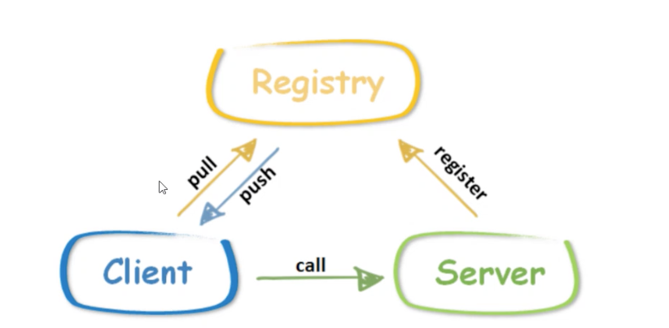
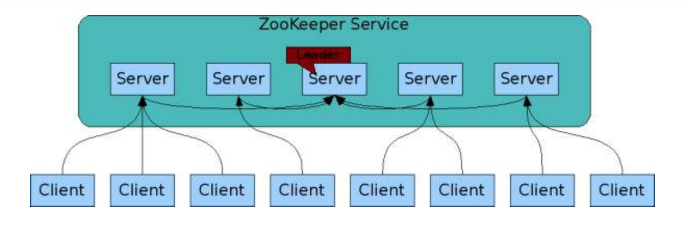

## 一 注册中心概念

以单体应用为例，调用一个接口，必须知道该接口的服务地址与具体的接口信息描述。微服务也是如此，假设你已经使用其中一种方式发布了一个服务，并且已经在一台机器上部署了服务，如果想要调用该服务，也同样需要知道部署该服务的机器地址。  

但是一个成熟的微服务系统内部必定融合数以千万记的服务地址，让调用者自己在如此多的服务中查找自己需要的服务显然是不合适的。我们需要一个类似“地图”一样的工具，来记录这些服务地址，这就是`注册中心`。  

服务消费者在有需求的时候，只需要查询注册中心，输入提供的服务名，就可以得到地址，从而发起调用。  

> 注册中心:用于保存服务的元数据信息列表，客户端通过注册中心才能获得获得真正的复制支持。  

贴士：LVS也能实现保存原数据信息的作用，但是每增加一个节点、IP等信息，LVS需要修改才能生效，而注册中心不需要关注，会自动将新增的IP加入注册中心。  

## 二 注册中心实现原理  

注册中心的实现原理，其实也即微服务中著名的服务注册与发现原理。在微服务架构下，主要有三种角色：
- 服务提供者（Server）：在启动时，根据服务发布配置文件信息，向 Registry 注册自身服务，并向 Registry 定期发送心跳汇报存活状态。
- 服务消费者（Client）：在启动时，根据服务引用配置文件信息，向 Registry 订阅服务，把 Registry 返回的服务节点列表缓存在本地内存中，并与 Sever 建立连接。
- 服务注册中心（Registry）：为 Server 与 Client 提供上述需求的API

  

在上图中：
- 当Server节点发生变更时，Registry会同步变更，Client感知后会刷新本地内存中缓存的服务节点列表
- Client 从本地缓存的服务节点列表中，基于负载均衡算法选择一台 Server发起调用

从上述需求中，也可以大致看出 注册中心需要提供的 API：
- 服务注册接口：服务提供者通过调用服务注册接口来完成服务注册。
- 服务反注册接口：服务提供者通过调用服务反注册接口来完成服务注销。
- 心跳汇报接口：服务提供者通过调用心跳汇报接口完成节点存活状态上报。
- 服务订阅接口：服务消费者通过调用服务订阅接口完成服务订阅，获取可用的服务提供者节点列表。
- 服务变更查询接口：服务消费者通过调用服务变更查询接口，获取最新的可用服务节点列表。

此外，注册中心也应该有自己的后台管理系统，方便运维、开发人员管理：
- 服务查询接口：查询注册中心当前注册了哪些服务信息。
- 服务修改接口：修改注册中心中某一服务的信息。

## 三 注册中心的集群部署

注册中心作为服务提供者和服务消费者之间沟通的桥梁，它的重要性不言而喻。所以注册中心一般都是采用集群部署来保证高可用性，并通过分布式一致性协议来确保集群中不同节点之间的数据保持一致。  
  
大多数注册中心包括：
- Server服务端：提供注册中心的核心服务
- Client客户端：提供注册中心的数据读取服务

在注册中心集群中，服务提供者和服务消费者可以同注册中心中的任意一个节点通信，因为它们的数据一定是相同的，即Client的读请求可以请求任意一个 Server。

这里就涉及到了分部之一致性的问题：
- 注册中心服务器在启动时，将会从集群实例中选举一个 Leader（如ZooKeeper的Paxos协议，Etcd的Raft协议等）
- Leader 负责处理数据更新等操作（如ZooKeeper的ZAB 协议）。
- 一个更新操作成功，当且仅当大多数 Server 在内存中成功修改 。

通过上面这种方式，数据中心集群的实例就保证了高可用性以及数据一致性。    

## 三 注册中心的数据存储形式

注册中心存储服务信息一般采用层次化的目录结构，非常类似于操作系统的目录结构：  

  

## 四 服务健康状态检测

注册中心的核心功能室服务注册、服务订阅，但是还必须提供对节点的健康状态监测功能，这样才能保证注册中心里保存的服务节点都是可用的。  

注册中心的健康状态检测机制：注册中心的客户端与服务端之间进行长连接，利用会话超时控制机制开检测健康状态。  

以ZooKeeper为例：
- 客户端和服务端建立连接后，会话也随之建立，并生成一个全局唯一的 Session ID。
- 服务端和客户端维持的是一个长连接，在 SESSION_TIMEOUT 周期内，服务端会检测与客户端的链路是否正常
  - 客户端定时向服务端发送心跳消息（ping 消息），服务器重置下次 SESSION_TIMEOUT 时间。
  - 如果超过 SESSION_TIMEOUT 后服务端都没有收到客户端的心跳消息，则服务端认为这个 Session 就已经结束了，ZooKeeper 就会认为这个服务节点已经不可用，将会从注册中心中删除其信息。  

## 五 服务状态变更通知

一旦注册中心探测到有服务提供者节点新加入或者被剔除，就必须立刻通知所有订阅该服务的服务消费者，刷新本地缓存的服务节点信息，确保服务调用不会请求不可用的服务提供者节点。  

注册中心一般提供Watch机制，来实现服务状态变更通知给服务消费者。在ZooKeeper中国，服务消费者在调用 ZooKeeper 的 getData 方法订阅服务时，还可以通过监听器 Watcher 的 process 方法获取服务的变更，然后调用 getData 方法来获取变更后的数据，刷新本地缓存的服务节点信息。  

## 六 白名单机制

在实际的微服务测试和部署时，通常包含多套环境，比如生产环境一套、测试环境一套。开发在进行业务自测、测试在进行回归测试时，一般都是用测试环境，部署的 RPC Server 节点注册到测试的注册中心集群。但经常会出现开发或者测试在部署时，错误的把测试环境下的服务节点注册到了线上注册中心集群，这样的话线上流量就会调用到测试环境下的 RPC Server 节点，可能会造成意想不到的后果。   

为了防止这种情况发生，注册中心需要提供一个保护机制，你可以把注册中心想象成一个带有门禁的房间，只有拥有门禁卡的 RPC Server 才能进入。在实际应用中，注册中心可以提供一个白名单机制，只有添加到注册中心白名单内的 RPC Server，才能够调用注册中心的注册接口，这样的话可以避免测试环境中的节点意外跑到线上环境中去。  

