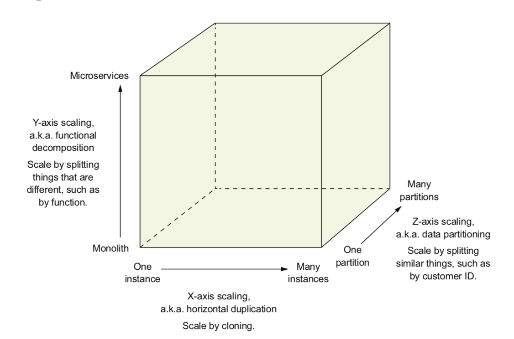
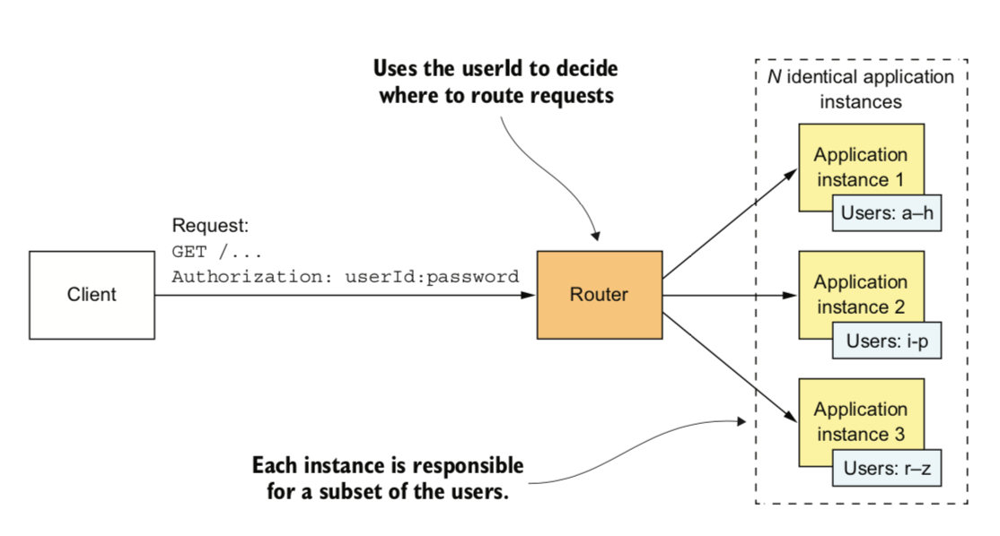
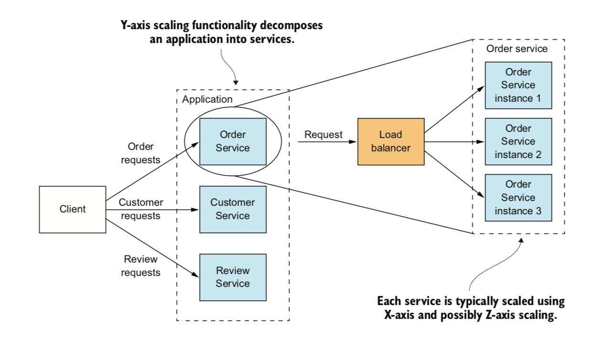
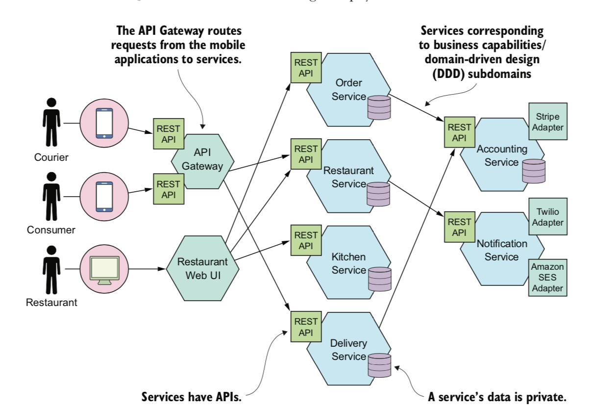

## 一 单体架构

在经典书籍《微服务架构设计模式》一书中，作者列出了非常经典的单体应用程序FTGO（作者列举的应用名）的示例图：  

从图中可以看到，该应用也算是功能健全、结构模块化，是非常经典的单体架构。如果是Java应用，他会是一个war包打包在tomcat中运行，如果是一个golang应用，可能会是个可执行的二进制文件，如果是个Nodejs应用，交付形态可能是一个目录中包含多个子目录的源码。  

单体架构本身并不存在问题，他也有很多优点：
- 应用开发简单：所有人、开发工具都只需要构建这一个项目即可
- 易于大规模更改：可以更改代码、数据库模式等，然后重新构建部署
- 测试直观：没有复杂的请求链路，只需要使用类似Postman这样的工具调用api即可
- 部署简单：比如Java程序，只需要将打包后的war包放入tomcat服务器即可
- 横向扩展简单：扩展多实例极其简单，只需要使用负载均衡器进行调度。 

## 二 单体地狱

虽然单体架构带来一定的好处，但是如果要加入新功能呢？举例：对于Java类项目来说，每次加入功能，都需要所有服务统一添加、部署、重启。 

**开发难度提高**：  
随着时间推移，开发、测试、部署、扩展都会变得越来越困难。因为曾经小巧的单体应用会逐渐变为巨无霸，系统本身会包含无数的模块，很难有人能完整的理解该项目，且项目会陷入恶性循环，最终形成开发者难以驾驭的”脏泥球“，开发进度会越来越慢。  

**持续部署难以实现**：  
亚马逊在2011年就做到了11.6秒完成一次生产环境部署。但是在单体应用中，大量开发人员维护一个代码仓库，会经常发生变更，虽然可以进行分支管理，但是随之也会带来合并痛苦。同时代码测试也是一个相当长的周期，还会引起牵一发动全身的情况。  

**无法按需扩展**：  
单体应用最好的扩展方式是按照第一节中所说，横向扩展。但是如果应用现在有个功能对硬件要求过高，但是使用量很低，其他功能对硬件要求很低，但是使用量极大，那么横向扩展就会带来非常不必要的资源浪费。  

**可靠性越来越低**：  
单体应用很难做到故障隔离，因为所有模块在同一个进程中运行。举例：某个模块出现内存泄漏，将会导致所有实例崩溃。  

**不能有效进行技术更新**：  
单体项目依赖于某个技术之后，如果在开发新模块时，想对该技术更新，就必须将原有依赖该技术的所有模块代码也进行一定的修复，这带来了技术换代的巨大阻碍。

## 三 单体架构到微服务

#### 3.1 扩展模型

下面是一个三维可扩展模型：  

  

X轴：水平复制。通过克隆实例的方式扩展，在多个实例之间实现请求负载均衡，也就是单体架构常用的横向扩展，如图所示：  

  

Z轴：数据分区。根据请求的属性，路由请求，即通过类似客户ID的方式，把相似的数据分区进行扩展，每个实例只负责整体数据的一个子集，如图根据用户的userId，请求到了不同的示例：  

   

Y轴：服务拆分。根据功能将单体应用拆分为一组服务，每个服务负责特定的功能，每个功能的实例又可以继续按照X、Z轴的方式进行扩展  

  

#### 3.2 模块化与微服务

模块化是开发大型、复杂应用的基础。  

注意：微服务的API位它自身构建了一个不可逾越的边界，无法越过API访问服务内部，这是微服务与单体应用服务拆分的本质不同。

#### 3.3 每个服务都有自己的数据库

微服务是松耦合的，实现松耦合的方式之一，是每个服务都拥有自己的私有数据库。对一个线上商店来说，订单服务有一个订单表的数据库，客户服务有一个客户表的数据库，在开发阶段，开发者可以修改自己的服务的数据库模式，而不必与其他开发者协调，实现了运行时服务间的独立。  

贴士：每个服务有自己的数据库并不意味着每个服务都需要一个数据库服务器。

#### 3.4 微服务架构示例图

针对第 一 节中的示例单体应用，在微服务下，其架构如图：  

  

#### 3.5 微服务与SOA

在01-02节中有介绍SOA服务化系统能够分解任务，让每个服务更简单，职责单一，便于扩展，但是SOA技术体系中，无论是WebService还是ESB都有时代遗留问题：
- WebService问题：依赖中心化的服务发现机制，SOAP通信协议使用XML过重，服务化管理和治理设施不完善
- ESB问题：ESB视图总线隐藏了系统内部的复杂性，总线本身也是中心化管理模型

微服务就是为了解决上述问题而诞生的设计方案。让一个小型应用专注的做好一件事情，一个微服务就是一个小型应用，方便随时替换、独立开发、独立部署。所以，微服务也是无法单独存在的，他是整个系统的组成部分，与其他微服务一起工作，以完成原先要在一个大型应用里才能完成的事情。  

同时，微服务和SOA在处理数据的方式上也不尽相同，SOA应用一般都有一个全局的数据模型，并且共享数据，微服务的每个服务一般都拥有自己的领域模型。  

下面对比下生产级 单体架构 与 微服务架构

生产级soa架构图
   
从图上总结但it架构：
- 在java体系中，单体的架构将所有模块化组件混合后运行在同一个服务JVM进程中
- 可对包含多个模块化组件的整体JVM进程进行水平扩展，而无法对某个模块化组件进行水平扩展
- 某个模块化组件发生变化时，需要对整个项目进行编译、打包、上线

生产级微服务架构图：  
  

从图上总结微服务架构：
- 职责单一的功能被放在一个独立的服务中
- 每个服务运行在一个单独的进程中
- 每个服务有多个实例在运行，每个实例可以运行在容器化平台内，达到平滑伸缩的效果
- 每个服务有自己的数据存储，实际上，每个服务都应该有自己独享的数据库、缓存、消息队列
- 每个服务应该有自己的运营平台，达到高度自治
- 每个服务都可以根据性能需求独立的进行水平伸缩

微服务与SOA架构的对比：
- 建设目的不同：SOA强调不同的异构服务之间的协作和契约，并强调有效继承、业务流程编排、历史应用集成，微服务目的是有效拆分，实现敏捷开发和部署
- 部署方式不同：SOA将代码打包在一个war包里，统一部署，微服务通常使用docker等技术实现自动化容器管理，每个微服务运行在单一进程内
- 服务粒度：SOA对粒度没有要求，一般是粗粒度的，微服务倡导细粒度拆分与职责单一

## 四 微服务不是银弹

微服务固然带来了许多好处，如：
- 使大型应用程序实现了持续交付、部署
- 因每个服务相对较小而变得便于维护
- 每个服务都可以独立进行部署、扩展
- 新技术能够得到有效采纳
- 因为微服务架构拆分特性，让开发团队也能实现自治

微服务也因为其架构特性同时带来了相当多的挑战：
- 服务的定义、拆分极其考验团队
- 分布式系统本身固有的复杂性，给开发、测试、部署带来了新的难题，尤其是运维上需要非常稳定强大的系统支持
- 开发跨多服务功能时，更需要多团队的协调