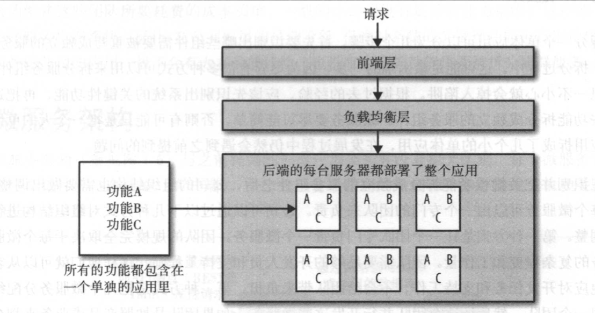
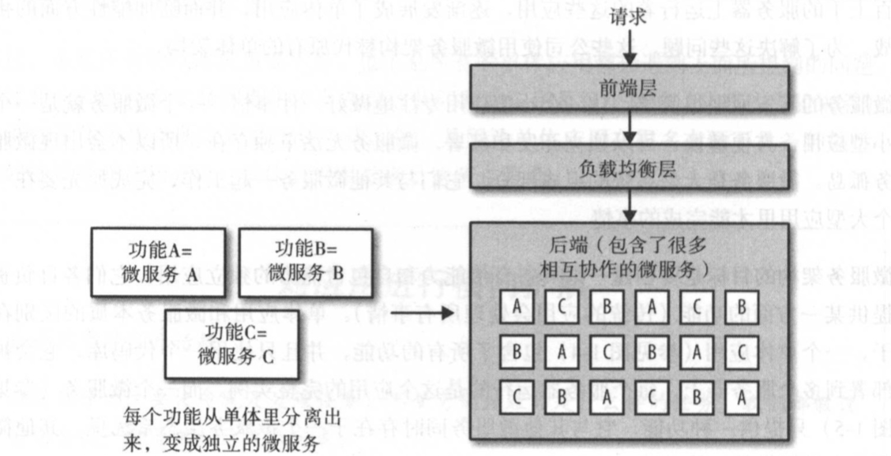
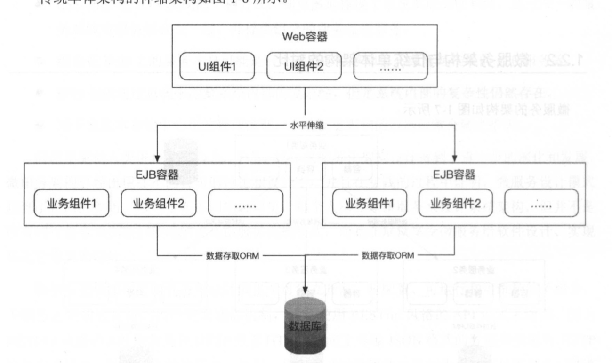
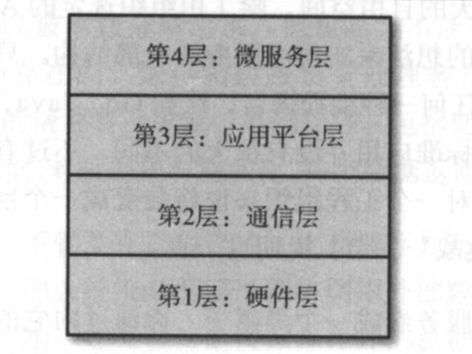

## 一 微服务简介

大型软件系统作为单体应用被部署后，引入新技术变得非常困难，传统单体架构如图所示：  

在01章节说道，SOA服务化系统能够分解任务，让每个服务更简单，职责单一，便于扩展，但是SOA技术体系中，无论是WebService还是ESB都有时代遗留问题：
- WebService问题：依赖中心化的服务发现机制，SOAP通信协议使用XML过重，服务化管理和治理设施不完善
- ESB问题：ESB视图总线隐藏了系统内部的复杂性，总线本身也是中心化管理模型

微服务就是为了解决上述问题而诞生的设计方案。让一个小型应用专注的做好一件事情，一个微服务就是一个小型应用，方便随时替换、独立开发、独立部署。所以，微服务也是无法单独存在的，他是整个系统的组成部分，与其他微服务一起工作，以完成原先要在一个大型应用里才能完成的事情。  

微服务结构图：  

  

微服务架构主张松耦合、高内聚效果，与SOA和ESB相比，不再强调服务总线和通信机制的多样性，微服务架构将软件应用设计为多个可独立开发、可配置、可运行、可维护的子服务，子服务之间通过良好的接口定义通信机制，通常使用RESTful风格的API形式来通信（因为该协议常使用JSON通信），这些服务不需要中心化的统一管理，每个服务的功能可自治，并且可以由不同的语言、系统、平台实现。  

微服务架构并不是为了拆分而拆分，真正的目的是通过对微服务进行水平扩展解决传统单体应用在业务急剧增长时候遇到的扩展瓶颈问题。  

下面对比下生产级 单体架构 与 微服务架构

生产级单体架构图
   
从图上总结但it架构：
- 在java体系中，单体的架构将所有模块化组件混合后运行在同一个服务JVM进程中
- 可对包含多个模块化组件的整体JVM进程进行水平扩展，而无法对某个模块化组件进行水平扩展
- 某个模块化组件发生变化时，需要对整个项目进行编译、打包、上线

生产级微服务架构图：  
  

从图上总结微服务架构：
- 职责单一的功能被放在一个独立的服务中
- 每个服务运行在一个单独的进程中
- 每个服务有多个实例在运行，每个实例可以运行在容器化平台内，达到平滑伸缩的效果
- 每个服务有自己的数据存储，实际上，每个服务都应该有自己独享的数据库、缓存、消息队列
- 每个服务应该有自己的运营平台，达到高度自治
- 每个服务都可以根据性能需求独立的进行水平伸缩

微服务与SOA架构的对比：
- 建设目的不同：SOA强调不同的异构服务之间的协作和契约，并强调有效继承、业务流程编排、历史应用集成，微服务目的是有效拆分，实现敏捷开发和部署
- 部署方式不同：SOA将代码打包在一个war包里，统一部署，微服务通常使用docker等技术实现自动化容器管理，每个微服务运行在单一进程内
- 服务粒度：SOA对粒度没有要求，一般是粗粒度的，微服务倡导细粒度拆分与职责单一

## 二 微服务生态

#### 2.0 微服务生态的组成

微服务并不是孤立存在的，它们存在于一个环境里，微服务在这个环境里进行交互。在一个设计良好的微服务生态系统里，微服务与基础设施之间是分离的。微服务与硬件、网络、构建和部署管道、服务发现和负载均衡都是分离的，他们都是微服务生态系统基础设施组成部分。如何以一种稳定可靠、可伸缩、可容错的方式来构建、维护、标准化基础设施，才是微服务运维的根本。  

微服务升天分为4层：  
  

#### 2.1 第1层-硬件层

硬件层是微服务运行的基础，按照业务需求，可以是从云服务商提供，也可以是企业自己购置的服务器。微服务的硬件层生态主要有：
- 物理服务器
- 数据库系统
- 操作系统
- 资源隔离和抽象
- 配置管理
- 主机级别的监控
- 主机级别的日志

#### 2.2 第2层-通信层

由于微服务之间的交互会在多个层上进行，所以通信是微服务重要的一环。该层主要生态包括：
- 网络与DNS
- RPC、端点、消息传递
- 服务发现与注册
- 负载均衡

**RPC、端点、消息传递**：  

微服务通过远程过程调用（RPC）或消息传递方式与其他微服务进行交互，其基本原理是：使用一个特定的协议，一个微服务把符合特定格式的数据通过网络发送到另一个服务或消息代理上。最常见的通信方式是HTTP+REST/Thrift，发送的数据一般是JSON/protocol buffer，不过由于其是同步阻塞的，有些厂商使用消息传递（异步非阻塞）的方式通信，其原理是一个微服务把数据通过网络发送给一个消息代理，消息代理会把消息路由到其他微服务上，消息穿很低可以使用直接请求/响应的方式，也可以使用发布/订阅的方式。值得一提的是Apache的Kafka支持上述两种消息模式。  

虽然消息传递带来的异步特性，但是它没有比REST更强的伸缩性，因为是集中式的，会导致消息对垒和消息代理变成整个生态系统的故障点，异步特性也会导致竞争条件。 

**服务发现与服务注册**：  

单体应用中，所有流量都发送给了负载均衡器，最后被分发到应用服务器上。在微服务架构中，业务流量被路由到不同的应用程序上，再被分发给部署了特定微服务的服务器。为了能够高效的实现上述场景，微服务架构需要在通信层实现：服务发现、服务注册、负载均衡。常见的服务发现技术有：etc、Consul、ZooKeeper。  

#### 2.3 应用平台层 

应用平台层包含了所有独立于微服务的内部工具和服务，其包含的主要内容有：
- 内部自助工具
- 开发环境
- 测试、构建、打包、发布公户
- 部署管道
- 微服务界别的日志与监控

#### 2.4 微服务层

该层属于业务范畴，与基础设施层完全分离。  

