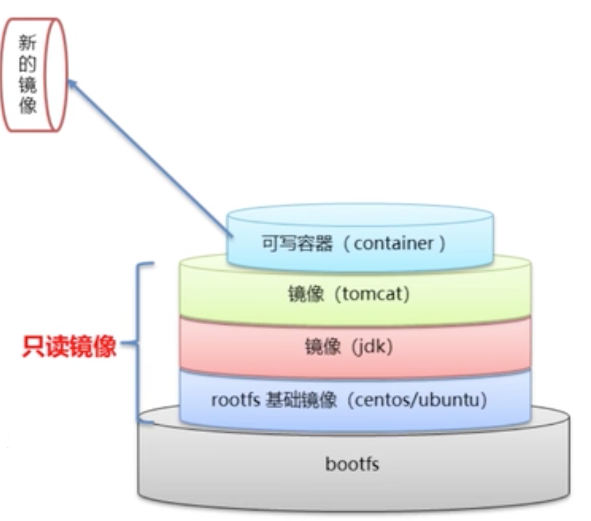

## 一 docker架构简介

Docker采用C/S架构，其引擎是模块化的，由许多工具协同工作，其主要组件包括：
- Docker Client：Docker客户端工具
- Docker daemon：Docker守护进程，实现了Docker的API。在Linux上，客户端与daemon之间通过IPC/UNIX Socket完成（/var/run/docker.sock）。
- containerd：用于操作新容器，如：容器的生命周期管理、镜像管理，创建容器的过程其实是fork一个runc实例。可以被第三方工具直接使用，如K8s中默认的容器运行时即是containerd。
- runc：OCI容器运行时规范的一个实现，是一个完全独立的容器运行时工具
- shim：容器解耦工具。在旧时代docker模型中，所有运行时逻辑在daemon中实现，启动和停止daemon会导致宿主机所有运行中的容器被kill！！！shim实现了无daemon容器，用于将运行中的容器与daemon解耦，方便daemon升级。

如图所示：  
  

学习Docker需要了解的四大核心技术:
- 镜像（image）
- 容器（container）
- 数据卷（data volumes） 
- 网络（network）

## 二 docker镜像

### 2.1 镜像命令

镜像是docker的可执行文件，其中包括运行应用程序所需的所有代码内容、依赖库、环境变量和配置文件等，通过镜像才能创建容器。  

镜像常用命令有（镜像名可以是 镜像ID:镜像版本）：
```
docker images                  # 列出本地镜像，添加 -a 会列出已删除镜像，添加 镜像名 则只列出该名称的镜像 
docker search 镜像名            # 搜索镜像    
docker pull 镜像名              # 下载镜像，默认存储于/var/lib/docker
docker inspect 镜像名           # 查看镜像详细信息
docker tag 原镜像名 新镜像名      # 修改镜像名，示例：docker tag nginx:latest my-nginx:v1.0
docker rmi 镜像名               # 删除镜像，删除所有镜像示例：docker rmi `docker images -q`
docker save 导出镜像名 打包镜像名  # 将本地的一个或多个镜像打包保存成本地tar文件
docker load 本地镜像名           # 导入打包的一个镜像到本地
```

贴士：
- 如果一个image_id存在多个名称，那么应该使用 名称:版本 的格式删除镜像 
- 命令参数(OPTIONS)
  -  `-f`（--force）强制删除
  -  `-o`, --output string 指定写入的文件名和路径 

根据模板创建镜像：
```
# 登录系统模板镜像网站:https://download.openvz.org/template/precreated/
# 找到一个镜像模板进行下载，如: #https://download.openvz.org/template/precreated/ubuntu-16.04-x86_64.tar.gz 

# 命令格式:
cat 模板文件名.tar | docker import - [自定义镜像名]

# 演示效果:
cat ubuntu-16.04-x86_64.tar.gz | docker import - ubuntu-mini
```

### 2.2 镜像原理

Linux的文件系统由bootfs和rootfs两部分组成：
- bootfs：包含bootloader（引导程序）、kernel（内核）
- rootfs：即root文件系统，包含典型Linux系统中的`/dev`，`/proc`，`/bin`，`/etc`等目录和文件

不同的Linux发行版，其bootfs基本一样，而rootfs不同。  

Docker的镜像本质上市一个分层文件系统，如下所示：  

  

Docker镜像的最底端复用了宿主机的bootfs，第二层是root文件系统，称为base image，再往上逐级添加其他镜像文件。这种统一的文件系统（Union File System）技术能够将不同的层整合为一个文件系统，为这些层提供统一的视角，从用户角度来说，他们只会看到一个文件系统。  

一个tomcat镜像，需要从底往上依赖图中所示的多个其他镜像，如JDK镜像，所以tomcat的安装包才几十M，但是Docker中的tomcat安装后镜像却几百兆！  

同样的道理，Docker的centos镜像很小，远远不足1G，因为该镜像可以直接复用宿主机的bootfs，只单独使用了rootfs和其他镜像层。  