## 一 docker的端口映射

Docker通过端口映射的方式，将容器中的端口映射到宿主机的某个端口上，这样外部就可以通过宿主机的`ip:port`访问容器内部的内容。  

Docker的端口实现可以是随机映射的，也可以指定端口来映射。   

默认情况下是随机映射的：
```
# 格式 docker run -d -P [镜像名称] 
netstat -tnulp              # 查看当前宿主机开放了哪些端口
docker run -d -P nginx      # 启动一个默认随机映射的nginx镜像
netstat -tnulp              # 再次查看当前宿主机开放了哪些端口

# 此时可以在浏览器访问 http://localhost:端口  nginx可以直接使用了
```

指定端口进行映射：
```
# 格式：docker run -d -p [宿主机ip]::[容器端口] --name [容器名称][镜像名称]

# 示例 如果不指定宿主机ip，则是0.0.0.0
docker run -d -p 192.168.8.14::80 --name server1 nginx
# 查看新容器ip
docker inspect --format='{{range .NetworkSettings.Networks}}{{.IPAddress}} {{end}}' 0ad3acfbfb76
# 查看端口映射       
docker ps           
```

当然也可以进行多个端口的映射：
```
# 格式 docker run -d -p [宿主机端口1]:[容器端口1] -p [宿主机端口2]:[容器端口2] --name [容器名称][镜像名称]
docker run -d -p 520:443 -p 6666:80 --name server2 nginx
```

docker常用网络命令：
```
docker network help             # 查看网络相关命令
docker network ls               # 查看当前主机网络
docker network inspect bridge   # 查看bridge的网络内部信息
```

## 二 Docker的网络架构

### 2.1 架构概述

从1.7.0版本开始，Docker正式把网络跟存储这两个部分的功能实现都以插件化的形式剥离出来，允许用户通过指令来选择不同的后端实现。剥离出来的独立网络项目叫做 libnetwork ，libnetwork中的网络模型(CNM：Container Networking Model)十分简洁，可以让上层的大量应用容器最大程度上不去关心底层实现。  

整体来看，docker的网络架构包含三个部分：
- CNM：网络设计标准，规定了docker网络架构的基础组成要素
- Libenetwork：CNM的具体实现
- 驱动：网络数据层

### 2.2 CNM

在CNM标准中，包含三个基本要素：
- 沙盒：Sandbox，独立的网络栈，包括以太网接口、端口、路由表、DNS配置
- 终端：Endpoint，终端利用虚拟端口将沙盒连接到网络虚拟网络接口
- 网络：802.1d网桥（类似交换机）的软件实现，是需要交互的终端的集合，并且终端之间相互独立

不同的容器之间进行交互的方式：  

  

上图中容器A只有一个终端，并连接到了网络A，容器B有2个终端，并接入了网络A和网络B，容器A与容器B之间可以互相通信，因为都接入了网络A，但是入股没有三层路由支持，容器B的两个终端之间不能互相通信。  

注意：终端只能接入一个网络，所以容器需要接入多个网络，就需要多个终端。  

### 2.3 Libnetwork

Libnetwork是CNM标准规范的Go语言实现。在Docker早期，网络部分代码位于daemon中，使得daemon变得臃肿，后来该部分被拆分，重构为了Libnetwork。  

Libnetwork除了实现了CNM的3个组件，还实现了本地服务发现（service Discovery）、基于Ingress的容器负载均衡、网络控制层和管理层。  

### 2.4 驱动

驱动用于实现数据层，如：网络连通性、隔离性是由驱动处理的。不过Docker也只是封装了若干内置驱动，在Linux上包括：Bridge、Overlay、Macvlan。  

docker的网络最终架构图：  

  

第三方也可以编写Docker的网络驱动，如Calico、Contiv等，每个驱动都负责其上所有网络资源的创建和管理。   

