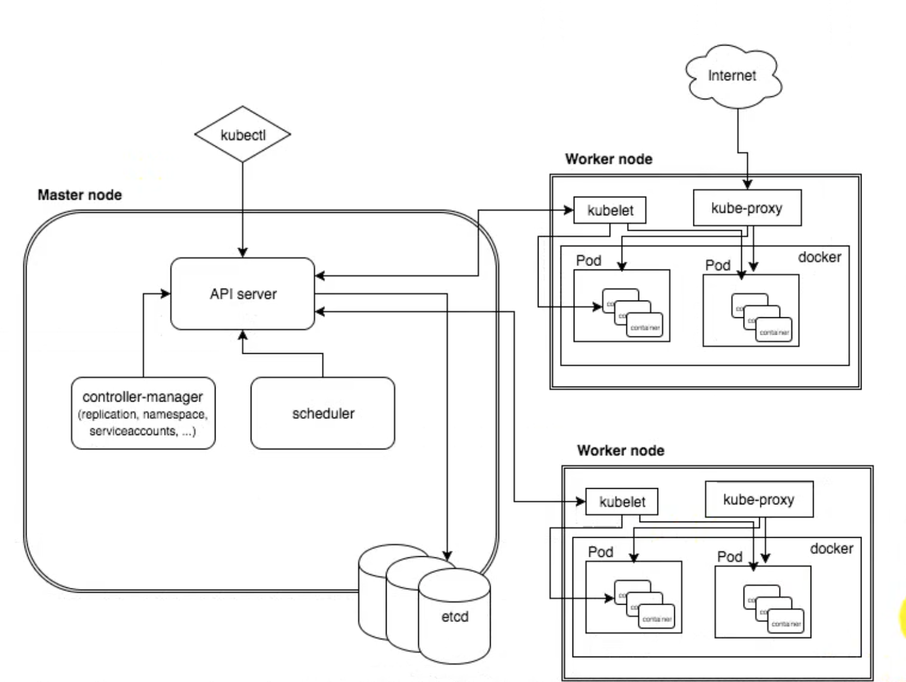
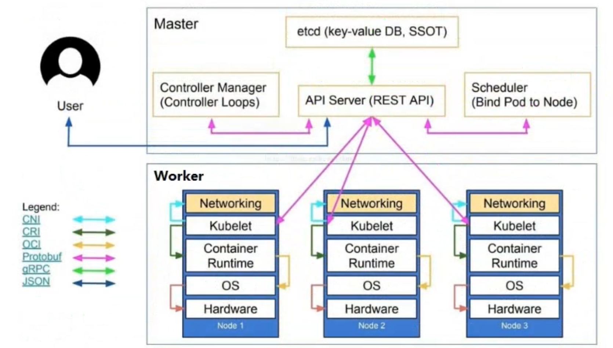

## 一 服务编排

> 服务编排：在实际开发中，业务可能需要被拆分成多个子任务，然后对这些子任务进行顺序组合，当子任务按照方案执行完毕后，就完成了业务目标，服务编排即对多个子任务执行顺序进行确定的过程

常见的服务编排工具：
- docker swarm：docker公司出品的服务编排工具套件
- Mesos：
- kubernetes：即大名鼎鼎的k8s，其目标是让容器化应用的部署更加简单、高效！

## 二 K8s简介

Kubernetes是Google在2014年发布的一个开源项目，简称k8s，即k与s之间有8个字母，起源于谷歌内部的Borg系统的Go语言实现。    

k8s是一个轻便、可扩展的开源平台，用于管理容器化的应用和服务。**通过k8s能够进行应用的自动化部署与扩容、缩容！**

k8s特性：
- 自动包装：可以基于容器对应用环境的资源配置要求自动部署应用容器
- 自愈能力：
  - 容器运行出错时，会对容器进行重启
  - 部署的Node节点出问题时，会对容器进行重新部署和重新调度
  - 容器未通过监控检查时，会关闭容器，直到容器能够正常运行，才会对外提供服务
- 水平扩展：通过一些简单的命令、UI界面就可以对应用容器进行规模扩大、剪裁
- 服务发现：用户不需要额外的服务发现机制，能够给予K8S自身能力实现服务发现与负载均衡
- 滚动更新：k8s可以根据应用的变化，对应用进行一次性、批量式更新

K8S还具备其他一些功能，如：版本回退、秘钥管理（热部署）、存储编排等，**但是超强的横向扩容能力,是其最强大、最实用的地方之一！**   

当前版本的K8S支持管理节点数为2000台，支持POD管理15万个！  

## 三 k8s架构简介

k8s在部署时是有中心节点的，如图所示：  

 

k8s包含两种节点：
- Master node：集群的管理节点，用于对工作节点进行调度管理，支持外部用户使用kubectl的命令操作k8s集群。包括组件有：
  - API Server：
  - Scheduler：
  - Cluster State Store：这是etcd的数据库
  - Controller Manager Server：
- Worker node：集群的工作节点，用于运行业务应用的容器。包括组件有：
  - kubelet：
  - kube proxy：
  - Container Runtime：

k8s节点的工作明细图：  

  

## 四 k8s集群的部署

k8s有多种搭建方式，但是由于国内网络原因，都存在网络困难问题：
- 单机方案：
  - minikube：k8s官方的单机集群快速部署工具，国内推荐使用阿里云版：https://github.com/AliyunContainerService/minikube
  - docker desktop：docker可视化客户端现在也支持k8s，由docker公司出品，国内也推荐使用阿里云版：https://github.com/AliyunContainerService/k8s-for-docker-desktop
- kubeadm：官方提供的生产环境集群版安装工具包，所有组件都在集群中运行，非常优雅，但是该工具正式推出时间不长！！！
- 二进制：纯手动源码安装，安装复杂