## 一 Controller

### 1.1 Controller概念

上一节中通过命令或者yaml清单直接创建的pod，是不受控制器管理的，当Pod出现问题时，就会造成服务提供失败。使用控制器创建的Pod在出现问题时，控制器会把Pod重新拉起，以达到用户的期望状态。      

常见的Pod控制器有：
- ReplicaSet：副本集控制器，用于对Pod进行副本规模扩大、剪裁。
  - 旧版中也有个控制器ReplicationController功能和RS差不多，新版推荐直接使用RS，因为支持集合式的selector（pod打tag后，支持批量选择操作）。
  - 注意：RS虽然可以独立使用的，但是仍然推荐使用Deployment自动管理RS，因为RS不支持rolling-update（滚动更新）等，会引起兼容问题
- Deployment：声明式更新控制器，用于发布无状态应用
- StatefulSet：有状态副本集，用于发布有状态应用，常见的如持久化存储、Pod的有序部署与回收（如先启动mysql、然后是tomcat、最后是nginx）、维护Pod网络标识（即重新调度Pod后，其PodName和HostName不变）
- DaemonSet：以守护进程方式运行，在k8s集群每一个Node上运行一个副本，用于发布监控、日志收集，如部署fluentd、logstash等
- Job：运行一次性作业任务
- CronJob：运行周期性作业任务

### 1.2 Depoloyment控制器

Deployment控制器可以实现：上线部署、滚动升级、创建副本、回滚等功能，内部包含了ReplicaSet。在使用控制器时，也推荐使用Deployment，而不是直接使用ReplicaSet，除非需要自定义升级功能，或者根本不需要升级Pod。  

通过kubectl命令创建Deployment控制器：

```
# run 默认会运行一个Deployment控制器！！
# nginx-app1：deployment控制器类型的应用名称
# IfNotPresent：容器镜像下载策略：如果本地有镜像，优先使用本地镜像
# --replicas=2：运行的Pod公有2个副本，这是用户的期望值
# Deployment控制器内部的ReplicaSet控制器会一直监控此应用运行的Pod副本状态，如果数量达不到用户期望，会重新拉起新的Pod，以保证Pod数量维持在期望值。

kubectl run nginx-app1 --image=nginx:latest --image-pull-policy=IfNotPresent --replicas=2

# 查看控制器
kubectl get deployment.apps     
kubectl get replicaset
kubectl get replicaset.apps
kubectl get pods -o wide        # 查看下pod状态，此时会出现2个pod，因为在run时，设置了2个relicas

# 在任意节点上，都可以访问上述输出的任意ip结果
curl http://10.244.3.7

# 删除控制器
kubectl delete deployment.apps nginx-app1
```

注意：**带有控制器的pod不建议直接删除pod，而应该删除控制器。如果直接删除带有控制器类型Pod，会被重新拉起！**

### 1.3 资源清单文件创建控制器

资源清单文件ctrl-demo1.yaml
```yaml
apiVersion: apps/v1
kind: Deployment
metadata: 
  name: nginx-app2
spec:
  replicas: 1
  # 标签选择器：控制器nginx-app2如何找到Pod Nginx
  selector:             
    matchLabels:
      app: nginx-pl
  # 应用的Pod模板
  template:
    metadata:
      name: nginx-p
      labels:
        app: nginx-pl
    spec:
      containers:
      - name: nginx
        image: nginx:latest
        imagePullPolicy: IfNotPresent
        ports:
        - containerPort: 80
```

使用：
```
# 添加
kubectl apply -f ctrl-demo1.yaml

# 删除
kubectl delete -f ctrl-demo1.yaml
```

## 二 Deployment控制器对滚动更新的支持

在更新时，Deployment控制器会定制当前内部的RS，创建新的RS并运行，回滚时，也是停止当前运行的新RS，运行旧的RS，如图所示：  

  