## 一 Pod 简介

Pod是k8s资源调度的最小单元，注意：k8s的最小单元并不是容器，一个Pod中包含了多个容器，笔者认为这样做能更好的做到资源分配、负载均衡。  

Pod相关的命令：
```
# 该命令默认查看default命名空间中的Pod，注意 pods可以简写为pod
kubectl get pods      # 指定查看Pod： kubectl get pods --n kube-system

# 显示结果
NAME                     READY   STATUS    RESTARTS   AGE
nginx-554b9c67f9-k99dn   1/1     Running   0          71m
```

## 二 使用资源清单创建Pod

编写一份创建含有nginx的Pod，文件名为 poddemo1.yaml。在书写yaml文件前，我们需要先准备nginx的docker镜像：
```
# 必须在worker节点上pull，因为master节点不允许调度业务容器
docker pull nginx:latest
```

pod-demo1.yaml：
```yaml
apiVersion: v1
kind: Pod
metadata:
  name: p-mynginx
spec:
  containers:
  - name: c-mynginx
    image: nginx:latest
    imagePullPolicy: IfNotPresent
    ports:
    - name: nginxport
      containerPort: 80
```

执行资源清单文件：
```
kubectl apply -f pod-demo1.yaml
```

## 三 访问Pod

实际开发中，不推荐访问Pod，因为宿主机重启时，Pod的地址会发生变化，这里只是一个演示：
```
# 查找并显示pod的详细信息
kubectl get pods -o wide

# 显示结果
NAME                          READY   STATUS    RESTARTS   AGE    IP            NODE      NOMINATED NODE   READINESS GATES
p-mynginx-5f54f59897-7jrdr    1/1     Running   0          102s   10.244.3.10   worker1   <none>           <none>
p-mynginx-5f54f59897-mfngq    1/1     Running   0          102s   10.244.3.9    worker1   <none>           <none>

# 任意机器访问pod所在ip即可
curl http://10.244.3.10 
curl http://10.244.3.9
```

## 四 删除pod

使用命令行删除pod：
```
kubectl delete pods pod名称
```
同样，删除pod也可以使用资源清单进行删除。

## 五 Pod的生命周期

### 5.0 Pod启动步骤

Pod生命周期过程：
- 1、创建Pod：通过kubectl操作创建容器接口后，容器进行环境初始化，此时会启动一个基础容器Pause，负责网络、存储卷共享。  
- 2、Pending：接着启动0-多个Init容器，Init容器总是运行到Pod成功启动为止，每个Init容器都必须在下一个Init容器启动前完成启动。
- 3、Running：Main主容器运行，其在开始（start）和结束（stop）时，可以运行一些脚本命令
- 4、Main主容器运行一段时间后，会进行就绪检测（readiness）与监测（liveness）
  - readiness：就绪检测，当容器内部的镜像能够真正启动后，才会让Pod进入running状态。   
  - liveness：监测容器能不能正常运行，若不能则进行重启或者重新创建Pod 

  

在Pod结束运行时的状态:
- Succeeded：Pod中所有容器都被终止，并不会重启
- Failed：Pod中所有容器都被终止，但是至少有一个容器是因为失败终止，即该容器以非0状态退出
- Unknown：未知，无法取得Pod状态，通常是因为与Pod所在主机通信失败

### 5.1 Init容器

如果要在主容器（应用程序容器）启动前，需要一些预备操作，比如梳理数据、创建文件等等，可以使用Init容器。  

Init容器必须在应用程序容器启动之前运行完成，而应用容器之间是并行运行的。所以Init容器具备阻塞、延迟应用容器的功能。  

Init容器使用Linux Namespace，能够访问Secret权限，而应用程序则不能，比如某个文件主容器不能访问，但是又必须对内容进行修改后才能使用，这时候可以在Init容器中对文件作出相应的修改。  


Init容器的使用方式：
```yaml
kind: pod
spec:
  containers:
  - name: my-main-container
    image: myimage
    command: ['sh', '-c', "echo main..."]
  initContainers:
  - name: my-init-one
    image: myinit-one
    command: ['sh', '-c', "echo one..."]
  - name: my-init-two
    image: myinit-two
    command: ['sh', '-c', "echo two..."]
```

在启动后，查看：
```
kubectl get pod -w    # 此时status会显示 Init:0/2，直到全部就绪
```

如果Pod的Init容器启动失败，则k8s会依据restartPolice策略进行下一步操作：
- Always：restartPolice的默认值，Init失败后，会不断重启
- No：不会重启

### 5.2 探针

探针是容器所在节点的kubelet对容器执行的定期诊断。kubelet调用容器实现的Handler实现相应的处理，如下所示：
- ExecActio：在容器内执行指定命令，如果命令退出时返回码为0，则认为诊断成功
- TCPSocketAction：对镇定端口上的容器IP地址进行TCP检查，如果端口打开，则诊断认为成功
- HTTPGetAction：对指定端口和路径上的容器的IP地址执行Get请求，响应码大于等于200且小于400，则诊断被认为是成功的

诊断的结果可以为：成功、失败、未知。  

探针实现：
```yaml
spec:
  containers:
  - name: ....
  # 探针就绪检测
  readinessProbe: 
    httpGet: 
      port: 80
      path: /index.html
    # 容器启动1s后执行检测  
    initialDelaySeconds: 1
    # 多少秒后继续检测
    periodSeconds: 3
  # 探针存活检测：也支持httpGet,tcpSocket
  livenessProbe: 
    exec: 
      command: ["test", "-e", "/tmp/live"]
    # 容器启动1s后执行检测  
    initialDelaySeconds: 1
    # 多少秒后继续检测
    periodSeconds: 3
```

### 5.3 start与stop执行动作

```yaml
spec: 
  containers:
  - name: ...
    lifecycle: 
      postStart:
        exec:
          command: ["/bin/sh", "-c", "echo start..."]
      preStop:
        exec:
          command: ["/bin/sh", "-c", "echo stop..."]
```
