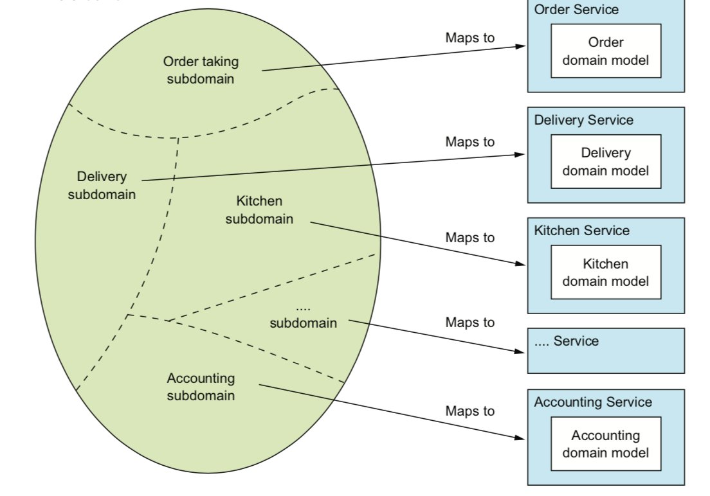

## 一 拆分策略

#### 1.0 常见拆分策略

- 根据业务拆分
- 根据子域进行服务拆分

#### 1.1 根据业务进行服务拆分

比如在线商城根据业务能力，分为：订单管理、库存管理、发货等等。  

比如在线点餐系统分为：
- 供应商管理
  - Courier management：送餐员信息管理
  - Restaurant management：餐馆信息管理，如营业时间、餐厅地址等
- 消费者管理
- 订单管理
  - Order management：消费者创建、管理订单
  - Restaurant order management：餐馆管理订单的生产过程
  - Courier availability management：管理外卖员的实时状态
  - Delivery management：确认订单
- 账单管理
  - Consumer  accounting：消费者账单
  - Restaurant accounting：餐馆账单
  - Courier acctounting：外卖员账单

我们可以将上述子级业务映射到服务中，因为子级服务之间交叉关联性很小。但是账单管理则不同，三个子级分类之间相似性很大，所以账单管理可以整体映射为一个服务。  

围绕业务组织服务的好处是：较为稳定的业务能够使架构也变得相对稳定。  

#### 1.2 根据子域进行服务拆分

  

## 二 拆分指导原则

- 单一职责原则：设计小的、内聚的单一职责服务。你如客户获取外卖：订单创建、准备、送餐都由一个的那一刻服务承载
- 闭包原则：设计方向应该是一个变更只会影响一个服务

## 三 微服务拆分的注意点

- 网络延迟：对服务的特定分解会导致各个服务之间的大量往返调用，可以通过批处理API进行聚合返回，也可以把多个服务组合在一起，用编程语言函数调用来代替进程间通信
- 同步进程间通信导致可用性降低：一般使用REST方式同步调用其他服务，一旦一个服务不可用，整个请求都会发生问题，这时候可以采用异步消息来消除同步调用产生的耦合问题
- 服务间维持数据一致性：比如某个服务发生数据变化，需要以原子方式同步更新多个服务数据，传统方式是使用两段提交的分布式事务管理机制。现在可以使用类似Saga的消息协作本地事务，因为其特性是最终一致的。
- 上帝类：上帝类是在整个应用程序中使用的全局类，大量的字段会映射到多个数据库表，比如电商系统的订单类！
  - 解决方案一：将Order类打包到苦衷并创建一个重点Order数据，处理订单的所有服务都使用此库访问数据库，该方案违反了微服务架构原则，对Order中心的任意更改都会影响到其他服务
  - 解决方案二：将Order数据库封装在OrderService中，该服务由其他服务调用以检索和更新，但是该方案造成OrderService称为一个纯数据服务，称为包含很少业务逻辑的贫血模型
  - 解决方案三：更好的方案是使用领域模型师合集将每个服务视为具有自己的领域模型的单独子域。