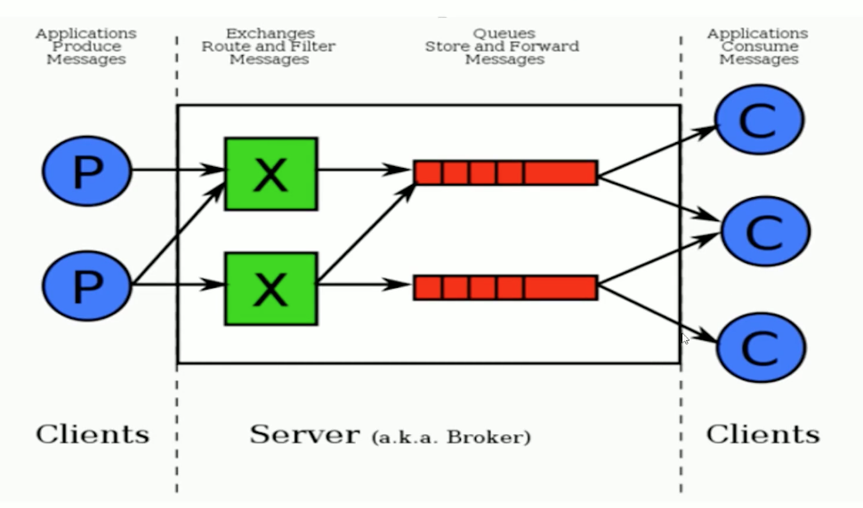

## 一 RabbitMQ概述

### 1.1 RabbitMQ简介

> RabbitMQ: 开源、跨语言的消息代理和队列服务器。RabbitMQ基于AMQP协议，使用Erlang语言开发。  

RabbitMQ的特点：
- 开源、稳定性高、性能优秀
- 能够提供可靠性消息投递模式（confirm）、返回模式（return）
- 集群模式丰富，表达式配置、HA模式、镜像队列模型

### 1.2  AMQP协议

> AMQP: 高级消息队列协议，是具备现代特征的二进制协议。提供了统一消息服务的应用层标准高级消息队列协议，专为面向消息中间件而设计

AMQP协议模型：  

  

该协议中的一些具体概念：
- Server：又称为 Broker，负责接受客户端的连接，实现AMQP的实体服务。
- Connection：连接，应用程序与Broker间的网络连接
- Channel：网络信道，数据的读写都是在Channel中进行的，客户端可以建立多个Channel，每个Channel代表一个会话
- Message：消息，服务器与应用程序之间传送的数据，包含两部分：
  - Properties：对消息的修饰，如优先级、延迟
  - Body：消息体内容
- Virtual host：虚拟地址，用于进行逻辑隔离，是最上层的消息路由。一个虚拟地址内可以有多个不重名的Exchange、Queue。简单来讲：他是用来划分服务的，项目中有多个服务，A服务可以将其不同的消息都路由的 "/A" 的虚拟地址中，B服务可以将其不同的消息都路由的 "/B" 的虚拟地址中。
  - Exchange：交换机，用于接收消息，根据路由建转发消息到绑定的队列上
  - Binding：Exchange和Queue之间的虚拟连接，可以包含routing key
  - Queue：即消息队列

### 1.3 RabbitMQ整体架构 

架构图：

  

消息流转图： 

  

## 二 RabbitMQ安装

### 2.1 Mac安装

```
# 替换homebrew源
echo 'export HOMEBREW_BOTTLE_DOMAIN=https://mirrors.tuna.tsinghua.edu.cn/homebrew-bottles' >> ~/.bash_profile
source ~/.bash_profile

# 安装rabbitmq
brew update
brew install rabbitmq
echo 'export PATH=$PATH:/usr/local/opt/rabbitmq/sbin' >> ~/.zprofile
source ~/.zprofile
```

### 2.2 CentOS7 安装

```
# 准备：
yum install 
build-essential openssl openssl-devel unixODBC unixODBC-devel 
make gcc gcc-c++ kernel-devel m4 ncurses-devel tk tc xz

# 下载：
wget www.rabbitmq.com/releases/erlang/erlang-18.3-1.el7.centos.x86_64.rpm
wget http://repo.iotti.biz/CentOS/7/x86_64/socat-1.7.3.2-5.el7.lux.x86_64.rpm
wget www.rabbitmq.com/releases/rabbitmq-server/v3.6.5/rabbitmq-server-3.6.5-1.noarch.rpm

# 采用rpm包安装后，修改器核心配置文件
vim /usr/lib/rabbitmq/lib/rabbitmq_server-3.6.5/ebin/rabbit.app

# 如修改密码、配置等等，例如：loopback_users 中的 <<"guest">>,只保留guest
```

## 三 RabbitMQ的启动与停止

```
# 安装管理插件
rabbitmq-plugins enable rabbitmq_management

# 后台启动
rabbitmq-server start &     

# 停止
rabbitmqctl stop
```

管理界面地址：http://localhost:15672/  
默认登录账户和密码都是：guest