## 一 Nginx高可用架构

Nginx虽然实现了负载均衡，但是其本身也有宕机的可能，而且Nginx的宕机会让所有的集群服务时效，这是不能容忍的，所以Nginx的高可用非常重要。  

双机高可用一般通过虚拟IP实现（即linux的IP别名）。为一台主服务器加一台热备服务器，正常情况下，主服务器绑定一个公网虚拟IP，提供负载均衡服务，热备服务器处于空闲状态，当主服务器发生故障时，热备服务器接管主服务器的虚拟IP，提供负载均衡服务。  



## 二 Nginx高可用架构配置

配置前提：
- 多台安装Nginx的服务器
- 每台Nginx服务器均需安装keepalived：`yum install keepalived`

修改keepalived配置文件，其配置文件位于 `/etc/keepalived/keepalived.conf`：
```
global_defs {
    ...
    router_id LVS_DEVELBACK     # 访问到的主机，此时需要在host文件中添加 127.0.0.1  LVS_DEVEL
}

vrrp_script chk_http_port {
    script "/usr/local/src/nginx_check.sh"
    interval 2              # 检测脚本执行的间隔
    weight 2
}

vrrp_instance VI_1 {
    state MASTER            # 如果是备份服务器，这里是 BACKUP
    interface ens33         # 网卡
    virtual_router_id 51    # 主备机的路由ID必须相同
    priority 100            # 主备机的优先级，一般主机值较大，备份机较小
    ...
    virtual_ipaddress {
        192.168.3.55        # 虚拟地址
    }
}
```

检测nginx心跳的脚本文件nginx_check.sh：
```sh
#!/bin/bash
A=`ps -C nginx -no-header |wc -l`
if [ $A -eq 0];then
    /usr/local/nginx/sbin/nginx
    sleep 2
    if [`ps -C nginx --no-header |wc -l` -eq 0];then
        killall keepalived
    fi
fi
```

启动主备机的keepalived和nginx：
```
# 注意nginx如果已经启动了，则需要重启
systemctl start keepalived.service
```
