## 一 web请求处理机制 

### 1.1 方式一：多进程

多进程方式：服务器每次接收到一个客户端请求，都会由主进程生成一个子进程来和客户端建立连接，直到断开，该子进程结束。  

多进程实现简单，各个子进程之间相互独立，处理请求时互不干扰，缺点是生成一个子进程需要进行内存复制操作，在资源和时间付出了很大的开销，如果并发请求大，就会导致资源紧张。  

Apache服务器使用了多进程方式，为了应对高并发，采取“预生成进程”机制。即请求到来之前就已经生成了子进程，并且当子进程工作完毕，不会被销毁而是等待下一个客户端请求。虽然有所改进，但是没有从根本上解决问题。  

### 1.2 方式二：多线程

服务器每接收到一个客户端时，由主进程派生衣蛾线程来和客户端交互。派生开销很小，但是多个线程位于同一个进程内，可以访问同样的内存空间，彼此之间互相影响，增加了出错成本。多线程服务器经典代表是IIS。 

### 1.3 方式三：异步方式

同步与异步：
- 同步：发送请求后，需要等待接收方的响应后，才接着执行后续的事情
- 异步：发送请求后，无须等待接收方的响应，直接开始后续操作，发送方的请求形成一个队列，接收方处理完后通知发送方

阻塞与非阻塞（与操作系统提供的相应调用方法有关）：
- 阻塞：Socket调用结果返回之前，当前线程从运行状态被挂起，一直等到调用结果返回之后，才进行就绪状态，获取CPU后继续执行
- 非阻塞：如果调用结果不能马上返回，当前线程也不会被挂起，而是立即返回执行下一个调用

同步和阻塞，异步和非阻塞其实不是相同的概念：
- 同步阻塞：发送方发送请求后，一直等待响应，接收方在处理的IO时不能处理任何其他事情，比如超时排队付款，客户向收银员付款后等待找零，不能做其他事情，而收银员需要等待收款返回结果。
- 同步非阻塞：发送方发送请求后，一直等待响应；接收方在处理该请求的IO时，如果不能马上得到结果，就立即返回，去做其他的事情，但是发送方没有等到结果，所以会一直等待。实际中基本不使用该方式。
- 异步阻塞：发送方发送请求后，不用等待响应，而接收方阻塞式处理IO
- 异步非阻塞：发送方不用等待响应，接收方也无须等待IO处理结果

## 二 Nginx的请求处理

Nginx采用多进程和异步非阻塞相结合机制，在启动后，产生一个主进程和多个工作进程，工作进程用于接收和处理客户端请求，每个工作进程采用异步非阻塞方式处理请求。   

IO调用是如何把自己的状态通知给工作进程的：
- 轮询方式：工作进程在进行其他工作时，每隔一段时间检查IO状态，如果完成，则响应，如果未完成则继续工作
- 主动方式：IO完成后主动通知工作进程，常见的select、poll、epoll、kqueue都采用该方案。这些系统调用，也被称为事件驱动模型，提供了一种机制，可以让进程同时处理多个并发请求，不用关心IO状态，IO调完全由事件驱动模型管理，事件准备好后通知工作进程事件已经就绪。

事件的具体介绍见下一节：Nginx的事件模型。

## 三 Nginx基本架构

#### 3.1 Nginx进程

服务器启动后，产生一个主进程，负责解析配置文件，初始化数据结构，注册模块配置，信号处理，网络监听等，主进程还会产生一到多个工作进程，负责进程初始化，模块调用，请求处理等工作。  

如图所示：  

  

一个Master和多个Worker的好处：
- 利用Nginx进行热部署，`nginx -s reload` ，因为未工作的work进程可以重新加载
- 每个worker是一个独立的进程，多个worker可以降低请求中断的风险

一个master进程对应多个worker进程，worker进程负责处理具体的请求逻辑，出现问题的概率较大，master主要处理worker进程的监控：如worker出错终止，master会重新fork一个worker进程。  

让每个worker进程运行在一个单独的内核上，可以最大限度减少CPU进程切换成本，效率最高。即**计算机核心数可以用来配置worker数**。  

Nginx为了提高效率，采用了缓存机制，将历史数据缓存到了本地，每次Nginx服务器启动后的一段时间内，会启动专门的进程对本地的缓存内容进行重建索引，保证对文件的快速访问。    

主进程作用：
- 读取Nginx配置文件并验证其有效性和正确性
- 建立、绑定、关闭Socket
- 按照配置生成、管理、结束工作进程
- 接收外界指令，比如重启、升级、退出等服务器指令
- 不中断服务，实现平滑重启、升级、失败回滚处理
- 开启日志文件，获取文件描述符
- 编译和处理Perl脚本

工作进程作用：
- 接收客户端请求
- 将请求一次送入各个功能模块进行过滤处理
- IO调用，获取响应数据
- 与后端服务器通信，接收后端服务器处理结果（反向代理）
- 数据缓存，访问缓存索引、查询和调用缓存数据
- 发送请求结果，响应客户端请求
- 接收主程序指令，比如重启、升级、退出

缓存模块，主要由缓存索引重建（Cache Loader）和缓存索引管理（Cache Managger）两类进程完成工作。- 缓存索引重建进程：nginx服务启动一段时间后（默认1分钟）由主进程生成，在缓存数据重建完成后就自动退出；缓存索引管理进程一般在于主进程的整个生命周期，负责对缓存索引进行管理：根据磁盘上缓存文件在内存中建立索引元数据库，对缓存文件目录进行扫描，检查内存中已有俺村元数据是否正确，更新索引元数据库
- 缓存索引管理进程：负责在索引元数据更新完成后，对元数据是否过期做出判断

注意：Nginx具有CPU亲和（affinity）性，Nginx会将CPU核心与Nginx工作进程进行绑定，每个worker进程都会固定在一个CPU上执行，减少切换CPU的cache miss，获得了更好的性能。

#### 3.2 Nginx进程交互

Nginx的进程之间的交互依赖于管道机制，交互的准备工作都是爱工作进程中完成的。  

主进程与工作进程交互：  

Nginx主进程会建立一张全局的工作进程表用于存放当前未推出的所有工作进程。新生成的工作进程会被加入到该表中，并建立一个单项管道并将其传递给该工作进程。注意：这个管道是主进程指向工作进程的单向管道，包含了主进程向工作进程发出的指令、工作进程ID、工作进程在工作进程表中的索引、必要的文件描述符  

主进程与外界交互：  

主进程与外界通过信号进行通信，当接收到需要处理的信号时，通过管道向相关的工作进程发送正确的指令，每个工作进程都有能力捕获管道中的可读事件，当管道中有可读事件时，工作进程从管道读取并解析指令，然后采取相应的措施。

工作进程与工作进程交互：  
二者交互原理与主进程、工作进程之间交互原理一致，只要工作进程中回见能够得到彼此的信息，建立管道就可以通信，但是由于工作进程之间是相互隔离的，因此一个进程要想知道另一个进程的信息，只能通过主进程来设置了。  
为了能让工作进程间交互，主进程在生成工作进程后，在工作进程表中进行遍历，将新的进程ID以及针对该进程建立的管道句柄传递给工作进程表中的其他进程，为工作进程之间交互做准备，每个工作进程捕获管道中的可读事件，根据指令采取响应的措施。