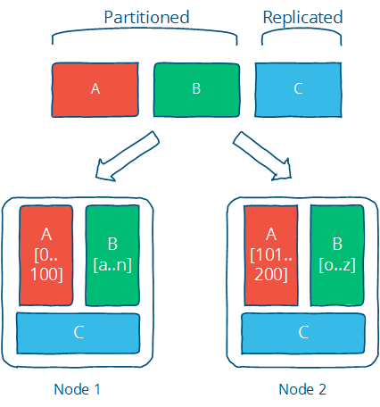
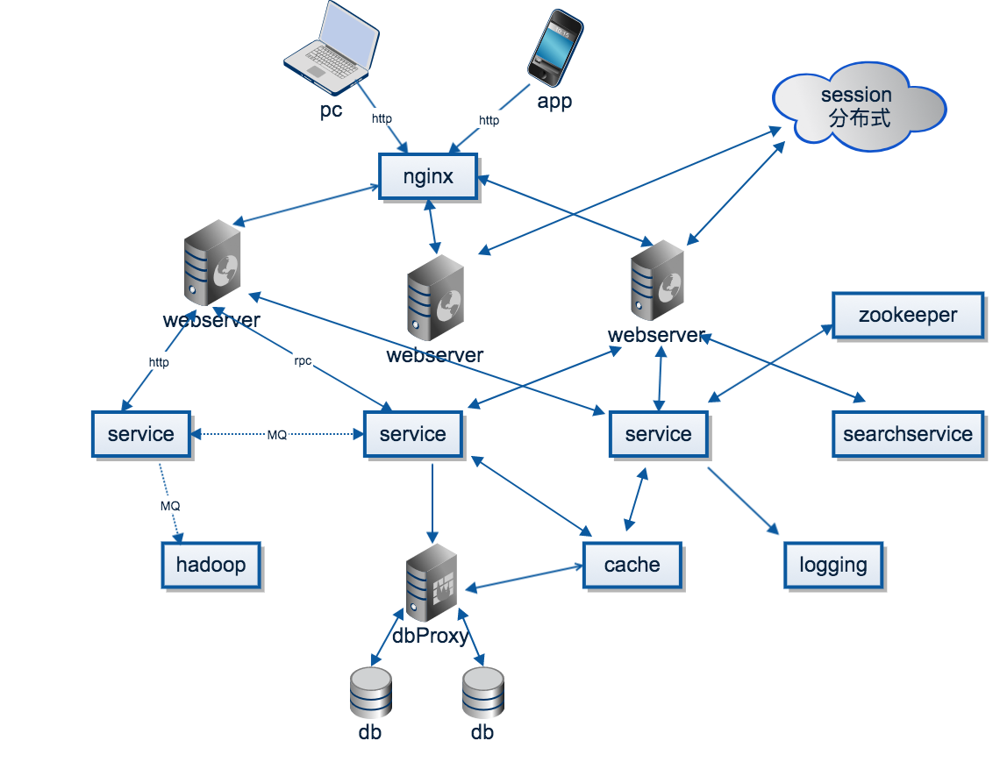

## 零 开宗明义

#### 0.1 笔记计划结构

- 架构概述篇
    - 架构演进
    - 微服务设计
    - 微服务要点
- 架构实践篇
    - Java中的微服务架构
    - Go中的微服务架构
- 架构原理篇
    - 分布式系统
    - 分布式原理与泛型
    - 算法的实现与源码分析

#### 0.2 集群 分布式 微服务 SOA

很多时候，我们在讨论技术架构时，都离不开集群、分布式以及现在的微服务。他们三者往往让初学者捉摸不透有什么区分。笔者在第一章第0节特点优先介绍这三者的概念，以预防后期笔记让读者产生困惑。

**先导示例**：一个任务，1台机器执行需要10小时完成，现在购买了10台机器，如何提升效率？
- 采用集群方案：10台机器都部署了该任务，此时执行1个任务，只需要其中1台机器执行，时长10小时，但是如果我们有10个任务要执行，耗费时长仍然是10小时，平均下来，1个任务耗时1小时；
- 采用分布式方案：拆分成10个子任务，每个子任务只需要1小时完成，那么1个任务只需要1小时就能完成。

**集群与分布式**：  
- 集群：代表业务的物理的形态，某个业务部署在了多个服务器上。在效率上，集群通过提高单位时间内执行的任务数来提升效率。
- 分布式：代表业务的工作形态，某个业务被拆分成了多个子业务，子业务分别部署在了不同的服务器上。在效率上，分布式通过缩短单个任务的执行时间（单任务被拆分为多个子任务，多个子任务并行执行，所以单任务时间被缩短）来提升效率

由上我们可以看出，分布式中的每一个节点（服务器），都可以作为集群部署，而集群就不一定是分布式的了。 
好的设计应该是分布式和集群的集合，先分布式再集群，具体实现就是业务拆分成很多子业务，然后针对子业务进行集群部署，这样每个独立的子业务出现了问题，不会对整个系统造成影响。  

**SOA**：  
业务系统分解为多个组件，让每个组件独立提供离散、自治，可复用的服务能力，通过服务的组合和编排来实现上层的业务流程。  

**微服务**：  
微服务只是一种架构风格，将一个大型软件拆分为多个松耦合的微服务，各个微服务可以独立部署，即将业务拆分为多个独立的单元，单元之间通过网络实现数据的交互。  

所以笔者这里认为微服务其实是分布式理念按照SOA的设想后的一种严格实现，但是微服务的应用可以分布在多态服务器上，也可以在同一个服务器。  

微服务相比分布式服务来说，它的粒度更小，服务之间耦合度更低，由于每个微服务都由独立的小团队负责，因此它敏捷性更高，分布式服务最后都会向微服务架构演化，这是一种趋势， 不过服务微服务化后带来的挑战也是显而易见的，例如服务粒度小，数量大，后期运维将会很难。  

从上我们也不难发现，分布式是现代大型应用技术架构的基石。

#### 0.3 分布式系统概念

分布式系统由一组计算节点组成，这些节点之间通过通过网络进行通信，并且能够协调工作以完成共同的任务。  

根据上述说法，我们可以发现，使用分布式系统可以让多个廉价的计算机通过协作来达到昂贵的大型机的处理能力。相对而言，这样做降低了成本（只有当单个节点的处理能力无法满足日益增长的计算、存储任务的时候，且硬件的提升（加内存、加磁盘、使用更好的CPU）高昂到得不偿失的时候，应用程序也不能进一步优化的时候，我们才需要考虑分布式系统）。  

常见的分布式应用主要包括：分布式计算（computation）与分布式存储（storage）。计算需要数据，要么来自实时数据（流数据），要么来自存储的数据；而计算的结果也是需要存储的，单机操作系统完美的实现了计算与存储，分布式系统只不过将单机理论推广到了多个节点。  

由上看出，我们面临的第一个挑战是如何将任务分发到不同的计算机节点，大难是分而治之，即分片（partition）：
- 对于计算，那么就是对计算任务进行切换，每个节点算一些，最终汇总就行了，这就是MapReduce的思想；
- 对于存储，每个节点存一部分数据就行了。当数据规模变大的时候，Partition是唯一的选择，同时也会带来一些好处。

#### 0.4 分布式系统问题

当然，理论是丰满的，分布式系统仍然有许多单机系统中从未有过的挑战：
- 单个节点的故障（进程crash、断电、磁盘损坏）是小概率事件，但是节点越多，事故概率也就越高（指数级增加）
- 节点之间通过网络通信，网络本身可能出现断网、高延迟的情况

解决上述问题的办法是：冗余或者复制集（Replication），即多个节点负责同一个任务，最为常见的就是分布式存储中，多个节点复杂存储同一份数据，以此增强可用性与可靠性。同时，Replication也会带来性能的提升，比如数据的locality可以减少用户的等待时间。  

笔者这里认为即分布式与集群的配合使用，如图所示Partition与Replication是如何协作的：

  

Partition和Replication是解决分布式系统问题利器，但也引入了更多的问题，最常见的问题是一致性问题：因为复制集各个副本之间需要保持数据的一致性，一致性在系统的角度和用户的角度又有不同的等级划分。如果要保证强一致性，那么会影响可用性与性能，在一些应用（比如电商、搜索）是难以接受的。如果是最终一致性，那么就需要处理数据冲突的情况，这也是不同的一致性解决方案理论的诞生缘由，如：CAP、FLP。

#### 0.5 分布式系统特性与标准

- 透明性：用户无需关心分布式系统如何实现，也不关心读到的数据来自哪个节点，在使用体验上，与单机系统无异
- 可扩展性：当任务增加的时候，分布式系统的处理能力需要随之增加，当任务规模缩减的时候，可以撤掉一些多余的机器，达到动态伸缩的效果
- 可用性与可靠性：通过不可用时间与正常服务时间的比值来衡量；可靠性而是指计算结果正确、存储的数据不丢失
- 高性能：最常见的：高并发，单位时间内处理的任务越多越好；低延迟：每个任务的平均时间越少越好。
- 一致性：一致性有很多等级，一致性越强，对用户越友好，但会制约系统的可用性；一致性等级越低，用户就需要兼容数据不一致的情况，但系统的可用性、并发性很高很多。

#### 0.6 简单的分布式架构

架构图如下所示：  
  

在客户端，用户使用Web、APP、SDK，通过HTTP、TCP连接到分布式系统后：
- 第一个问题：选择哪个节点来提供服务？
    - **负载均衡**：通常使用负载均衡（load balance）解决
- 第二个问题：被负载到的服务器节点如何处理请求？
    - **分布式缓存**：简单的请求，比如读取数据，那么很可能是有缓存的，即分布式缓存，如果缓存没有命中，那么需要去数据库拉取数据。
    - **rpc**：对于复杂的请求，可能会调用到系统中其他的服务。假设服务A需要调用服务B的服务，首先两个节点需要通信，网络通信都是建立在TCP/IP协议的基础上，但是，每个应用都手写socket是一件冗杂、低效的事情，因此需要应用层的封装，因此有了HTTP、FTP等各种应用层协议。当系统愈加复杂，提供大量的http接口也是一件困难的事情。因此，有了更进一步的抽象，那就是RPC（remote produce call），使得远程调用就跟本地过程调用一样方便，屏蔽了网络通信等诸多细节，增加新的接口也更加方便。
    - **分布式事务**：一个请求可能包含诸多操作，即在服务A上做一些操作，然后在服务B上做另一些操作。比如简化版的网络购物，在订单服务上发货，在账户服务上扣款。这两个操作需要保证原子性，要么都成功，要么都不操作。分布式事务是从应用层面保证一致性：某种守恒关系。
    - **服务注册与发现**：上面说到一个请求包含多个操作，其实就是涉及到多个服务，分布式系统中有大量的服务，每个服务又是多个节点组成。那么一个服务怎么找到另一个服务（的某个节点呢）？通信是需要地址的，怎么获取这个地址，最简单的办法就是配置文件写死，或者写入到数据库，但这些方法在节点数据巨大、节点动态增删的时候都不大方便，这个时候就需要服务注册与发现：提供服务的节点向一个协调中心注册自己的地址，使用服务的节点去协调中心拉取地址。
- 第三个问题：如何处理日志？
    - **消息队列**：请求操作会产生一些数据、日志，通常为信息，其他一些系统可能会对这些消息感兴趣，比如个性化推荐、监控等，这里就抽象出了两个概念，消息的生产者与消费者。那么生产者怎么讲消息发送给消费者呢，RPC并不是一个很好的选择，因为RPC肯定得指定消息发给谁，但实际的情况是生产者并不清楚、也不关心谁会消费这个消息，这个时候消息队列就出马了。简单来说，生产者只用往消息队列里面发就行了，队列会将消息按主题（topic）分发给关注这个主题的消费者。消息队列起到了异步处理、应用解耦的作用。
    - **分布式运算**：用户操作会产生一些数据，这些数据忠实记录了用户的操作习惯、喜好，是各行各业最宝贵的财富。比如各种推荐、广告投放、自动识别。这就催生了分布式计算平台，比如Hadoop，Storm等，用来处理这些海量的数据。
- 第四个问题：用户数据如何持久化？
    - **分布式存储**：用户的数据需要持久化，但数据量很大，大到按个节点无法存储，那么这个时候就需要分布式存储：将数据进行划分放在不同的节点上，同时，为了防止数据的丢失，每一份数据会保存多分。传统的关系型数据库是单点存储，为了在应用层透明的情况下分库分表，会引用额外的代理层。

#### 0.7 分布式常见的技术实现

```
负载均衡：
　　　　Nginx：高性能、高并发的web服务器；功能包括负载均衡、反向代理、静态内容缓存、访问控制；工作在应用层
　　　　LVS： Linux virtual server，基于集群技术和Linux操作系统实现一个高性能、高可用的服务器；工作在网络层

service：　　
　　　　SOA、微服务、spring boot，django

容器：
　　　　docker，kubernetes

cache：
　　　　memcache、redis

协调中心：
　　　　zookeeper、etcd等

rpc框架：
　　　　grpc、dubbo、brpc

消息队列(用于异步处理、应用解耦、流量削锋和消息通讯)：
　　　　kafka、rabbitMQ、rocketMQ、QSP

实时数据平台：
　　　　storm、akka

离线数据平台：
　　　　hadoop、spark

dbproxy：
　　　　cobar也是阿里开源的，在阿里系中使用也非常广泛，是关系型数据库的sharding + replica 代理

db：
　　　　mysql、oracle、MongoDB、HBase

搜索：
　　　　elasticsearch、solr

日志：
　　　　rsyslog、elk、flume
```

## 一 相关资料

#### 1.1 系统架构

- [《从零开始学架构》](https://book.douban.com/subject/30335935/)
- [《大型网站技术架构》李智慧](https://book.douban.com/subject/25723064/)
- [《互联网创业核心技术:构建可伸缩的web应用》](https://book.douban.com/subject/26906846/)
- [《架构即未来:现代企业可扩展的Web架构、流程和组织》](https://book.douban.com/subject/26765979/)
- [《系统架构 : 复杂系统的产品设计与开发》](https://book.douban.com/subject/26938710/)
- [《架构整洁之道》](https://book.douban.com/subject/30333919/)   
- [《企业IT架构转型之道》](https://book.douban.com/subject/27039508/)
- [《架构修炼之道》](https://book.douban.com/subject/33389549/)
- [《银行信息系统架构》](https://book.douban.com/subject/26677445/)

#### 1.2 分布式

原理篇：
- [《分布式系统：概念与设计》](https://book.douban.com/subject/21624776/)
- [《 Designing Data-Intensive Applications 》](https://book.douban.com/subject/30329536/)
- [《分布式实时处理系统：原理、架构与实现》](https://book.douban.com/subject/26833829/)
- [《面向模式的软件架构》](https://book.douban.com/subject/4848563/)

实践篇：
- [《从Paxos到Zookeeper分布式一致性原理与实践》](https://book.douban.com/subject/26292004/)
- [《大规模分布式存储系统》](https://book.douban.com/subject/25723658/)
- [《RabbitMQ实战指南》](https://book.douban.com/subject/27591386/)

#### 1.3 微服务

原理篇：
- [《生产微服务》](https://book.douban.com/subject/27127050/)
- [《微服务设计》](https://book.douban.com/subject/26772677/) 
- [《高可用可伸缩微服务架构》](https://book.douban.com/subject/33417842/)
- [《微服务架构设计模式》](https://book.douban.com/subject/33425123/)
- [《持续演进的Cloud Native：云原生架构下微服务最佳实践》](https://book.douban.com/subject/30370644/)

实践篇：
- [《Spring微服务实战》](https://book.douban.com/subject/30233791/)
- [《架构探险：轻量级微服务架构》](https://book.douban.com/subject/27115266/)
- [《Spring Cloud微服务实战》](https://book.douban.com/subject/27025912/)
- [《Kafka权威指南》](https://book.douban.com/subject/27665114/)

## 1.4 docerk与k8s
- [《深入浅出Docker》](https://book.douban.com/subject/30486354/)
- [《第一本Docker书 修订版》](https://book.douban.com/subject/26780404/)
- [《Docker——容器与容器云（第2版）》](https://book.douban.com/subject/26894736/)
- [《每天5分钟玩转Kubernetes》](https://book.douban.com/subject/30186113/)
- [《Kubernetes in Action》](https://book.douban.com/subject/26997846/)
- [《深入浅出Prometheus》](https://book.douban.com/subject/33391107/)

## 视频

- [MIT 6.824(英)](https://www.bilibili.com/video/av38073607)
- [麻省大学：分布式系统概念及分布式操作系统原理(英)](https://www.bilibili.com/video/av45207204)
- [分布式架构概述](https://www.bilibili.com/video/av49324425)
- [分布式亿级高并发电商项目(14天)](https://www.bilibili.com/video/av32170669)
- [springboot分布式项目实战](https://www.bilibili.com/video/av54330093)
- [微服务架构的分布式事务解决方案](https://www.bilibili.com/video/av23742194)
- [一站式学习Redis 从入门到高可用分布式实践](https://www.bilibili.com/video/av54347890)
- [MySQL大型分布式集群Mycat实战-龙果](https://www.bilibili.com/video/av53909897)
- [面试官可能会对分布式系统发起的一串连环炮](https://www.bilibili.com/video/av50571287)
- [Java微服务架构（Spring Boot + Spring Cloud）](https://www.bilibili.com/video/av36042649)
- [springboot微服务架构阶段全套教程](https://www.bilibili.com/video/av47580663)
- [微服务安全架构与案例实践](https://www.bilibili.com/video/av49293128)

## 网址

- [ddia中文翻译](https://github.com/Vonng/ddia)

## 附录：笔记汇总

**OverNote**地址：https://github.com/overnote   

**推荐书籍**地址：https://github.com/ruyuejun/polaris  

**OverNote系列分门别类**：  
- [架构-分布式与微服务](https://github.com/overnote/architecture/)：分布式与微服务相关
- [计算机底层五巨头](https://github.com/overnote/fivex)：算法、操作系统、网络、组成原理、编译原理
- [服务端常用技术](https://github.com/overnote/serverside)：Nginx、mysql、redis、mongodb、linux系统等
- [Go](https://github.com/overnote/golang)：详尽的Go领域笔记，包括语法、并发编程、web编程、微服务等
- [JavaScript](https://github.com/overnote/javascript)：包含网页、JS、前端工程化、Node、vue、react、小程序等JS相关领域技术
- [Python](https://github.com/overnote/python)：整理中
- [Java](https://github.com/overnote/java)：整理中


