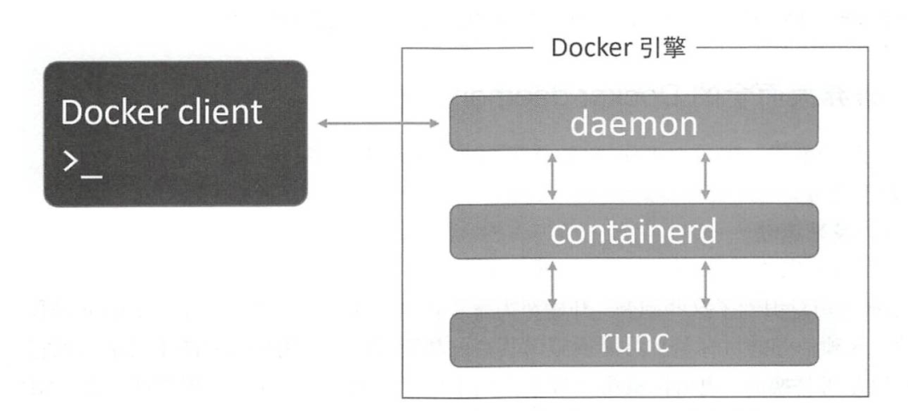

## 一 docker架构简介

Docker引擎是用来运行和管理容器的核心软件，常被人们代称为Docker或者Docker平台，类似于VMware的ESXi。  

Docker采用C/S架构，其引擎是模块化的，由许多工具协同工作，其主要组件包括：
- Docker Client：Docker客户端工具
- Docker daemon：Docker守护进程，实现了Docker的API。在Linux上，客户端与daemon之间通过本地的IPC/UNIX Socket完成的（/var/run/docker.sock）。
- containerd：用于操作新容器，如：容器的生命周期管理、镜像管理，创建容器的过程其实是fork一个runc实例。可以被第三方工具直接使用，如K8s中默认的容器运行时即是containerd。
- runc：OCI容器运行时规范的一个实现，是一个完全独立的容器运行时工具
- shim：容器解耦工具。在旧时代docker模型中，所有运行时逻辑在daemon中实现，启动和停止daemon会导致宿主机所有运行中的容器被kill！！！shim实现了无daemon容器，用于将运行中的容器与daemon解耦，方便daemon升级。

如图所示：  
  


学习Docker需要了解的四大核心技术:
- 镜像（image）
- 容器（container）
- 数据卷（data volumes） 
- 网络（network）

## 二 docker镜像

镜像是docker的可执行文件，其中包括运行应用程序所需的所有代码内容、依赖库、环境变量和配置文件等，通过镜像才能创建容器。  

镜像常用命令有：
```
# 搜索docker hub上的 nginx镜像
docker search nginx     

# 下载nginx镜像，镜像默认存储于/var/lib/docjer/目录中
docker pull nginx 

# 列出本地镜像，添加 -a 会额外列出已删除镜像，添加 镜像名 则只列出该名镜像。
docker images 

# 查看nginx镜像详细信息
docker inspect nginx   

# 镜像重命名 docker tag [老镜像名称]:[老镜像版本][新镜像名称]:[新镜像版本]
docker tag nginx:latest panda-nginx:v1.0
```

删除镜像：
```
# 命令格式:
docker rmi [命令参数][镜像ID]
docker rmi [命令参数][镜像名称]:[镜像版本]
docker image rm [命令参数][镜像]

#命令演示:
docker rmi 3fa822599e10
docker rmi mysql:latest
```

贴士：
- 如果一个image_id存在多个名称，那么应该使用 名称:版本 的格式删除镜像 
- 命令参数(OPTIONS): -f（--force）强制删除

镜像导出：将本地的一个或多个镜像打包保存成本地tar文件
```
# 命令格式: docker save [命令参数][导出镜像名称][本地镜像镜像] 
# 命令参数: -o, --output string 指定写入的文件名和路径 
docker save -o nginx.tar nginx
```

镜像导入：将save命令打包的镜像导入本地镜像库中
```
# 导入镜像命令格式:
docker load [命令参数][被导入镜像压缩文件的名称] 
docker load < [被导入镜像压缩文件的名称]
docker load --input [被导入镜像压缩文件的名称] 

# 命令参数:-i(--input) string 指定要打入的文件，如没有指定，默认是STDIN

docker load < nginx.tar
```

查看镜像历史：查看本地一个镜像的历史(历史分层)信息
```
# 查看镜像命令格式: docker history [镜像名称]:[镜像版本]  或者 docker history [镜像ID] 
docker history sswang-nginx:v1.0
```

根据模板创建镜像：
```
# 登录系统模板镜像网站:https://download.openvz.org/template/precreated/
# 找到一个镜像模板进行下载，如: #https://download.openvz.org/template/precreated/ubuntu-16.04-x86_64.tar.gz 

# 命令格式:
cat 模板文件名.tar | docker import - [自定义镜像名]

# 演示效果:
cat ubuntu-16.04-x86_64.tar.gz | docker import - ubuntu-mini
```