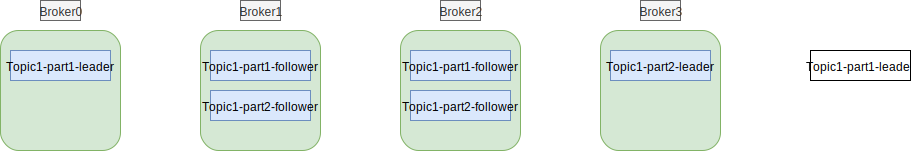

## 一 Kafka高性能的解析

### 1.0 Kafka高性能原因

- 顺序写磁盘
- 零拷贝

### 1.1 顺序写磁盘

操作系统不直接提供物理磁盘给应用程序访问，而是使用虚拟内存访问机制。当发生大量内存随机访问时，磁盘随机访问速度可能不如直接顺序访问磁盘的速度快，如果采用顺序写入，使用千兆网卡，那么写入磁盘的速度会超过网卡的带宽，也就是说网络将成为瓶颈点，磁盘不再是瓶颈。  

### 1.2 零拷贝-单机性能

操作系统将数据从磁盘读取到内核空间的Page Cache过程如下：
- 1 业务应用从内核空间读取数据到用户空间缓冲区
- 2 业务应用将数据写入内核空间到Socket缓冲区
- 3 操作系统将数据从Socket缓冲区复制到通过网络发送的NIC缓冲区

如图所示：  



上述步骤显然是非常低效的，整过过程存在四次数据复制，两次上下文切换。  

Linux的数据传输也可以避免在内核态和用户态之间复制，例如函数mmap(),sendFile()等，Kafka采用的是sendFile()，允许Linux将数据从Page Cache直接发送到网络，避免了数据复制。  

### 1.3 Partition-集群机制

在Topic下建立的Partition才是Kafka的最小存储单元，这意味着只要有足够的分区，同一个Topic可以持久化到N台物理机上

## 二 Kafka的数据存储机制

Kafka的存储设计基于日志实现，该日志是便于阅读、程序处理的结构化日志，是按照时间顺序排列的追加序列，且只能在末尾添加，不能修改（以此利用顺序读写能力）。。  

Kafka的日志文件会根据范围进行分片，每个分片都是一个片段，永远只有一个活跃文件，其余都是只读文件，这样可以让很多操作变得极为简单（避免多线程读写问题）。当活跃文件达到阈值时，会新建一个文件作为活跃文件，保证永远只有一个活跃文件。   

Kafka中的存储的逻辑关系是:Broker——>Topic——>Partition——>Segment，也就是Broker下包含多个Topic，一个Topic按照范围被分为多个连续的Partition。  

Partition无法再被分割，只能复制为多个副本分布到多个物理机，每个Partition对应服务器上一个物理的文件夹，每个Partition有多个Segment组成。Segement存在的原因：Partition是最小单元，会不断增大，不利于Kafka维护。在默认情况下，每个Segment包含1G或者1周的数据，哪个先到以哪个为准，在写数据时，一旦达到上限，就会关闭当前文件，新建一个文件继续写入，因此Partition是文件夹，内部有多个Segment。  

Segment可以简单理解为Partition的分片，但是由2个文件组成：
- .log：实际存储数据的文件
- .index：索引文件

Offset是Message在Partition中的偏移量，能够唯一确定Partition重点饿一条Message，Kafka的消息没有明确的消息id，因此可以认为Offset就是Partition就是Message的ID，每个Message都包含三个属性：
- Offset
- MessageSize
- data


示例：
```
现在在三台物理机上分别各部署了一个Broker实例，其中一个名为user的Topic被分为了10个Partition，复制系数为3，则一共有30个Partition副本，这30个副本会被分配到这三个Broker上。  

在Broker的数据目录中会存在user-0，user-1....，user-9共计10个文件夹，每个文件夹就是一个Partition。

现在有1000条消息发送到Broker,消息的offset从0-1000，其中，0-100写入一个log文件，从101-200会被写入另一个log文件，依次类推。  

只需要将index文件存入内存就能知道数据的具体位置
```

## 三 Kafka保证消息不丢失

### 3.0 ACK机制

服务向数据库发送requrest后，如果插入成功，数据库则向服务响应一个response，这就是ACK。Kafka也是采取类似数据库的机制：生产者向Broker投递数据时，采用同样的原理。  

理论上，系统之间传送消息主要有三种方式：
- 最多一次，消息可能丢失，但绝不会重复传输
- 最少一次，消息绝对不丢，单可能会重复传输
- 只有一次，每条消息肯定会被传输，但可能会重复传输

所有的消息系统都想达到只有一次传输的效果，但是代价极高，Kafka采用的是最少一次，会产生重复投递。  

### 3.2 复制

Broker进程挂掉不会导致数据丢失，因为数据被缓存到了操作系统缓存中，除非操作系统本身出现问题，最好的办法仍然是在其他服务器上存放一份一样的数据。  

Kafka以Topic为复制因子，以Partition为复制单位，复制数据到集群的多个节点上。

示例：
```
假设有4个Broker，Topic1的复制因子设定为3，分区数为2  

在生产消息给Broker时，首先计算属于哪个Partition，
    如果属于Partition1，则发送到Broker0，写入Topic1-part1-leader
    Broker1和Broker2下的Topic1-part1-follower会拉取消息并复制到本地
一旦副本数够了后，leader就会提交
```

如图所示：  

  

现在还有2个问题：
- 复制多少分才足够？
- 一个Broker挂掉，还用不用等待

Kafka在元数据中存储了ISR(In-Sync Replicas，包括leader和follower)列表，当生产者发送消息到leader时，leader会等待消息复制到所有处于ISR列表中的follower节点，全部完成后才会提交。一旦follower落后太多或者失败，leader会将其从ISR中删除，当follower追赶到一定范围内后，会被重新加入ISR。  

根据CAP定理，可用性和一致性是矛盾的，如果复制因子为3，当ISR列表中只有一个节点可用时，那么是给生产者返回成功还是失败？
- 返回失败：意味着可用性下降了
- 返回成功：意味着一旦该节点出现问题，则数据有丢失风险

在Kafka中，可以以Topic或Broker为单位设置最小同步副本，参数为min.insync.replicas，默认值为1，当request.required.acks为-1时，参数才会生效。当ISR中的副本数少于min.insync.replicas，Broker会向生产者返回异常。  

### 3.3 消息删除机制

Broker默认情况下会删除7天还未被消费的数据

### 3.4 发送消息机制 

Kafka生产者配置producer.type=async/sync，默认为sync，会同步发送消息，不会造成消息丢失。  

但是设置async会大幅提醒性能，因为会在生产者端进行本地buffer，即累积消息到一定的数量才会发送。但是在累积消息过程中，Kafka挂掉了，就会造成消息丢失！  

### 3.5 消费消息

消费消息更注重可靠性，需要显式提交Offset，即所有业务都处理完成的时再提交Offset，这样可能导致重复消费，所以还要提供幂等接口。  


