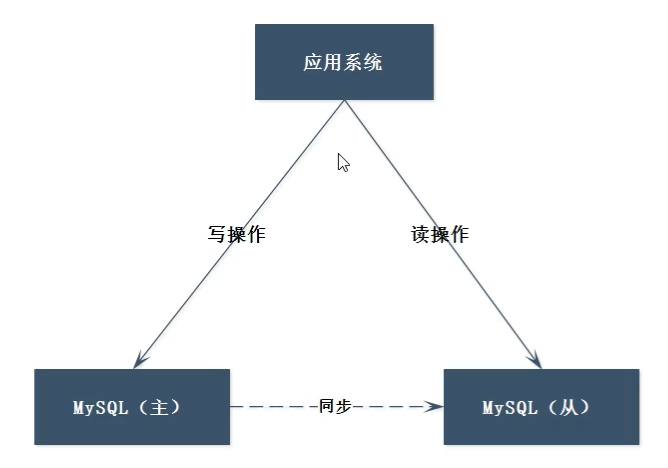
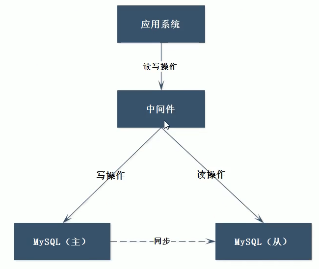
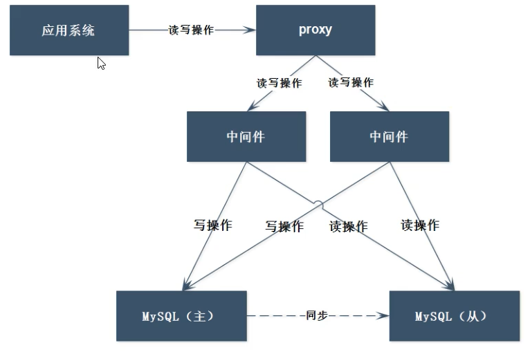
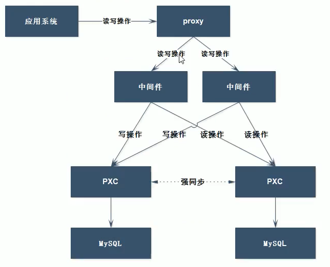
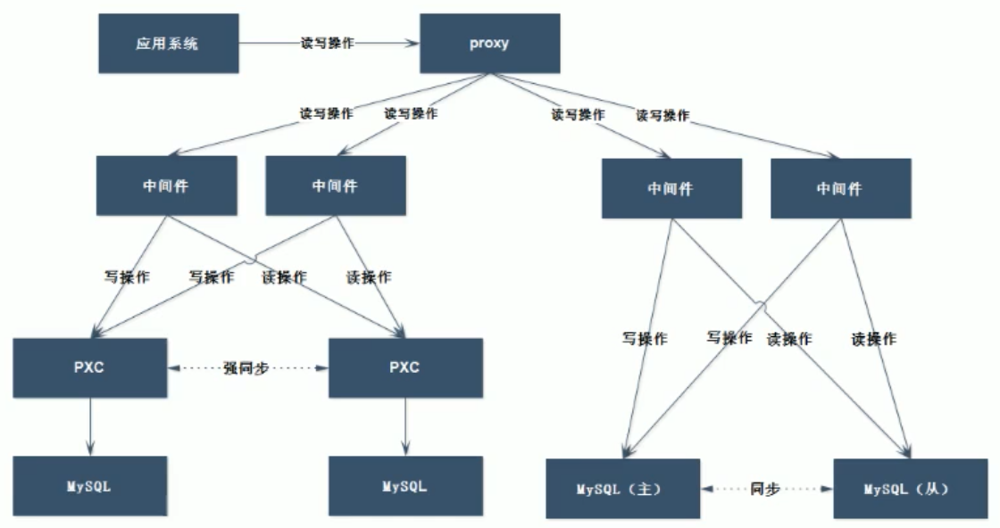
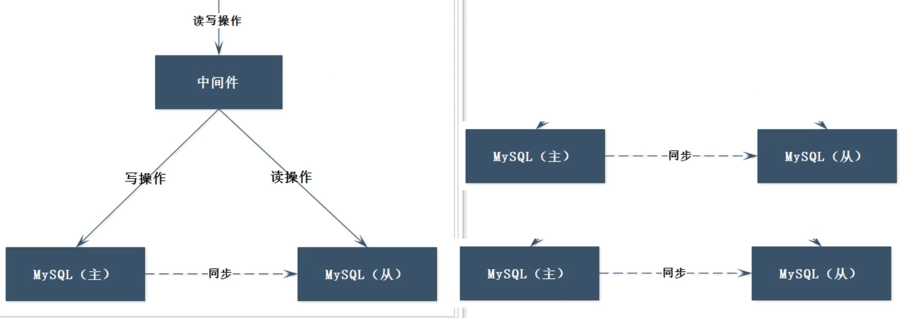

## 一 MySQL读写分离架构

### 1.1 读写分离架构概述

数据库一般是读多、写少的场景，读写分离架构可以应对该现象：
- 主库：必须有一个主库，负责写入数据
- 从库：数目有1到多个，负责读取数据

读写分离架构要求写数据必须写到写库，读数据必须读到读库，且读库和写库数据必须一致。  

  

主从读写分离架构需要解决两个问题：
- 问题1：应用程序内需要判断是写操作，还是读操作，然后对主从进行选择，有两种解决该问题方式：
  - 中间件解决：利用一些第三方中间件解决，如 MyCat
  - 程序内部实现：利用Spring中的AOP特性
- 问题2：主从数据的同步是异步完成的，即代表着数据的弱一致性，可能会导致数据写入主库后，从库读取数据出现错误，常见解决方案是：
  - PXC集群

### 1.2 读写判断-中间件解决方案

在中间件内配置读写规则，实现数据库服务器的选择。  

  

使用上图架构的好处是应用开发无需感知多个数据库的存在，只需要连接到中间件即可。  

上述架构额外引入了中间件，造成了依赖的增加。同时，中间件也存在着负载压力，中间件也要实现多节点负载均衡架构：  

  

### 1.3 数据一致性解决方案-PXC集群

PXC提供了强一致性功能，可以保证数据在任何一个节点写入的同时可以同步到其他节点。  

  

## 二 Mysql最终的混合架构方案

  

## 三 Mysql分片

在主从分离架构中，MySQL的数据存储容量完全取决于主库的容量，这在实际开发中也是不可能的，这里就需要进行数据分片。  

主从的分片结果：  

  

分片主要使用Mycat中间件，见下一章。  