## 一 web 服务器概念

Web 服务器是用于提供网络信息浏览服务的软件，常见的有：

- Apache: 目前占有率最大的 web 服务器。多进程架构，开支消耗很大，在多处理器环境中性能会有所下降，所以扩容 Apache 站点时常见的做法是增加服务器、扩充集群
- Tomcat: 专门用于 Java 的轻量级服务器，对高并发处理较弱
- IIS: windows 上常见的 web 服务器
- Nginx: 最初是为了解决 C10K 问题，拥有高性能、支持高并发特点，是目前最火热的 web 服务器。

## 二 C10K 问题

C10K 问题：最初的服务器是基于进程/线程模型，新到来一个 TCP 连接，就需要分配一个进程。假如有 C10K，就需要创建 1W 个进程，单机必定是无法承受的。

## 一 代理

### 1.1 正向代理

> 正向代理：如果把局域网外的 Internet 视为一个资源库，则局域网中的客户端要访问 Internet，则需要通过代理服务器来访问，该代理服务即正向代理

如上所示，即通过代理服务器实现正常的网络访问，只是简单的实现了一个网络的中转代理功能。

### 1.2 反向代理

> 反向代理：会将客户端的请求转发给真正的目标服务器，反向代理服务器从目标服务器获取数据后，由反向代理服务器负责将数据返回给客户端！

如图所示，在反向代理时，客户端对服务器是无感知的，客户端认为反向代理服务器就是真实的目标服务器，这样就隐藏了真实服务器的 IP 地址。

## 二 动静分离

比如一些前端文件，css 和 js 往往是无需变化的，我们将其称为静态资源，而一些模板文件，如 ejs 文件、jsp 文件都是内容是动态的。

将动态文件和静态文件分离部署便是动静分离，这样能为不同类型的资源提供不同类型的 web 服务，如静态资源交给 nginx 管理，能够有效提升性能。

不过要注意的是动静分离并不是简单的指静态文件与动态文件的分离，从严格意义上来说，应该是动态请求与静态请求的分离！

## 三 负载均衡

### 3.1 负载均衡概念

> 负载均衡：为了应对高流量压力，后端服务器往往以集群方式部署了多台服务器，每台服务器都具备完备的数据访问能力。为了让这些流量均衡的分发到这些服务器，就需要一个负载均衡器，进行均发，这便是负载均衡。

### 3.2 负载均衡方法

- 方式一：用户手动选择。比如一些软件下载站，同一个软件给与不同的下载点。
- 方式二：DNS 轮询。对统一主机，添加多条 A 记录，DNS 服务器将解析请求按照 A 记录的顺序，随机分配到不同的 IP 上。

方式二虽然初级，但是成本低，可以用于不重要服务，缺点是负载不均衡，因为使用该 DNS 存在缓存，一旦被使用，则用户在一段时间内访问的 web 服务器都是同一台。

### 3.3 四/七层负载均衡

在开发系统互联模型中（OSI），网络的通信工作分为七层：物理层，数据链路层，网络层，传输层，会话层，表示层，应用层。

其中第四层传输层：传输层是两台计算机之间进行通信时，第一个端到端的层次，起缓冲作用。当网络层服务质量不能满足要求时，该层提高服务，以满足高层要求，当网络层服务质量较好时，该层只进行较少工作。此外，它还要处理端到端的差错控制和流量控制等，最终为会话提供可靠、无误的数据传输。该层协议包括 TCP,UDP,SPX 等。

第七层：应用层，为操作系统或网络应用程序提供访问网络服务的接口，包括文件传输，文件管理，电子邮件等信息处理，常见协议有 Telnet，FTP,HTTP，SNMP 等。

现代负载均衡技术通常操作 OSI 模型中的 4，7 层。第四层负载均衡将一个网络上的 IP 映射为多个内部服务器的 IP 地址，对每次 TCP 请求动态使用其中一个内部 IP 地址，以达到负载均衡的目的，第七层负载均衡适用于 HTTP 服务器，根据 HTTP 报头执行负载均衡任务。

负载均衡实践：

- 在硬件层面，可以为第四、七层提供负载均衡交换机
- 软件层面，四层负载均衡代表作是 LVS（可以将请求均衡的转移到不同服务器上，且调度器能自动屏蔽故障服务器）
- 软件层面，七层负载均衡大多基于 HTTP 反向代理方式，常见代表作是 Nginx，HAProxy 等
- 大型应用混合负载均衡，如新浪网，负载均衡同时用到了“多线多地区只能 DNS 解析，DNS 轮训，四/七层负载均衡交换机”等技术，只能 DNS 解析能够让北京电信用户访问北京电信机房，深圳网通用户解析到深圳网通机房
