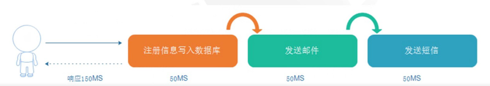
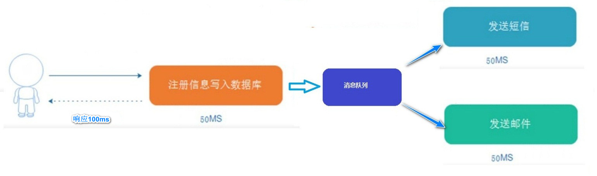
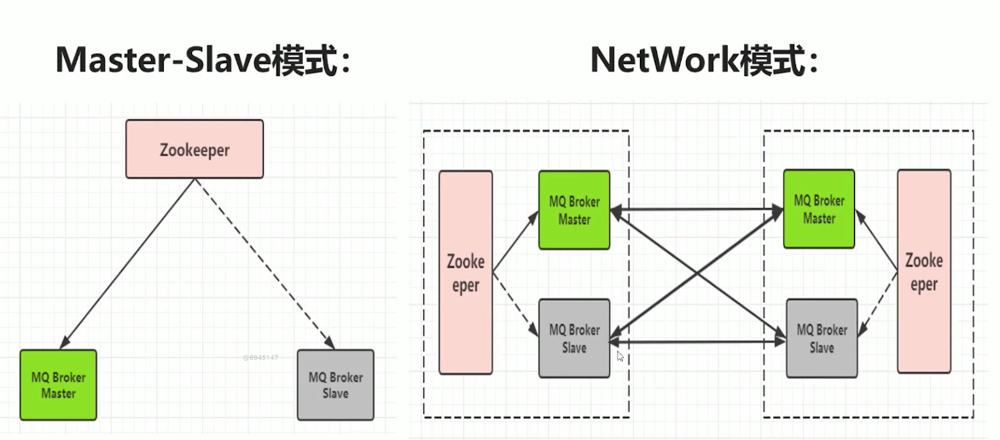
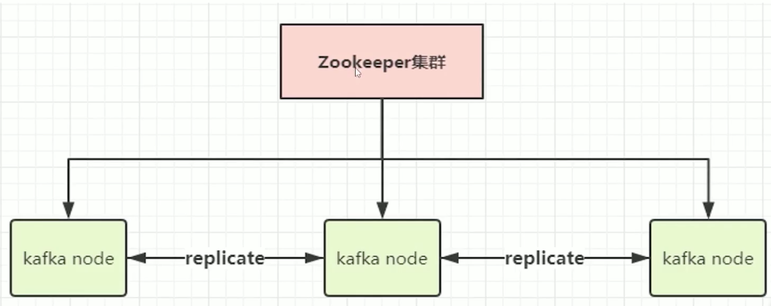
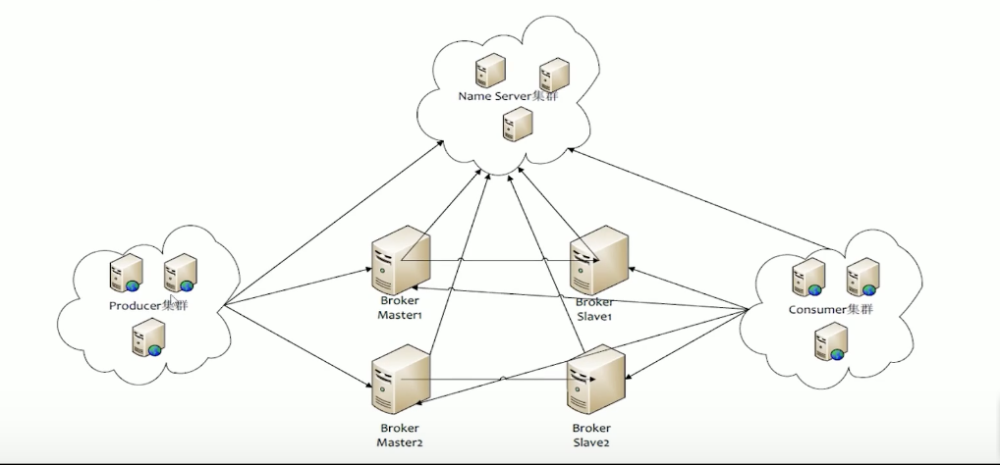
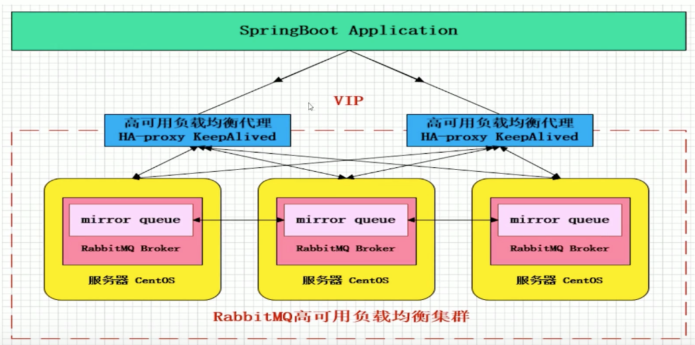

## 一 消息队列的引入

下面以传统的串行方式描述用户注册的流程：将用户的注册信息写入数据库成功后，依次进行发送注册成功邮件，发送注册成功短信。

如图所示：

引入消息队列后，可以大大缩减响应的时间：将注册信息写入数据库成功后，发送注册邮件的同时，发送注册短信。

当然，这只是简单的一个消息队列在应用中的利用。大型成熟的消息系统可以在此基础上，进行业务解耦、异步处理等操作，对业务架构的影响是更加直观的。

## 二 消息系统的分类

消息系统主要分为两种类型：

- 点对点：采用队列方式，如 A->B，当 B 消费的队列中的数据，那么队列的数据就会被删除掉。
- 发布订阅：大多数的消息系统是基于发布-订阅消息系统

发布订阅类型消息的基础模型：

发布订阅类型的消息系统主要有三大组件：

- 主题：消息的分类
- 发布者：将消息发送给消息系统（一般是主动推送）
- 订阅者：从消息系统中获取数据（可以采用拉/推方式）

## 三 消息系统的应用场景

消息中间件主要用于：

- 应用解耦：将一个大型的任务系统分成若干个小模块，模块之间通过不同的消息进行通信，由消息系统进行这些消息的统一管理
- 异步处理：如用户注册成功后，异步发送邮件通知用户
- 流量削峰：高峰流量进入消息队列处理，减轻后端压力
- 日志处理：如使用 Kafka 在大数据场景中进行日志收集

消息队列一般都内置了高效的通信机制，因此也可以用在纯的消息通讯，比如点对点的消息队列，或者聊天室等。

## 四 常见消息中间件

### 4.0 常见消息中间件列举

常见的消息中间件有：ActiveMQ、RabbitMQ、Kafka、RocketMQ。  
基于 Go 开发的消息队列有：Nsq、Nats。

MQ 的衡量标准包括：性能、数据存储、集群架构

### 4.1 ActiveMQ

ActiveMQ 是早期流行的消息中间件，是 Apacke 出品的开源消息总线，但是性能较低，逐渐被当前互联网趋势下的高并发场景所放弃。

ActiveMQ 的架构有两种：

- Master-Slave 模式：即主备模式，Master 与 Slave 都启动着，但是 Slave 不对外提供服务。当 Master 宕机时，利用 Zookeeper 进行切换，Slave 会被切换为 Master。
- NetWork 模式：本质上是两组主备模式的集成，使用网关进行连接，即可实现分布式集群

如图所示：

### 4.2 Kafka

Kafka 是 LinkedIn 开源的分布式发布-订阅消息系统，目前归属于 Apache。

Kafka 主要特点：

- 利用 Pull 模式处理消息消费，追求高吞吐量，一开始的目的是用于日志收集、传输
- 支持复制
- 不支持事务
- 对消息的重复、丢失、错误没有严格要求

由于**Kafka 只关注吞吐量，其性能极高**，在廉价的单机服务器上也能达到每秒 10 万条数量的吞吐，适合产生大量数据的互联网数据收集业务，但是不适合消息严格的场景。

Kafka 架构如图：

Kafka 同样利用 Zookeeper 进行集群管理，不同的节点之间可以进行副本的复制。

### 4.3 RocketMQ

RocketMQ 是阿里开源的消息中间件，目前是归属于 Apacje，由纯 Java 开发,具备高吞吐量，高可用性特点，适合大规模分布式系统应用。RocketMQ 的思路起源于 Kafka，但是对消息的可靠传输及事务做了优化，已被广泛应用于阿里的交易、充值、流计算等场景。

RocketMQ3.0 放弃了 Zookeeper，因为其性能较低，转而使用了自研的 NameServer 来管理集群。

RocketMQ 也支持分布式事务、水平扩展、主从自由切换，但是其商业版收费！！！

### 4.4 RabbitMQ

RabbitMQ 是使用 Erlang 开发的开源消息队列系统，基于 AMQP 协议实现。该协议特征是面向消息、队列、路由（点对点、发布订阅）、可靠性、安全。

AMQP 协议非常适合企业内对数据一致性、稳定性、可靠性要求很高的场景，其性能虽然不及 Kafka，但是也能满足一定场景的性能、吞吐量要求。

RabbitMQ 的架构：

## 五 消息队列设计要求

MQ 组件的基本需求：

- 支持消息高性能的序列化转换、异步发送消息
- 支持消息生产实例与消费实例的连接池技术
- 支持可靠性消息投递，保障消息的 100%不丢失
- 支持消费端的幂等操作，避免消费端重复消费

MQ 组件的扩展需求：

- 支持迅速发送消息，如在大数据日志系统中可以保证高吞吐量
- 支持延迟消息模式：消息可以延迟发送，指定延迟时间，可以用于某些延迟检查、服务限流
- 支持事务消息，如在金融行业中单笔大额操作
- 支持顺序消息，保证消息送达消费端的前后顺序，例如下单时的一些复合操作
- 支持消息补偿、重试，以及快速定义异常、失败消息
- 支持集群消息负载均衡
- 支持消息路由
