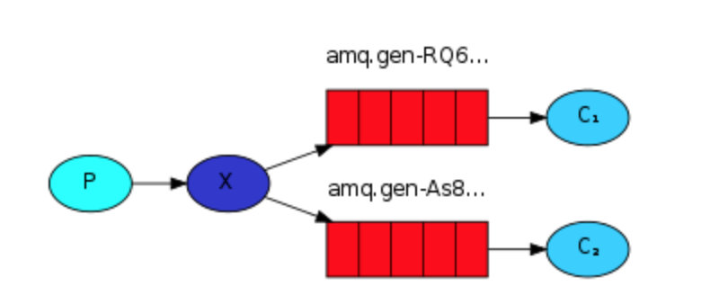
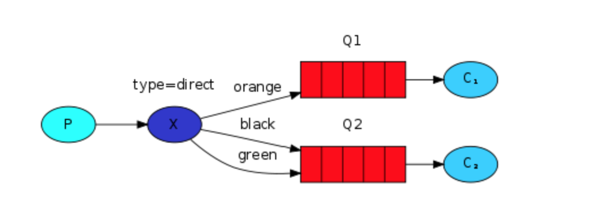
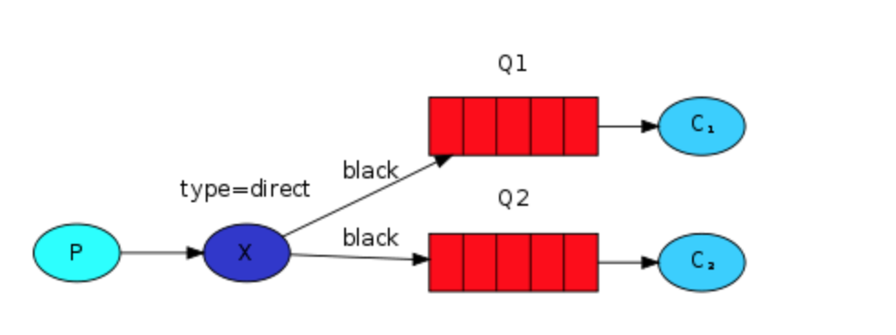
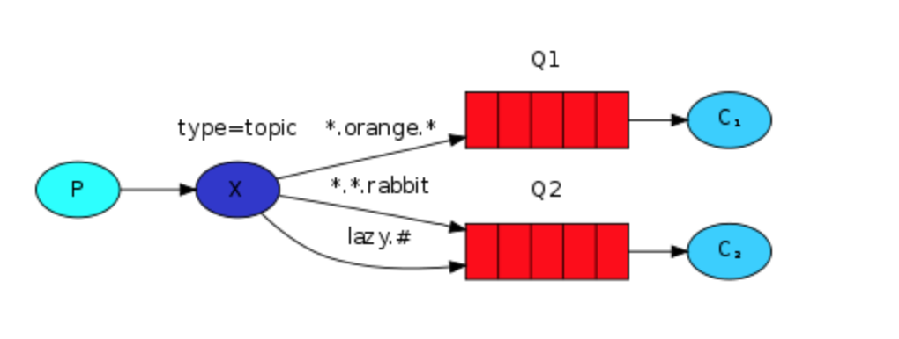

## 一 交换机总结

常用的Exchange类型有：fanout、direct、topic三种。  

fnout：扇出型。用以迟滞发布订阅模式，交换机把消息转发到所有与之绑定的队列中。  

  


direct：直接匹配型，用于支持路由模式，会对比路由键和绑定键，如果路由键和绑定键完全相同，则把消息转发到绑定键所对应的队列中。    

  

direct也可以实现多重绑定：

  


topic：模式匹配。  

   

RMQ会自带几个交换器，简单看下，这里只介绍AMQP default。当交换器名称为空时，表示使用默认交换器。空的意思是空字符串。默认交换器是一个特殊的交换器，他无需进行绑定操作，可以以直接匹配的形式直接把消息发送到任何队列中。  

## 二 消费端消息接收

### 2.1 推模式

RMQ Server主动把消息推给消费者：
```go
func (ch *Channel) Consume(queue, consumer string, autoAck, exclusive, noLocal, noWait bool, args Table) (<-chan Delivery, error)
```

- queue:队列名称。
- consumer:消费者标签，用于区分不同的消费者。
- autoAck:是否自动回复ACK，true为是，回复ACK表示高速服务器我收到消息了。建议为false，手动回复，这样可控性强。
- exclusive:设置是否排他，排他表示当前队列只能给一个消费者使用。
- noLocal:如果为true，表示生产者和消费者不能是同一个connect。
- nowait：是否非阻塞，true表示是。阻塞：表示创建交换器的请求发送后，阻塞等待RMQ Server返回信息。非阻塞：不会阻塞等待RMQ Server的返回信息，而RMQ Server也不会返回信息。（不推荐使用）
- args：一般为nil，用于一些自定义场景
注意下返回值：返回一个<- chan Delivery类型，遍历返回值，有消息则往下走， 没有则阻塞。

### 2.2 拉模式

消费者主动从RMQ Server拉消息：
```go
func (ch *Channel) Get(queue string, autoAck bool) (msg Delivery, ok bool, err error)
```

## 三 消费端幂等性

### 3.1 幂等性概念

> 幂等性：对一个事情重复操作N次（100次，1000次等等），其结果是一致的
> 在消息队列中，幂等性的机制是为了避免 消息的重复消费问题。消费端实现幂等性，意味着即使受到了多条一样的消息，也不会被消费多次

使用数据库的乐观锁来解释，使用版本号来控制库存超卖：
```
update store set count = count - 1,version = version + 1 where version = currentVersion
```

在下单时，先查询到version的版本号，假设为currentVersion，
由于在更新时存在 `where version = currentVersion`的条件限制，就不会出现超卖现象。   

### 3.2 幂等性主流实现机制

常见的业界主流幂等性操作：
- 唯一ID + 指纹码 机制，利用数据库主键去重
  - 实现方式：`select count(1) from order where id = 唯一ID+指纹码`，返回非0就证明已经被操作了，无需insert
  - 实现简单，但高并发下有数据库写入性能瓶颈
  - 解决方案：跟进ID进行分库分表进行算法路由，实现分压、分流
- 利用Redis的原子性实现
  - 原理：set操作会将存在的数据进行更新，这样可以简单实现一个原子特性
  - 需要考虑的问题：如果需要落库，那么如何做到数据库和缓存的原子性。如果不进行落库，则需要定时同步策略

## 四 生产端 消息确认confirm机制

confirm机制：
> 消息确认：生产者投递消息后，如果Broker收到消息，则会给生产者一个应答。生产者接收应答后，用来确定该消息是否正常。

RabbitMQ确认消息步骤：
- 1 在channel上开启确认模式：`channel.confirmSelect()`
- 2 在channel上添加监听：`addConfirmListener`，监听成功和失败的返回结果。

## 五 生产端 Return消息机制

Return Listenr用于处理一些不可路由的消息。  

Mandatory设置为true后，则监听器会接收到路由不可达消息，如果未false，则Broker会自动删除不可达消息！  

## 六 消费端的消息监听

一般消息的监听放在一个循环中，进行consumer.nextDelivery方法进行获取吓一跳消息，然后进行消费处理。该代码并不优雅！  

消费端可以实现自定义监听。

## 七 消费端限流

如果有以下场景：RabbitMQ服务器上堆积上了上万条消息，此时打开一个消费端，会有大量消息瞬间推送过来，客户端会无法同时处理这么多数据。  

针对该情况，RabbitMQ提供了qos（服务质量保证）功能，在非自动确认消息的前提下，如果有一定的消息堆积，不进行新消息的消费。所以在生产环境中，**必须设定AutoACK为false**！！！设置后，消息被确认前是不会到达消费端的。  

`channel.BasicQos()`方法可以设定限流的一些参数。

## 八 消费端ACK与重回队列

消费端重回队列：针对没有处理成功的消息，消息会重新递送给Broker。  

在生产环境中，一般会关闭重回队列（设置为false）。 

## 九 消息TTL

TTL即Time To Live 生存时间：
- RabbitMQ支持消息的过期时间：在发送消息时指定过期时间
- RabbitMQ支持队列的过期时间：从入队开始计算，超过了队列超时时间，则自动清除消息

## 十 死信队列

死信队列：DLX，Dead-Letter-Exchange。RabbitMQ的死信队列与其他MQ不同，是与交换机相关的。  

当消息在一个队列中变成死信（dead message）之后，能被重新publish到另一个Exchange，这个Exchange就是DLX。  

消息变成死信的情况：
- 消息被拒绝：`basic.reject/basic.nack`，并且requeue=false（不重回队列）
- 消息TTL过期
- 队列已满

DLX和普通的交换机没有区别，主要用于让RabbitMQ将死信路由到另外一个队列中。   


设置死信队列：
- Exchange：dlx.exchange
- Queue：dlx.queue
- RoutingKey：#
- 在队列中添加一个扩展参数：arguments.put("x-dead-letter-exchange", "dlx.exchange")